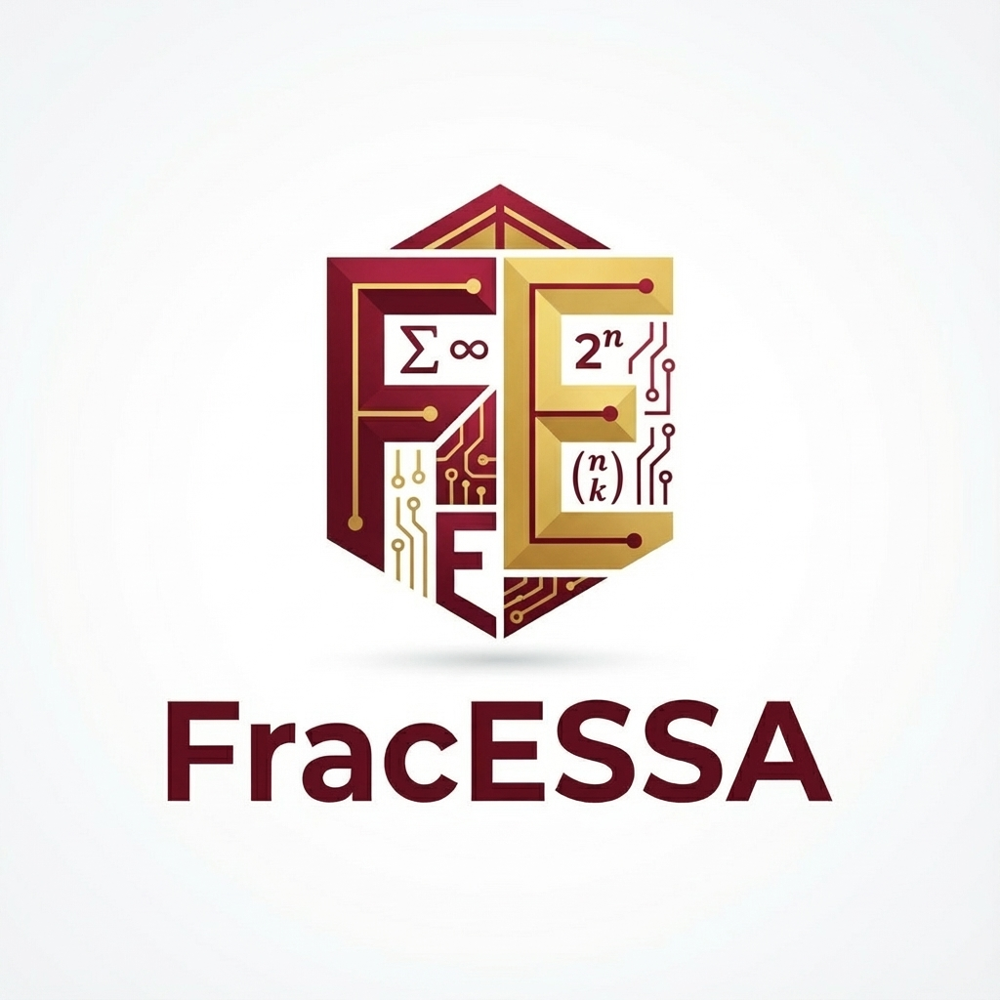

<p align="right">
  
</p>

# FracESSA
### Fractional Evolutionary Stable Strategy Analyzer

FracESSA is a high-performance computational engine developed to identify **Evolutionary Stable Strategies (ESS)** within the framework of **Standard Quadratic Problems (SQP)**. Originally developed as part of a doctoral dissertation project, the software provides a robust and mathematically rigorous implementation of stability analysis in evolutionary game theory.

By utilizing exact rational arithmetic, FracESSA eliminates the numerical instabilities and rounding errors associated with traditional floating-point computations, ensuring the reliable identification of strategies in even the most ill-conditioned payoff matrices.

---

## Technical Overview

The identification of ESS is a fundamental problem in evolutionary biology and game theory, requiring the determination of local maximizers of a quadratic form over the standard simplex. FracESSA implements a combinatorial approach optimized for high-dimensional matrices, combining exact algebraic methods with modern performance engineering.

### Theoretical Foundation
The core algorithmic logic is based upon the research conducted by **Imanuel M. Bomze**, specifically the methodology introduced in:
> **Bomze, I. M. (1992).** *Detecting all evolutionary stable strategies.* Biological Cybernetics, 67(6), 519–521.

The software systematically explores supports of the strategy simplex, verifying the necessary and sufficient conditions for evolutionary stability as defined in Bomze’s extensive work on quadratic forms and stability criteria.

---

## Core Features and Implementation

### Exact Rational Computation
At the heart of FracESSA is the **Fast Library for Number Theory (FLINT)**. Every critical computation—from determinant calculation to linear system solving—is performed using exact fractions. This approach is essential for research-grade results where the boundaries of stability regions can be extremely sensitive to precision loss.

### Heuristic Performance Optimization
To maintain high throughput while preserving exactness, FracESSA employs a multi-stage filtering pipeline:
1. **Double-Precision Screening**: Potential supports are first evaluated using standard double-precision arithmetic. This stage rapidly prunes the majority of non-viable candidates.
2. **Exact Algebraic Verification**: For candidates passing the heuristic check, the system performs a full verification using exact rational arithmetic to confirm both Nash equilibrium conditions and stability status.

### Support for Complex Symmetries
While the analyzer supports general symmetric payoff matrices, it includes optimized routines for **Circular Symmetric Matrices**. This feature significantly reduces the search space for large-scale periodic models common in spatial ecology and evolutionary biology.

---

## Usage and Integration

### Command Line Interface
The primary interface for FracESSA is a standalone CLI tool. Matrices are provided in a compact triangular format: `dimension#values`.

**Standard Analysis:**
```bash
# Analyze a 3-dimensional symmetric matrix
./fracessa "3#4,13/2,1/2,5,11/2,3"
```

**Advanced Parameters:**
The application supports several flags for fine-tuning the analysis:
- `--candidates (-c)`: Outputs a detailed report of every support examined, including payoffs and stability status.
- `--timing (-t)`: Provides high-resolution benchmarks for the execution segments.
- `--exact (-e)`: Forces the system to bypass double-precision filtering and use exact arithmetic for all operations.
- `--log (-l)`: Generates a comprehensive execution profile in `fracessa.log`.

### Python API
For integration into research pipelines (e.g., Jupyter Notebooks), a native Python interface is provided via `fracessa_py`.

```python
from fracessa_py import Fracessa, Matrix

# Initialize the analyzer
analyzer = Fracessa()

# Define the payoff matrix structure
matrix = Matrix("0,1,0", dimension=2)

# Compute the set of all ESS
result = analyzer.compute_ess(matrix, include_candidates=True)

print(f"Total ESS Identified: {result.ess_count}")
for candidate in result.candidates:
    if candidate.is_ess:
        print(f"Refined Support: {candidate.support_bits}")
```

---

## Building and Environment

### System Dependencies
- **Linux/macOS**: Requires the development headers for `GMP` and `MPFR`. `FLINT` is integrated into the build process.
- **Windows**: Distribution via `vcpkg` is supported using the `flint:x64-windows-static-release` triplet.

### Compilation
The project uses a standard CMake build system:
```bash
cd cpp
cmake -B build -DCMAKE_BUILD_TYPE=Release
cmake --build build --config Release -j4
```

---

## Research and Attribution

FracESSA was designed as a tool for rigorous academic inquiry. If you reference this software in your academic publications, please cite both the software and the foundational work by Bomze.

```bibtex
@phdthesis{ullrich2024,
  author = {Ullrich, Reinhard},
  title = {FracESSA: High-Performance Computational Methods for Evolutionary Stability},
  school = {University Name},
  year = {2024}
}

@article{bomze1992,
  author = {Bomze, Imanuel M.},
  title = {Detecting all evolutionary stable strategies},
  journal = {Biological Cybernetics},
  volume = {67},
  number = {6},
  pages = {519--521},
  year = {1992}
}
```

---
<p align="center">Academic Research Software • Developed by Reinhard Ullrich</p>
