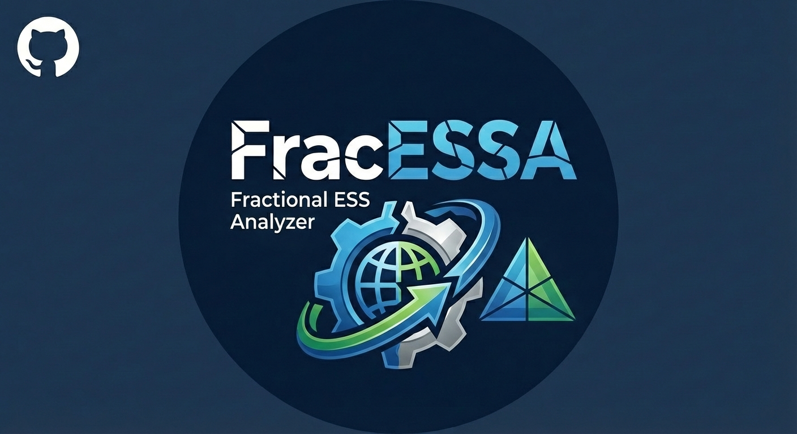

<p align="center">
  
</p>

# FracESSA
Fast ESS analysis for symmetric games with exact rational verification.

FracESSA is a C++17 command-line tool for Evolutionary Stable Strategy (ESS) search on symmetric payoff matrices.
It is designed for raw speed in large support-space scans while still preserving exact correctness where it matters.

## Why FracESSA
- Two-stage pipeline: fast floating-point filter, then exact FLINT fraction checks.
- Bitset-based support enumeration over a `2^n` search space.
- Optimized for many repeated operations on small/medium matrix dimensions.
- Circular-symmetric and general symmetric matrix input support.

## Quick Start

### 1. Build
```bash
./build.sh
```

### 2. Run Tests
```bash
./test.sh
```

### 3. Run One Matrix
```bash
./cpp/build/fracessa "3#4,13/2,1/2,5,11/2,3"
```

### 4. Batch Verification
```bash
./python.sh
```

## Input Format
Matrix input is:
```text
dimension#values
```

Supported encodings:
- Symmetric upper-triangular: `n*(n+1)/2` values.
- Circular-symmetric compact: `floor(n/2)` values.

## CLI Flags
- `-c, --candidates` include candidate rows in output.
- `-l, --log` write detailed log output.
- `-e, --exact` disable float pre-filter, use exact path only.
- `-f, --fullsupport` evaluate full support first.
- `-t, --timing` print wall-clock timing.
- `-m, --matrixid` optional matrix ID for logging/verification runs.
- `-u, --unsafe` use fast parser without full validation.

Output format:
- line 1: ESS count
- optional line 2 (`-t`): runtime in seconds
- optional extra lines (`-c`): candidate CSV rows

## Build Dependencies
- C++17 compiler
- CMake >= 3.18
- GMP, MPFR, FLINT
- Python 3 with development headers (for the pybind module)

Notes:
- Third-party C++ dependencies (`spdlog`, `argparse`, `googletest`, `pybind11`) are pulled by CMake `FetchContent`.
- First configure in a fresh `cpp/build/` directory requires internet access unless dependencies are cached.
- Current Linux and macOS release binaries dynamically link GMP/MPFR/FLINT; they are not universal standalone binaries.

## Repository Layout
- `cpp/`: core engine, tests, local build, and profiling tools
- `python/`: automation, verification scripts, baseline generation
- `aidocs/`: current project knowledge, open issues, wrapper docs, benchmark reports, and references
- `experiments/`: reproducible benchmark code, metadata, and results
- `.github/workflows/`: release/build automation

## Project Focus
FracESSA is explicitly tuned for high-throughput ESS workflows where millions of support-level operations are common.
Micro-overheads in hot paths matter and are optimized aggressively by design.
