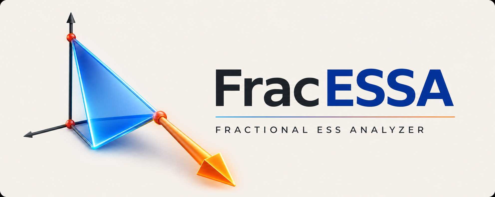

<p align="center">
  
</p>

# FracESSA

## The problem

We consider the *Standard Quadratic Optimization Problem (StQP)* given by

$$
\max_{\mathbf x\in \Delta^n} \mathbf x^\top{\mathsf A}\mathbf x
$$

where ${\mathsf A}$ is a symmetric $n\times n$ matrix and $\Delta^n$ is the standard simplex

$$
\Delta^n=\lbrace\mathbf x\in\mathbb{R}^{n}:\sum_{i=1}^{n}x_i=1,\ x_i\geq0\quad\text{for }i=1,\ldots,n\rbrace.
$$

FracESSA analyzes this StQP when ${\mathsf A}$ has rational entries. The same symmetric matrix also has a game-theoretic
interpretation: it is the payoff matrix of a symmetric partnership game, and $\mathbf x^\top{\mathsf A}\mathbf x$ is the average
payoff when the population uses the mixed strategy $\mathbf x$. Under this interpretation, the evolutionarily stable strategies
(ESS) are exactly the strict local maximizers of the quadratic form $\mathbf x^\top{\mathsf A}\mathbf x$. FracESSA therefore finds
the game-theoretic stable states by analyzing the candidate and local-maximizer structure of the StQP.
It searches the possible supports, checks the corresponding equilibrium candidates, and classifies their stability. FracESSA returns
the number of ESS and can also return their exact probability vectors, supports, payoffs, and stability results.

The nonempty support space has size $2^n-1$, so running time can grow quickly with the dimension and structure of the matrix.
FracESSA is optimized for repeated operations on many small support systems.

## How the search works

FracESSA examines the nonempty supports in increasing size and skips supports made redundant by exact results or matrix symmetries.
`safe` makes every candidate decision with exact arithmetic. `fast` uses floating-point arithmetic to discard many supports quickly,
then checks every surviving candidate and every stability decision exactly. The faster filter can miss candidates, but each candidate
it retains is reconstructed exactly.

## Capabilities and limitations

FracESSA accepts symmetric payoff matrices whose entries are integers or exact fractions. With `safe`, it finds every equilibrium
candidate and every ESS rather than stopping after one solution. FracESSA parses every input entry as an exact rational number, and
every reported `vector` and `payoff` is exact as well. Each rational is a numerator divided by a denominator, both backed by
arbitrary-precision integers, so there is no fixed limit on the
number of digits; the practical limits are available memory and computation time. `fast` additionally creates a floating-point copy
for filtering, but it does not replace the exact input or round the exact results. The separate `payoff_dbl` field is only a convenient
binary64 approximation of the exact `payoff`. The search method affects completeness, not the exactness of those results.

The main limitations are:

- the matrix must be symmetric and contain rational values;
- the dimension must be between 1 and 63;
- the $2^n-1$ nonempty supports make some larger or difficult matrices computationally expensive;
- one matrix is processed on one CPU core, although the Python API can process several matrices in parallel.

## Choose a search method

FracESSA always requires an explicit method; there is no default.

| Method | Use it when | Guarantee |
|---|---|---|
| `safe` | The result must be complete and mathematically reliable | Uses exact arithmetic for every candidate decision |
| `fast` | Speed matters more than a completeness guarantee | Uses floating-point filtering before exact checks and can miss candidates |

Candidates returned by `fast` are checked exactly, but its early floating-point filtering can make the returned set incomplete.
When `fast` detects certain dangerous whole-matrix conditions, it automatically falls back to `safe`. Python returns the reason in
`safe_fallback`; the CLI prints it when `--timing` is enabled.

The CLI and Python API also expose `test`, an experimental copy of `fast` used for development. It is not intended for normal use.

## Install

The GitHub [Releases](https://github.com/reinhardullrich/fracessa/releases) page provides self-contained command-line binaries for
Linux x86-64, Linux ARM64, macOS Intel, macOS Apple Silicon, and Windows x86-64. Python, GMP, MPFR, and FLINT do not need to be
installed separately. On Linux and macOS, make the downloaded file executable before running it:

```bash
chmod +x fracessa-*
```

Windows users can run the downloaded `.exe` directly. The Linux binaries require glibc 2.28 or newer, and the macOS binaries
require macOS 11 or newer.

Python 3.11 through 3.14 users can install the native extension and Python API directly from PyPI:

```bash
python -m pip install pyfracessa
```

The distribution and import package are both named `pyfracessa`. Parquet output is optional:

```bash
python -m pip install "pyfracessa[parquet]"
```

## Build from source

Required system dependencies:

- a C compiler and a C++17 compiler;
- CMake 3.18 or newer;
- Python 3.11 or newer, including development headers;
- GMP, MPFR, and FLINT;
- Git and internet access for CMake's first download of `argparse`, `pybind11`, `spdlog`, and the test framework.

Build the command-line program and Python extension from the repository root:

```bash
git clone https://github.com/reinhardullrich/fracessa.git
cd fracessa
cmake -S cpp -B cpp/build -DCMAKE_BUILD_TYPE=Release
cmake --build cpp/build --parallel
```

The resulting programs are:

- `cpp/build/fracessa`: command-line interface;
- `cpp/build/fracessa_core.*`: native module used by Python.

Run the automated test suite with:

```bash
ctest --test-dir cpp/build --output-on-failure --parallel
PYTHONPATH=python python3 -m unittest discover -s python/tests -p 'test_*.py'
```

## Command-line use

The general form is:

```bash
./cpp/build/fracessa [OPTIONS] METHOD "DIMENSION#VALUES"
```

For example, the symmetric matrix

$$
A=\begin{pmatrix}
0 & 1 \\
1 & 0
\end{pmatrix}
$$

is written as `2#0,1,0`. Its exact ESS is

$$
\mathbf{x}=\left(\frac{1}{2},\frac{1}{2}\right).
$$

```bash
./cpp/build/fracessa safe --candidates "2#0,1,0"
```

```text
1
candidate_id;vector;support;support_size;extended_support;extended_support_size;multiplier;is_ess;stability;payoff;payoff_dbl
1;1/2,1/2;3;2;3;2;;1;T_pd_frc;1/2;0.5
```

The first CLI output line is always the ESS count. Without `--timing` or `--candidates`, it is the only line. `--timing` adds the
native elapsed time in nanoseconds and then the whole-matrix safe-fallback reason. `--candidates` adds the candidate CSV after
those lines.

The CLI does not print separate candidate-count or support-size-structure fields. Its candidate table contains the information needed
to reconstruct them: `support_size`, `is_ess`, and `multiplier`. The `vector` and `payoff` columns retain exact fractions, while `payoff_dbl` is only a convenient floating-point approximation.
`support` is a bit mask, and `is_ess` is `1` for an ESS. For compact circular input, `multiplier` says how many rotations and
reflections the displayed representative covers; a blank `multiplier` means one candidate.

Useful options:

| Option | Meaning |
|---|---|
| `-c`, `--candidates` | Print the candidate table after the ESS count |
| `-t`, `--timing` | Print native runtime in nanoseconds and the whole-matrix safe-fallback reason |
| `-f`, `--fullsupport` | Check the full support first |
| `-l`, `--log` | Write detailed diagnostics to `log/fracessa.log` |
| `-m`, `--matrixid ID` | Attach a signed 64-bit matrix ID to the log |

Run `./cpp/build/fracessa --help` for the current command-line reference.

## Matrix input

Every input begins with the dimension, followed by `#` and a comma-separated value list:

```text
dimension#values
```

Values must be integers or exact integer fractions such as `-3/5`. Decimal notation is not accepted; write `1/2` instead of
`0.5`.

### General symmetric matrices

Provide the upper triangle row by row. For

$$
A=\begin{pmatrix}
a_{11}&a_{12}&a_{13}\\
a_{12}&a_{22}&a_{23}\\
a_{13}&a_{23}&a_{33}
\end{pmatrix},
$$

the input is:

```text
3#a11,a12,a13,a22,a23,a33
```

Exactly $\frac{n(n+1)}{2}$ values are required.

### Circular-symmetric matrices

For dimensions 2 and larger, a circular-symmetric matrix with zero diagonal can use a compact list of
$\left\lfloor \frac{n}{2} \right\rfloor$ values. Entry $c_k$ is the payoff at circular distance $k$:

```text
n#c1,c2,...,c_floor(n/2)
```

For example, `5#1,3` expands to a 5-by-5 matrix with first row `0,1,3,3,1`. FracESSA recognizes this encoding from the shorter
value count and automatically applies its circular-symmetry reductions.

## Python use

The maintained Python API calls the same C++ engine in-process. Install `pyfracessa` from PyPI as shown above, or build the project
from source and make the source package visible from the repository root:

```bash
PYTHONPATH=python python3 your_script.py
```

A complete single-matrix example is:

```python
from pyfracessa import Matrix, RunConfig, run

matrix = Matrix(1, "2#0,1,0")
result = run(
    "safe",
    matrix,
    config=RunConfig(include_candidates=True),
    run_id="example",
)

print(result["candidate_count"])
print(result["candidate_structure"])
print(result["ess_count"])
print(result["ess_structure"])
print(result["candidates"])
```

The result is a plain dictionary. `candidate_count` and `ess_count` are the multiplier-aware totals found by the selected search.
`candidate_structure` and `ess_structure` partition those totals by support size. The count and structure fields are always returned;
`RunConfig(include_candidates=True)` additionally returns the individual representative rows in `candidates`. Each row contains the
exact `vector` and `payoff`; `payoff_dbl` is only a convenient floating-point approximation. The other fields report status, native
runtime, an optional whole-matrix safe-fallback reason, errors, and the input metadata.

### Process several matrices in parallel

`run_multiprocessing()` distributes independent matrices across worker processes. One matrix still uses one CPU core; the
parallelism is across matrices. Results are yielded in completion order, so use `matrix_id` to identify each one.

```python
from pyfracessa import MPConfig, Matrix, RunConfig, run_multiprocessing

matrices = [
    Matrix(1, "2#0,1,0"),
    Matrix(2, "3#4,13/2,1/2,5,11/2,3"),
]

if __name__ == "__main__":
    mp_config = MPConfig(
        workers=8,
        prefetch_per_worker=128,
        queue_maxsize=4096,
        start_method="spawn",
    )

    for result in run_multiprocessing(
        "safe",
        matrices,
        config=RunConfig(include_candidates=False),
        mp_config=mp_config,
    ):
        print(result["matrix_id"], result["ess_count"])
```

`MPConfig()` without arguments uses all CPUs available to the Python process. The `workers` field sets the number of worker
processes; `prefetch_per_worker` and `queue_maxsize` bound queued work and results; `start_method="spawn"` is the portable default.
The `if __name__ == "__main__":` guard is required with `spawn`. Native logging is sequential-only and cannot be enabled in a
multiprocessing run.

The [Python API guide](aidocs/pyfracessa/README.md) documents sequential execution, JSON input, CSV/JSON/Parquet output, sinks, and
every result field.

## Further documentation

- [Python API](aidocs/pyfracessa/README.md)
- [Test-matrix database](testdata/README.md)
- [Release procedure](aidocs/RELEASING.md)
- [Technical documentation index](aidocs/INDEX.md)

## License

FracESSA is free software licensed under [GPL-3.0-or-later](LICENSE). Prebuilt releases statically link third-party libraries; their
licenses and exact source locations are recorded in [THIRD_PARTY_NOTICES.md](THIRD_PARTY_NOTICES.md).

The root README is intentionally an introduction and usage guide. Mathematical derivations, numerical details, benchmarks, and
historical experiments are kept in the linked documentation instead.
