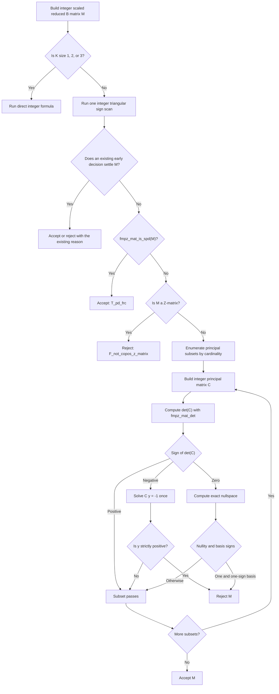

# Integer Stability And Copositivity Plan

Status: reviewed and implementation-ready; not implemented.

Date: 2026-08-06.

## 1. Goal

Keep the complete exact stability path in FLINT integer matrices after the scaled reduced B matrix has been constructed. The
mathematics, decision order, candidate reasons, and public output must remain unchanged.

The intended data flow is:

```text
integer game
    -> integer reduced Hessian and retained fraction-free factorization
    -> integer scaled reduced B matrix
    -> integer small-K criteria, sign scan, positive-definiteness test, and Hadeler test
```

Rational arithmetic remains necessary at the input and output boundaries:

- the parser accepts exact rational game entries;
- the game is converted once to one integer matrix plus a positive common denominator;
- successful candidate probabilities and payoffs remain public rational values.

It is not necessary inside the final stability decision. The scaled reduced B matrix is already integral before the current code
converts each entry to a fraction with denominator one.

This is not a project-wide removal of rational arithmetic. Removing `matrix_frc` or `fraction` globally would break exact rational
input and exact candidate output. The scope is narrower and complete: remove rational arithmetic from scaled reduced B construction,
positive-definiteness, and Hadeler copositivity, then delete the rational helpers that become unused only because of that migration.

## 2. Current avoidable work

`find_candidate_safe::build_scaled_reduced_b()` currently computes each entry in an `linalg::integer` named `scaled_entry`. It then
executes

```cpp
result(row, column).set_ratio(scaled_entry, one);
```

This changes the representation from `fmpz` to `fmpq`, but not the value. Every denominator is exactly one. The later code then:

1. applies the small one-, two-, and three-dimensional formulas with `fmpq` operations;
2. unwraps the integer numerators again during the shared sign scan;
3. performs rational `LDL^T` for the positive-definiteness shortcut;
4. copies rational principal submatrices during Hadeler enumeration;
5. performs rational LU for every principal submatrix of dimension at least four;
6. forms a complete rational inverse in the nonsingular negative-determinant branch; and
7. computes many rational cofactor determinants in the singular branch.

The first conversion is therefore the unnecessary boundary. The integer rewrite should remove that boundary rather than add a
second parallel copositivity implementation.

## 3. Mathematical invariant

Let the exact game be multiplied by one positive common denominator `d`. Let the retained reduced-Hessian solve use the positive
denominator `delta`. The current Schur-complement builder constructs an integer matrix `M` that is a positive multiple of Bomze's
final reduced matrix.

Consequently,

$$
x^T M x > 0
$$

holds for every nonzero `x >= 0` exactly when it holds for the unscaled reduced matrix. Changing `M` from denominator-one `fmpq`
storage to `fmpz` storage changes no value and no sign.

The integer conversion must not alter:

- the reference strategy;
- support or outside-best-reply order;
- the Schur-complement formula;
- the positive scale;
- the cardinality order of principal subsets;
- Gosper subset generation; or
- any stability reason string.

## 4. FLINT operations to use

The project already owns integer matrices through `linalg::matrix_int`, whose native storage is `fmpz_mat_t`. The specialized
copositivity kernel can use the existing `native_handle()` escape hatch; no new matrix hierarchy or solver class is needed.

| Required operation | FLINT operation | Result used by FracESSA |
|---|---|---|
| Exact entry signs and arithmetic | `fmpz_sgn`, `fmpz_mul`, `fmpz_addmul`, `fmpz_submul` through `linalg::integer` | Small-K formulas and one sign scan |
| Positive definiteness | `fmpz_mat_is_spd` | Exact early acceptance |
| Principal determinant | `fmpz_mat_det` | Hadeler determinant sign |
| Nonsingular Hadeler witness | `fmpz_mat_solve` | One solution of `M y = -1` |
| Singular Hadeler witness | `fmpz_mat_nullspace` | Exact nullity and nullspace basis |

`fmpz_mat_is_spd` is a certified predicate. FLINT first attempts an Arb interval `LDL^T` certificate. If that attempt is
inconclusive, FLINT computes an exact characteristic polynomial and applies an exact sign test. A numerical failure therefore does
not become a false answer.

`fmpz_mat_det` chooses its determinant algorithm from the matrix size and entry size. FracESSA should not duplicate that selection.

`fmpz_mat_solve` returns an integer numerator matrix `X` and an integer denominator `q` satisfying

$$
M X = (-\mathbf{1})q.
$$

The documentation does not promise that `q` is positive. The sign test must therefore treat `X/q` as positive exactly when every
entry of `X` has the same nonzero sign as `q`. It must not silently assume `q > 0`.

The public integer interface after migration should remain the same shape as the current rational interface:

```cpp
CopositivitySignScan scan_copositivity_signs(const matrix_int& matrix);
bool is_strictly_copositive_1x1(integer::const_reference b11) noexcept;
bool is_strictly_copositive_2x2(integer::const_reference b11, integer::const_reference b12,
                                integer::const_reference b22) noexcept;
bool is_strictly_copositive_3x3(integer::const_reference b11, integer::const_reference b12,
                                integer::const_reference b13, integer::const_reference b22,
                                integer::const_reference b23, integer::const_reference b33) noexcept;
bool is_strictly_copositive(const matrix_int& matrix);
```

No generic number concept, template checker, rational/integer overload set, or compatibility adapter is needed.

## 5. Integer Hadeler decision

Principal subsets must still be visited by increasing cardinality. When a principal matrix `C` is reached, every proper principal
submatrix of `C` has already passed strict copositivity. This is Hadeler's required invariant.

### 5.1 Positive determinant

Compute

$$
d_C=\det(C)
$$

with `fmpz_mat_det`. If `d_C > 0`, the principal matrix passes immediately.

### 5.2 Negative determinant

If `d_C < 0`, the matrix is nonsingular. Hadeler's rejecting condition can be tested with one fixed positive right-hand side instead
of a complete inverse. Solve

$$
C y=-\mathbf{1}.
$$

Under the proper-principal-submatrix invariant,

$$
C\text{ is not strictly copositive}
\quad\Longleftrightarrow\quad
y>0.
$$

Call `fmpz_mat_solve` once and inspect the exact signs of its numerator vector relative to its denominator. Read the denominator sign
once; a solution component is positive exactly when its numerator has that same nonzero sign. Reject if every component of `y` is
strictly positive; otherwise this principal matrix passes. Do not normalize or copy the solution merely to make the denominator
positive.

The exact nonzero determinant already proves that the solve must succeed. Keep only a debug assertion on the FLINT return value; do
not add a release hot-path fallback to another solver.

This replaces `k` rational solves for the complete inverse with one integer solve.

### 5.3 Zero determinant

If `d_C = 0`, call `fmpz_mat_nullspace`. FLINT returns the rational nullity and an integer matrix whose independent columns span the
right rational nullspace.

- Nullity one: inspect the one basis column. If every entry is strictly positive, it is a positive null vector. If every entry is
  strictly negative, negate its interpretation and obtain the same certificate. In either case reject. A mixed-sign or zero entry
  means this principal matrix passes.
- Nullity at least two: pass. The rank is then at most `k-2`, every `(k-1)`-minor is zero, and the adjugate is the zero matrix. It
  therefore cannot satisfy Hadeler's entrywise-positive adjugate condition.

These conclusions are valid here because cardinality order established Hadeler's invariant. They are not a general standalone test
for an arbitrary singular matrix.

The exact zero determinant proves that nullity is at least one. Keep that invariant as a debug assertion rather than a second runtime
rank calculation.

This removes the current `O(k^5)` cofactor construction. One nullspace elimination is approximately `O(k^3)` arithmetic operations,
apart from arbitrary-precision bit growth.

### 5.4 Why the six-step algorithm is correct

This subsection separates Hadeler's published theorem from the consequences used by FracESSA.

Let the complete matrix being tested be

$$
M\in\mathbb{R}^{k\times k}.
$$

Strict copositivity means

$$
z^T M z>0
$$

for every nonzero vector \(z\geq0\).

#### Step 1: enumerate principal submatrices only

Let \(L\) be the support of \(z\), meaning the indices where \(z_i>0\). Remove the zero components and call the remaining strictly
positive vector \(x=z_L\). Then

$$
z^T M z=x^T M[L,L]x.
$$

The same index set \(L\) occurs on both sides of \(M\), so \(M[L,L]\) is a principal submatrix. Thus any copositivity failure of
\(M\) is already a failure of one principal submatrix. A submatrix \(M[I,J]\) with different row and column sets cannot arise from
the quadratic form and need not be enumerated.

#### Step 2: compute the determinant after smaller cardinalities have passed

Hadeler defines a matrix of order \(\ell\) as strictly copositive of order \(\ell-1\) when every principal submatrix of order
\(\ell-1\) is strictly copositive. FracESSA enumerates cardinalities \(1,2,\ldots,k\). Therefore, when it reaches

$$
C=M[L,L]\in\mathbb{R}^{\ell\times\ell},
$$

every proper principal submatrix of \(C\) has already passed. This establishes the hypothesis of Hadeler's Theorem 3.

Under that hypothesis, the theorem states that the following three claims are equivalent:

1. \(C\) is not strictly copositive.
2. For every \(b>0\), there are \(x>0\) and \(\lambda\leq0\) such that \(Cx=\lambda b\).
3. \(\det(C)\leq0\) and \(\operatorname{adj}(C)>0\) entrywise.

This equivalence is the mathematical decision rule. Computing \(\det(C)\) first separates its three possible cases.

#### Step 3: a positive determinant passes

If

$$
\det(C)>0,
$$

Hadeler's third condition is false. Therefore the first condition is false, and \(C\) is strictly copositive. This is a direct use
of the published theorem, not a new FracESSA result.

#### Step 4: a negative determinant needs one solve

If \(\det(C)<0\), then \(C\) is invertible. Choose the one fixed positive vector \(b=\mathbf{1}\).

If \(C\) is not strictly copositive, Hadeler's second statement gives \(x>0\) and \(\lambda\leq0\) with

$$
Cx=\lambda\mathbf{1}.
$$

Invertibility excludes \(\lambda=0\), because that would imply \(Cx=0\) with \(x\neq0\). Hence \(\lambda<0\). Define

$$
y=\frac{x}{-\lambda}>0.
$$

Then

$$
Cy=-\mathbf{1}.
$$

Conversely, if the unique solution of \(Cy=-\mathbf{1}\) satisfies \(y>0\), then

$$
y^TCy=-y^T\mathbf{1}=-\sum_{i=1}^{\ell}y_i<0.
$$

The vector \(y\) is a direct failure witness. Consequently, under Hadeler's hypothesis,

$$
C\text{ is not strictly copositive}
\quad\Longleftrightarrow\quad
C^{-1}(-\mathbf{1})>0.
$$

Hadeler states the quantified equation in step 2; choosing \(b=\mathbf{1}\) and reducing it to one solve is the FracESSA
derivation.

#### Step 5: a zero determinant needs only the nullspace

If \(\det(C)=0\), then \(C\) has a nonzero nullspace.

If that nullspace is one-dimensional and its basis vector \(v\) is strictly one-sign, choose its sign so that \(v>0\). Then

$$
Cv=0
\qquad\text{and}\qquad
v^TCv=0.
$$

Therefore \(C\) is not strictly copositive.

For the converse, Hadeler's proof shows that a singular matrix which fails strict copositivity under the proper-principal-submatrix
hypothesis must be positive semidefinite of rank \(\ell-1\), with a strictly positive null vector. Thus its nullspace must be
one-dimensional and one-sign. A one-dimensional mixed-sign basis, or a basis containing a zero component, cannot be the singular
failure described by the theorem.

If the nullity is at least two, then

$$
\operatorname{rank}(C)\leq\ell-2.
$$

Every \((\ell-1)\times(\ell-1)\) minor is then zero, so

$$
\operatorname{adj}(C)=0.
$$

Hadeler requires the adjugate to be strictly positive entrywise for failure. Therefore this case passes. Replacing all cofactors by
one nullspace calculation is again a derived implementation of Hadeler's criterion, not a separate copositivity theorem.

#### Step 6: no general submatrices or explicit adjugate remain

The old implementation evaluated Hadeler's third statement literally by constructing \(\operatorname{adj}(C)\). Off-diagonal
adjugate entries are cofactors obtained by deleting different row and column indices, so that implementation created non-principal
minors internally.

Steps 4 and 5 decide exactly the same condition through one solve or one nullspace. The outer algorithm therefore still enumerates
all principal submatrices, but it no longer constructs general submatrices, individual cofactors, a complete inverse, or an explicit
adjugate.

### 5.5 Independent literature cross-check

An internet literature search on 2026-08-06 found independent statements supporting every mathematical part of the decision. It did
not find the complete six-step implementation written in exactly this form. The distinction is:

| FracESSA step | Independent source | Status |
|---|---|---|
| Only principal submatrices matter | Hiriart-Urruty and Seeger, Proposition 3.1 and Kaplan's principal-submatrix eigenvalue criterion | Published directly |
| Proper principal submatrices establish the recursive hypothesis | Cottle-Habetler-Lemke's order-\(n-1\) criterion; *Matrix Positivity*, Definition 6.3.1 | Published directly |
| \(\det(C)>0\) passes | Cottle-Habetler-Lemke strict criterion, restated as *Matrix Positivity*, Theorem 6.3.5 | Immediate contrapositive |
| \(\det(C)<0\) is decided by \(Cy=-\mathbf 1\) | The same criterion gives the stronger fact \(C^{-1}<0\) for a failing nonsingular matrix | One-solve specialization derived here |
| \(\det(C)=0\) fails exactly through a positive one-dimensional nullspace | Väliaho, Theorems 4.2 and 4.4; *Matrix Positivity*, Theorem 6.3.5 | Published essentially exactly |
| General minors and the explicit adjugate can be omitted | Follows by replacing the published adjugate condition with the solve and nullspace equivalents | Implementation consequence derived here |

The main independent sources are:

1. R. W. Cottle, G. J. Habetler, and C. E. Lemke, [*On classes of copositive matrices*](https://doi.org/10.1016/0024-3795(70)90002-9),
   *Linear Algebra and its Applications* 3 (1970), 295-310. This is the earlier source of the determinant/adjugate induction used by
   Hadeler. For a matrix strictly copositive of order \(n-1\), failure is characterized by \(\det(C)\leq0\) and
   \(\operatorname{adj}(C)>0\).
2. H. Väliaho, [*Almost copositive matrices*](https://doi.org/10.1016/0024-3795(89)90402-3), *Linear Algebra and its Applications*
   116 (1989), 121-134. Its Theorems 4.2 and 4.4 state that an almost strictly copositive matrix is positive semidefinite, has rank
   \(n-1\), and has a strictly positive eigenvector for eigenvalue zero. This directly validates the singular failure shape used in
   Step 5.
3. W. Kaplan, [*A test for copositive matrices*](https://doi.org/10.1016/S0024-3795(00)00138-5), *Linear Algebra and its
   Applications* 313 (2000), 203-206. Kaplan proves that a symmetric matrix is strictly copositive exactly when no principal
   submatrix has a strictly positive eigenvector with a nonpositive eigenvalue. This independently confirms both principal-only
   enumeration and the positive-nullvector rejection.
4. J.-B. Hiriart-Urruty and A. Seeger,
   [*A variational approach to copositive matrices*](https://www.math.univ-toulouse.fr/~mongeau/JBHU-copositive.pdf), *SIAM Review*
   52 (2010), 593-629. Section 3.2 surveys the Cottle-Habetler-Lemke determinant/adjugate test, while Section 4.1 derives the
   principal-submatrix eigenvalue view and explains why all \(2^n-1\) nonempty principal subsets appear.
5. C. R. Johnson, R. L. Smith, and M. J. Tsatsomeros,
   [*Matrix Positivity*, Chapter 6](https://doi.org/10.1017/9781108778619.007), Cambridge University Press, 2020. Theorem 6.3.5
   restates the strict Cottle-Habetler-Lemke criterion and separates the failing cases exactly into negative determinant, with one
   negative eigenvalue and a positive eigenvector, and zero determinant, with rank \(n-1\) and a positive null eigenvector. Theorem
   6.3.11 restates Kaplan's strict principal-submatrix criterion.

The one-solve reduction is shorter than the published full-inverse or adjugate tests but is not an additional assumption. In the
negative-determinant case, the published criterion gives

$$
C^{-1}=\frac{\operatorname{adj}(C)}{\det(C)}<0
$$

for every failing matrix. Hence \(-C^{-1}\mathbf 1>0\), which is exactly the solution of \(Cy=-\mathbf 1\). Conversely, any positive
solution is already a direct quadratic-form witness. No source found in this search states this fixed-right-hand-side optimization
as an algorithmic recommendation; it is FracESSA's algebraic specialization of the classical theorem.

Likewise, the nullity-at-least-two pass is not a new copositivity theorem. It is the contrapositive of the published singular
classification: every singular failure has rank \(n-1\), so a matrix of nullity at least two cannot be such a failure once all proper
principal submatrices have passed.

## 6. Other integer decisions

### 6.1 Small dimensions

Translate the existing one-, two-, and three-dimensional formulas line for line to `linalg::integer::const_reference`. They need only
exact products, additions, subtractions, and sign tests. No division is required.

Do not create a generic symbolic determinant helper. These three formulas are short, already reviewed, and intentionally avoid
allocating a principal matrix or invoking a general factorization.

The existing `integer` operations are sufficient, including alias-safe `set_product`, `addmul`, `submul`, and multiplication by the
small constant two. Do not expand `integer.hpp` solely for notation.

### 6.2 Shared sign scan

Change `scan_copositivity_signs()` to accept `matrix_int`. Remove the denominator-one assertions and numerator extraction. The scan
then reads each `fmpz` entry directly while preserving its existing outputs:

- diagonal positivity;
- negative-neighbor bit masks;
- rows containing negative off-diagonal entries;
- rows containing positive off-diagonal entries;
- negative-part row sums; and
- the exact all-ones quadratic value.

### 6.3 Positive definiteness

Replace `matrix_frc::is_positive_definite()` on the scaled reduced B matrix with `fmpz_mat_is_spd` on `matrix_int`.

The FLINT function repeats an `O(k^2)` symmetry check even though the Schur builder guarantees symmetry. The public API offers no
"already known symmetric" variant. Keep the direct call first; only replace it with a custom integer factorization if a benchmark
shows a material regression.

### 6.4 Logging

Add integer-matrix text formatting only for the existing logging path. It may use `fmpz_get_str` and must release FLINT-allocated
strings with `flint_free`. Logging is optional and not part of the benchmark hot path.

## 7. Proposed control flow



## 8. Exact source scope

This is the complete anticipated patch. If implementation discovers another required source file, stop and obtain approval rather
than broadening the change silently.

### 8.1 Production and build files

| File | Required change |
|---|---|
| `cpp/CMakeLists.txt` | Reject FLINT versions older than 3.6.0 at configure time. |
| `cpp/include/linalg/matrix_integer.hpp` | Add exact positive-definiteness and logging operations needed by the integer matrix. |
| `cpp/include/linalg/copositive_fraction.hpp` | Replace this file with `copositive_integer.hpp`; preserve the interface shape and rewrite the implementation for `matrix_int`. |
| `cpp/include/linalg/lu_factor_fraction.hpp` | Delete it after the integer checker passes equivalence tests; no other production caller exists. |
| `cpp/include/linalg/matrix_fraction.hpp` | Remove `set_identity`, `swap_rows`, scalar matrix multiplication, and rational positive-definiteness after their last production user is gone. Keep rational storage, entry access, input construction, and logging. |
| `cpp/include/fracessa/find_candidate_safe.hpp` | Change the scaled reduced B output type to `matrix_int`. |
| `cpp/src/find_candidate_safe.cpp` | Store `scaled_entry` directly in the result matrix and remove denominator-one fraction construction. |
| `cpp/include/fracessa/fracessa.hpp` | Store `scaled_reduced_b_` as `matrix_int` and correct the associated type comment. |
| `cpp/src/checkstab.cpp` | Include and call the integer copositivity interface. Keep path order and reason strings unchanged. |

`integer.hpp` needs no change. Its existing references and destination-first operations already cover the small formulas and sign
scan. Adding convenience operators would increase scope without changing the algorithm.

### 8.2 Tests and public dependency text

| File | Required change |
|---|---|
| `cpp/tests/test_copositivity.cpp` | Convert existing cases to integer matrices and add real dimension-four determinant, solve, and nullspace coverage. |
| `cpp/tests/test_matrix.cpp` | Move the scaled-matrix positive-definiteness tests from `matrix_frc` to `matrix_int`. |
| `cpp/tests/test_lu.cpp` | Delete it with the rational LU implementation. |
| `cpp/tests/CMakeLists.txt` | Remove the obsolete rational LU target and CTest registration. |
| `README.md` | State the new FLINT 3.6.0 minimum for source builds. |

No parser, CLI, Pybind, Python, database, support generator, fast-candidate, test-candidate, candidate-output, or release-workflow
source needs to change. The final patch must not retain parallel rational and integer copositivity checkers.

## 9. Reusable scratch storage

`CopositivityChecker` is constructed once for one complete scaled reduced B matrix and then visits many principal subsets. Reuse only
the few objects that would otherwise allocate for every subset:

- one principal-submatrix buffer;
- one all-minus-one right-hand side;
- one solve numerator vector; and
- one nullspace matrix;
- one determinant integer; and
- one solve-denominator integer.

Resize them once when the cardinality layer changes. Do not introduce a general workspace framework, allocator policy, or cache.

The all-minus-one right-hand side is constant within one cardinality layer and should be filled once for that layer, not once for
every negative-determinant subset. Allocate the nullspace matrix as `k x k`, as required by FLINT; when nullity is one, inspect only
its first column. Do not add matrix windows or maximum-dimension preallocation unless allocation profiling later shows a material
cost.

## 10. Correctness tests

The focused test must reach the generic dimension-four branch. The present tests named after Hadeler use dimension two and return
through the direct small-dimension formulas.

Use the following exact integer matrices:

1. Diagonal `5`, off-diagonal `-2`: every proper principal matrix is positive definite; the full matrix has negative determinant and
   `y = 1` solves `M y = -1`. The one-solve branch must reject.
2. Diagonal `3`, off-diagonal `-1`: the full matrix is singular with nullspace spanned by the all-ones vector. The nullity-one branch
   must reject.
3. Diagonal `1`, off-diagonal `2`: the matrix is strictly copositive but not positive definite. The generic nonsingular branch must
   pass.
4. `4I-vv^T` for `v=(1,-1,1,-1)`: the matrix is positive semidefinite and singular with a one-dimensional mixed-sign nullspace. The
   nullity-one branch must pass.
5. The four-by-four all-ones matrix: it is strictly copositive and has nullity three. The nullity-at-least-two branch must pass.
6. At least one of the cases above multiplied by an integer larger than 64 bits: the decision must remain unchanged and prove that
   the new path is genuinely arbitrary precision rather than accidentally machine-integer limited.

Retain the existing tests for:

- dimensions one through three;
- nonpositive diagonal rejection;
- sign-scan masks and sums;
- negative-part diagonal dominance; and
- early termination after a failing principal subset.

After unit tests pass, compare complete candidate output between the current rational binary and the integer revision. Use at least
IDs 4, 7, 19, and 20 for `F_not_copos`; ID 29 for `T_copos`; IDs 1 and 34 for `T_pd_frc`; and IDs 53 and 54 because each contains
multiple final-path outcomes. Add one small-K and one reduced-Hessian-rejection matrix. Do not use matrix 33 for an exact benchmark.

Compare current executable output directly rather than trusting historical database labels. Candidate count, ESS count, support,
extended support, exact probability vector, exact payoff, ESS decision, and reason string must match. Candidate ID and shift/reference
metadata may differ only if enumeration order was intentionally changed; this migration does not change enumeration, so they should
also remain byte-identical here.

## 11. Performance test

Keep `cpp/build-flint36` unchanged as the rational baseline. Build the integer revision separately as `cpp/build-integer-copos` with
the same FLINT 3.6.0, Release/native/LTO settings. Use one persistent Pybind process per build, CPU 2, and native nanosecond medians;
do not include process startup or text output.

Measure separately:

1. complete matrices known to reach the scaled reduced B path, including IDs 4, 7, 19, 20, and 29;
2. the direct dimension-four copositivity cases above, repeated enough to measure the checker rather than process startup; and
3. a balanced set of ordinary matrices to detect a regression outside the rare generic Hadeler path.

Two costs require explicit isolation:

- `fmpz_mat_is_spd` may be faster on normal matrices but can fall back to an exact characteristic polynomial on difficult matrices;
- after `fmpz_mat_det`, `fmpz_mat_solve` performs another elimination in the negative-determinant branch.

The first implementation should still use the direct FLINT calls. If the second elimination is measured as material, the next
experiment may reuse one FLINT fraction-free LU factorization for determinant and solve. Do not add that complexity in advance.

Retention gates:

- every exact result must match;
- no relevant matrix may lose or gain a candidate or ESS;
- the ordinary end-to-end path must not regress materially; and
- the affected copositivity path should show a repeatable improvement, not only fewer source lines or allocations.

## 12. FLINT version decision

Use FLINT 3.6.0 for this implementation. The release workflow already pins vcpkg 2026.07.29, whose FLINT port is 3.6.0. The current
development machine also has a native optimized FLINT 3.6.0 installation under `.local/flint-3.6.0`; Fedora's system FLINT 3.4.0
remains installed and unchanged.

The source patch must enforce FLINT 3.6.0 or newer at configure time. Read `__FLINT_VERSION`, `__FLINT_VERSION_MINOR`, and
`__FLINT_VERSION_PATCHLEVEL` from the discovered `flint/flint.h`, combine them into one numeric version, and fail configuration when
the result is below 3.6.0. Do not infer the version from the library filename, and do not retain a compatibility implementation for
older FLINT versions: either approach would preserve unnecessary uncertainty or duplicate code.

The local FLINT `fmpz_mat` module suite passes, including `is_spd`, determinant, solve, and nullspace. An isolated FracESSA Release
build against this installation also passes all C++/CLI tests and builds the Python extension. A new release-workflow run remains
required after the source patch to verify that the new API calls compile and run on every supported GitHub platform.

## 13. Implementation order

1. Preserve `cpp/build-flint36` as the rational baseline; do not rebuild it from changed source.
2. Add the FLINT 3.6.0 configure gate and verify a new empty build directory selects the project-local installation.
3. Add the minimal `matrix_int` positive-definiteness and logging methods.
4. Create `copositive_integer.hpp` by translating the existing small formulas and sign scan, then replace inverse/cofactor Hadeler
   work with determinant, one solve, and nullspace.
5. Change scaled reduced B storage and construction to `matrix_int`, switch `checkstab.cpp`, and run focused unit tests.
6. Run complete rational-versus-integer candidate equivalence before deleting anything.
7. Delete the now-unreferenced rational checker, rational LU, four dead `matrix_frc` methods, and the LU-only tests; then search again
   for every deleted symbol and run the complete test suite.
8. Run the end-to-end benchmark. Keep the direct FLINT implementation unless a repeated benchmark identifies one specific expensive
   call; do not add factorization reuse speculatively.

Steps 4 through 7 may happen inside one uncommitted implementation task, but the reviewed final diff must contain only the integer
checker. There must never be two production paths selected by a runtime flag.

## 14. Deliberately excluded work

Do not combine this conversion with:

- negative-entry connected-component decomposition;
- recursive row or Schur reductions;
- a new support generator;
- changed stability labels;
- database backfilling;
- a generic linear-algebra interface;
- a custom determinant selector; or
- changes to the exact candidate factorization.

Those are separate decisions. This plan has one job: stop converting an already integral stability matrix to rationals and use the
existing FLINT integer-matrix operations for the unchanged exact decisions.

## 15. References

- K. P. Hadeler, *On copositive matrices*, Linear Algebra and its Applications 49 (1983), Theorem 3; audited local transcription:
  `research/papers/Hadeler_1983.md`.
- Detailed local derivation of the fixed-right-hand-side test: `research/HADELER_ONE_SOLVE_REPLACEMENT.md`.
- FLINT integer-matrix API: <https://flintlib.org/doc/fmpz_mat.html>. Its documented contracts confirm that `fmpz_mat_solve`
  returns an integer numerator plus denominator and that `fmpz_mat_nullspace` returns independent right-nullspace basis vectors in
  columns.
