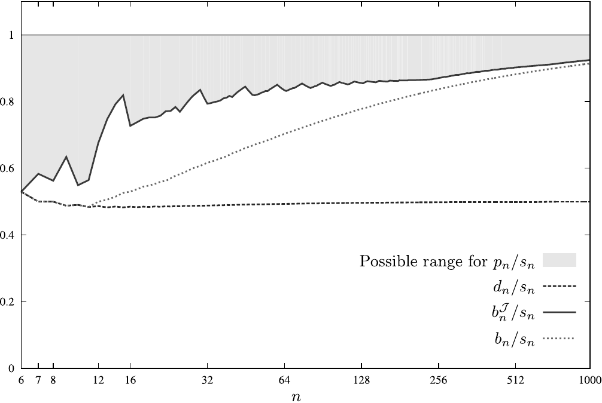
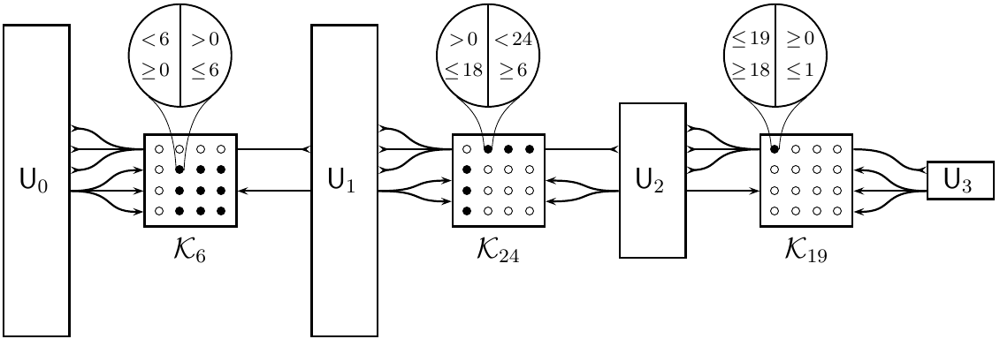

# New Lower Bounds and Asymptotics for the Cp-Rank

**Authors:** Immanuel M. Bomze, Werner Schachinger, Reinhard Ullrich 
**Affiliation:** University of Vienna, Austria 
**Journal:** *SIAM Journal on Matrix Analysis and Applications*, Vol. 36, No. 1, 2015, pp. 20-37 
**Source version:** November 1, 2014 
**Source PDF:** [bomze_schachinger_ullrich_2015_new_lower_bounds_cp_rank.pdf](bomze_schachinger_ullrich_2015_new_lower_bounds_cp_rank.pdf) 
**Exact LaTeX source:** [bomze_schachinger_ullrich_2015_new_lower_bounds_cp_rank.tex](bomze_schachinger_ullrich_2015_new_lower_bounds_cp_rank.tex)

> Complete text transcription based on the exact LaTeX source that generated the stored PDF. The formulas, theorem and
> equation numbers, tables, figures, and references were checked against the PDF. Journal running headers and page numbers
> are omitted.

## Abstract

Let $p_n$ denote the largest possible cp-rank of an $n\times n$ completely positive matrix. This matrix parameter has its
significance both in theory and applications, as it sheds light on the geometry and structure of the solution set of hard
optimization problems in their completely positive formulation. Known bounds for $p_n$ are
$s_n=\binom{n+1}{2}-4$, the current best upper bound, and the Drew-Johnson-Loewy (DJL) lower bound
$d_n=\left\lfloor\frac{n^2}{4}\right\rfloor$. The famous DJL conjecture (1994) states that $p_n=d_n$. Here we show
$p_n=\frac{n^2}{2}+\mathcal{O}(n^{3/2})=2d_n+\mathcal{O}(n^{3/2})$, and construct counterexamples to the DJL conjecture
for all $n\ge 12$ (for orders seven through eleven counterexamples were already given in [4]).

**Keywords:** Copositive optimization; completely positive matrices; nonnegative factorization. 
**1991 Mathematics Subject Classification:** Primary 15B48; Secondary 90C25, 15A23.

## 1. Introduction: Motivation, Notations

### 1.1. Motivation: The Cp-Cone and Copositive Optimization

In this article we consider completely positive matrices ${\mathsf M}$ and their cp-rank. An $n\times n$ matrix ${\mathsf M}$ is said to be *completely positive* if there exists a nonnegative (not necessarily square) matrix ${\mathsf V}$ such that ${\mathsf M}={\mathsf V}{\mathsf V}^\top$ ($\hbox{}^\top$ denotes transposition). This form of factorization is more restrictive than the general question of (exact) nonnegative matrix factorization mainly used in multivariate data analysis and machine learning [17], where ${\mathsf M}$ could be rectangular and the question is to find a factorization ${\mathsf M}= {\mathsf W}{\mathsf H}$ with rectangular matrices ${\mathsf W}$ and ${\mathsf H}$ of different sizes with no negative entries under some (e.g., rank) restrictions; see also, e.g., [3] for a widely popular approximate version of this concept. Here, complete positivity implies symmetry, positive-semidefiniteness and of course also nonnegativity of all entries. Typically, a completely positive matrix ${\mathsf M}={\mathsf V}{\mathsf V}^\top$ may have many such factorizations, and the *cp-rank* of ${\mathsf M}$, $\mbox{cpr }{\mathsf M}$, is the minimum number of columns in such a nonnegative factor ${\mathsf V}$. The set $\mathcal{CP}_n$ of all completely positive $n\times n$ matrices forms a proper cone (i.e., it is pointed, convex, and solid in the sense that it has nonempty interior). With respect to the *Frobenius* inner product $\langle {\mathsf A}, {\mathsf B}\rangle := \mathrm{trace}({\mathsf A}{\mathsf B}^\top)$, this cone is dual to the cone $\mathcal{COP}_n$ of symmetric *copositive matrices* of order $n$. An $n\times n$ matrix ${\mathsf S}$ is said to be copositive if $\mathbf x^\top{\mathsf S} \mathbf x\ge 0$ for every nonnegative vector $\mathbf x\in {\mathbb R}^n$.

Copositive and completely positive matrices are central in the rapidly evolving field of *copositive optimization* which links discrete and continuous optimization, and has numerous real-world applications. For recent surveys and structured bibliographies, we refer to [5; 6; 7; 10], and for a fundamental text book to [2].

A conic optimization problem of the form

$$
\inf \{ \langle{\mathsf C},{\mathsf X}\rangle : \langle {\mathsf A}_i ,{\mathsf X}\rangle = b_i ,\,  i \in \left\{1,\ldots, m\right \} , \, {\mathsf X}\in \mathcal{CP}_n \}
\tag{1}
$$

 is called *completely positive optimization problem*, but sometimes also *copositive optimization problem*, because the corresponding dual problem is given as

$$
\sup \left\{ \sum_{i=1}^m b_i y_i : \mathbf y\in {\mathbb R}^m ,\, {\mathsf S}= {\mathsf C}- \sum_{i=1}^m y_i{\mathsf A}_i \in \mathcal{COP}_n\right\} .
\tag{2}
$$

 Both problems consist in optimizing a linear form over a feasible set which can be described as the intersection of an affine subspace with one of the cones $\mathcal{COP}_n$ or $\mathcal{CP}_ n$. Hence at least one optimal solution (if this exists at all) must be contained in the boundary of these cones (unless the affine subspace is a singleton). Moreover, if strong duality for (1) and (2) holds, then there exists a primal-dual optimal pair $({\mathsf X}^*, {\mathsf S}^*)\in \mathcal{CP}_n\times \mathcal{COP}_n$ with $\langle{\mathsf S}^*, {\mathsf X}^*\rangle = 0$ or ${\mathsf S}^*\perp{\mathsf X}^*$, which relation can be exploited to obtain information about ${\mathsf X}^*$ if we have some knowledge on ${\mathsf S}^*$.

As remarked above, the conic primal-dual pair (1) and (2) serves to reformulate NP-hard optimization problems. Since everything else is linear, it is quite obvious that this approach shifts the whole complexity of the hard optimization problem into the (boundaries of the) cones $\mathcal{CP}_n$ and $\mathcal{COP}_n$. These boundaries are much more complex than the boundaries of the symmetric, self-dual cones used in polynomial-time conic optimization (such as Linear or Semidefinite Optimization, or optimization over the Minkowski cone). For instance, while the boundary of the semidefinite cone consists of matrices which are rank-deficient, the boundary of the completely positive cone $\mathcal{CP}_n$ also contains nonsingular matrices like the identity matrix, or matrices with all entries strictly positive like the all-ones matrix. So, neither linear constraints on the entries nor rank restrictions are sufficient to characterize or elucidate geometric properties of completely positive matrices. Therefore, the cp-rank was early recognized as a useful matrix parameter to shed more light upon the structure and the properties of completely positive matrices, and consequently has received considerable attention by researchers over the past decades.

Determining the maximum possible cp-rank of $n\times n$ completely positive matrices,

$$
p_n := \max\left\{\mbox{cpr }{\mathsf M}: {\mathsf M}\in \mathcal{CP}_n \right \} ,
$$

 is still an open problem for general $n$. It is known [2, Theorem 3.3] that $p_n=n$ if $n\le 4$, whereas this equality does no longer hold for $n\ge 5$. Let $d_n := \big\lfloor \frac{n^2}4\big\rfloor$ and $s_n := {n+1\choose 2}-4$. For $n\ge 5$, it is known that [15]

$$
d_n\le p_n \le s_n \, ,
\tag{3}
$$

 and that $d_n=p_n$ in case $n=5$ [16]. It is still unknown whether $d_6=p_6$.

The famous Drew-Johnson-Loewy (DJL) conjecture [9] is by now twenty years old. It states that $d_n=p_n$ is true for all $n\ge 5$, and some evidence in support of the DJL conjecture is found in [1; 8; 9; 14], see also [2, Section 3.3]. In a recent paper [4] it was shown that the DJL conjecture does not hold for orders $n$ ranging between seven and eleven by constructing examples which establish $p_n > d_n$.

### 1.2. Notations, Terminology and Paper Structure

Some notation and terminology: we abbreviate $[r\!:\!s]=\left\{r,r+1,\ldots ,s\right \}$ for integers $r\le s$. Let $\mathbf e_i\in {\mathbb R}^n$ be the $i$th column vector of the $n\times n$ identity matrix ${\mathsf I}_n$ and ${\pmb{\eta}_n}=\sum_{i=1}^n \mathbf e_i$. By ${{\mathsf E}_n}={\pmb{\eta}_n\pmb{\eta}_n^\top}$ we denote the $n\times n$ matrix of all ones. The nonnegative orthant is denoted by ${\mathbb R}^n_+$ which contains the standard simplex

$$
\Delta_n :=\left\{\mathbf x\in {\mathbb R}^n_+ : \pmb{\eta}_n^\top\mathbf x=1\right \} .
$$

 The matrix $\textup{Diag}(\mathbf y)$ is a diagonal matrix containing the entries of $\mathbf y$ on the diagonal. The Kronecker product is denoted by $\otimes$, and

$$
{\mathsf A}\oplus {\mathsf B}= \left [ \begin{array}{cc}{\mathsf A}&{\mathsf O}\\ {\mathsf O}^\top&{\mathsf B}\end{array}\right ]
$$

 means the direct sum of two square matrices. The letter ${\mathsf O}$ denotes the zero matrix of appropriate order. For a given $\mathbf x\in {\mathbb R}^k_+$, we define the *zero-norm* $\|\mathbf x\|_0$ as the number of positive entries $x_i>0$. Given a square matrix ${\mathsf S}\in  \mathcal{COP}_n$, we will use the phrase "zero(es) of ${\mathsf S}$" as an abbreviation of "zero(es) $\mathbf x\in \Delta_n$ of the quadratic form $\mathbf x^\top{\mathsf S}\mathbf x$"; this terminology differs slightly from that in [12] but is more convenient for our purposes.

The paper is organized as follows: In Section 2 we look at copositive matrices ${\mathsf S}$ with finitely many (but many) zeroes. Such matrices ${\mathsf S}$ lie on the boundary of the copositive cone, and elementary conic duality therefore tells us that there are nontrivial completely positive matrices ${\mathsf M}$ such that ${\mathsf M}\perp {\mathsf S}$. There is a strong connection between the zeroes of ${\mathsf S}$ and the cp-rank of ${\mathsf M}$, which is established through Lemma 2.2. Lemma 2.3 deals with cp-ranks of Khatri-Rao-like products (defined in Subsection 2.2) of matrices, which are necessary to make assertions about cp-ranks of high-order matrices. Combination of these auxiliary results culminates in Theorem 2.2 and in Corollary 2.1, which refutes the DJL conjecture for $n\ge 7$ and shows that the largest possible cp-rank $p_n$ lies asymptotically much closer to the upper bound $s_n$ than to the lower bound $d_n$.

Section 3 improves the lower bound for $p_n$ in the following way: in Section 2 only identity matrices are used as building blocks to construct matrices of higher order. This is sufficient to prove the assertions of Section 2, but better results can be obtained by using, as building blocks, matrices with cp-ranks that exceed their orders. Some of these building-block-matrices are new in the literature, some of them were already used in [4]. To further illustrate the advantage of the approach in this article, an explicit construction of a matrix of order twelve with high cp-rank is presented in an appendix. Note that in contrast to [4], for general order $n$, we need not construct the matrices explicitly but rather can invoke the existence result in Lemma 2.2.

## 2. Main Results

### 2.1. Rank, Two-Rank and Cp-Rank

Our method of finding matrices of high cp-rank builds upon two observations: (1) For certain matrices ${\mathsf M}\in\mathcal{CP}_n$, only multiples of vectors from a finite set $\{\mathbf u_1,\ldots,\mathbf u_k\}$ may appear as columns of a factor ${\mathsf V}$ in any factorization ${\mathsf M}={\mathsf V}{\mathsf V}^\top=\sum_{i=1}^ky_i\mathbf u_i\mathbf u_i^\top$, where $\mathbf y=[y_1,\ldots,y_k]^\top\in\mathbb{R}^k_+$. This property is shared by all matrices in a certain convex subcone of $\mathcal{CP}_n$ determined by the set $\{\mathbf u_1,\ldots,\mathbf u_k\}$. (2) This subcone contains matrices with cp-rank bounded below by a number computable from the set $\{\mathbf u_1,\ldots,\mathbf u_k\}$; so the cp-rank will be high if this number is large.\
This argument is made precise in the following results, starting from the observation in a more general context, that a convex cone spanned by some finite set of vectors of rank $r$ always contains a vector which is *not* a positive linear combination of *less than* $r$ vectors from this finite set; a converse of Caratheodory's theorem in some sense.

#### Lemma 2.1

*Let $V$ be a real vector space, let $\{\mathbf v_i:i\in[1\!:\! k]\}\subseteq V$ be a set of vectors of rank $r$, and define for $\mathbf y\in\mathbb{R}^k_+$

$$
P_\mathbf y:=\left\{\mathbf x\in\mathbb{R}^k_+:\sum_{i=1}^kx_i\mathbf v_i=\sum_{i=1}^ky_i\mathbf v_i \right\}.
$$

 Then there exists $\mathbf y\in\mathbb{R}^k_+$ such that

$$
\min_{\mathbf x\in P_\mathbf y}\|\mathbf x\|_0\, =\, r\, .
$$

*

*Proof.* First we show that $\min_{\mathbf x\in P_\mathbf y}\|\mathbf x\|_0 \le r$ for all $\mathbf y\in {\mathbb R}^n_+$ (this is basically Caratheodory's theorem, we include the short argument for the readers' convenience). To this end, choose an $\mathbf x\in P_\mathbf y$ with $m=\|\mathbf x\|_0$ minimal over $P_\mathbf y$. We assume without loss of generality $x_i>0$ for all $i\le m$. If $m>r$ would hold, then there were $\mu_i\in {\mathbb R}$ with $\sum\limits_{i=1}^m \mu_i\mathbf v_i =\mathbf o$ with some $\mu_i > 0$. Further without loss of generality we assume (for some $s\in [1\!:\!m]$) that $\mu_i\le 0$ for $i<s$ while $\mu_i > 0$ and $\frac {x_i}{\mu_i} \ge \frac {x_m}{\mu_m} > 0$ for all $i\in [s\!:\!m]$. Define $z_i := x_i - \frac {x_m}{\mu_m}\mu_i \ge0$ for all $i\in[1\!:\!m]$ and $z_i:=0$ for $i>m$, so that $\|\mathbf z\|_0 \le m-1$ (as also $z_m=0)$. But straightforward calculations show $\sum_i z_i\mathbf v_i = \sum_i x_i\mathbf v_i$, so $\mathbf z\in P_\mathbf y$, in contradiction to the assumptions. Next we use the fact that a vector space over an infinite scalar field is never the union of a finite number of proper subspaces, see [11, p.211]. Define the cone $C:=\left\{\sum_{i=1}^m y_i\mathbf v_i:\mathbf y\in\mathbb{R}^m_+\right\}\subseteq V$ and observe that the linear subspace $L=C-C$ is $r$-dimensional. If we had $\min\limits_{\mathbf x\in P_\mathbf y}\|\mathbf x\|_0<r$ for all $\mathbf y\in \mathbb{R}^m_+$, then $C$ (and thus also $L$) would have to be a subset of

$$
U:=\bigcup_{\substack{I\subseteq[1 : m] \\ |I|\le r-1}}
\left\{\sum_{i=1}^m x_i\mathbf v_i:\mathbf x\in\mathbb{R}^m , \, {x_i=0 \mbox{ for all }i\in [1\!:\!m]\setminus I}\right\},
$$

 which is impossible, since $U$ is a union of finitely many proper subspaces of $L$ (of dimension at most $r-1$). $\square$

For a matrix ${\mathsf A}=[\mathbf a_1,\ldots,\mathbf a_k]^\top$ we let ${\mathsf A}^{\langle 2\rangle}:=[\mathbf a_1\otimes\mathbf a_1,\ldots,\mathbf a_k\otimes\mathbf a_k]^\top$, and define the *two-rank* of ${\mathsf A}$ as

$$
\mbox{rank}^{(2)}\, {\mathsf A}:=\mbox{rank\,}{\mathsf A}^{\langle 2\rangle}\, .
$$

 For illustration, denote by ${\mathsf B}_i = \mathbf e_i\mathbf e_i^\top\in {\mathbb R}^{n\times n}$. Then ${\mathsf I}_n^{\langle 2\rangle} = [{\mathsf B}_1 | \cdots | {\mathsf B}_n]$. Note that always $\mbox{rank}^{(2)}\, {\mathsf A}\ge\mbox{rank\,}{\mathsf A}$ with equality if $\mbox{rank\,}{\mathsf A}= k$, i.e., if ${\mathsf A}$ itself has full row rank, then also ${\mathsf A}^{\langle 2\rangle}$ has (the same) full row rank. Furthermore we note for later use the trivial relations $\mbox{rank}^{(2)}\, (\alpha {\mathsf A}) = \mbox{rank}^{(2)}\, {\mathsf A}$ if $\alpha>0$,

$$
\mbox{rank}^{(2)}\,
\bigg[   { {\mathsf A}\atop {\mathsf B}}\bigg]
\ge \mbox{rank}^{(2)}\, {\mathsf B}\, ,
$$

 and a slightly less trivial one: $\mbox{rank}^{(2)}\, [{\mathsf A}| {\mathsf B}]\ge \mbox{rank}^{(2)}\, {\mathsf B}$.

#### Lemma 2.2

*Let ${\mathsf U}=[\mathbf u_1,\ldots,\mathbf u_k]^\top\in\mathbb{R}^{k\times n}_+$, where $\{\mathbf u_1,\ldots,\mathbf u_k\}$ are all the zeroes of some copositive matrix ${\mathsf S}\in\mathcal{COP}_n$.\
Then there exists a diagonal matrix ${\mathsf D}=\textup{Diag}(\mathbf y)$ with $\mathbf y\in\mathbb{R}^k_+$ such that the completely positive matrix ${\mathsf M}={\mathsf U}^\top{\mathsf D}{\mathsf U}$ satisfies $\mbox{cpr }{\mathsf M}= \mbox{rank}^{(2)}\, {\mathsf U}$.*

*Proof.* Consider any ${\mathsf M}={\mathsf U}^\top\textup{Diag}(\mathbf y){\mathsf U}$. We observe that $\langle {\mathsf M},{\mathsf S}\rangle =0$, i.e., that ${\mathsf M}\perp{\mathsf S}$ holds. Therefore by [4, Lemma 2.1] we conclude that any cp-factorization of ${\mathsf M}$ is of the form

$$
{\mathsf M}={\mathsf U}^\top\textup{Diag}(\mathbf x){\mathsf U}=\sum_{i=1}^kx_i\mathbf u_i\mathbf u_i^\top
$$

 with some $\mathbf x\in\mathbb{R}^k_+$. For any $\mathbf x$ corresponding to a minimal cp-factorization of ${\mathsf M}$ we then have $\mbox{cpr }{\mathsf M}=\|\mathbf x\|_0$. Since the rank of the set $\{\mathbf u_i\mathbf u_i^\top:i\in[1\!:\!k]\}$ equals $\mbox{rank}^{(2)}\,{\mathsf U}$, as is seen by identifying $\mathbf u_i\mathbf u_i^\top$ with $\mathbf u_i\otimes\mathbf u_i={\rm vec}(\mathbf u_i\mathbf u_i^\top)$, we can invoke Lemma 2.1 to obtain the desired conclusion. $\square$

### 2.2. Direct Sums and Khatri-Rao-Like Products

For matrices ${\mathsf U}\in\mathbb{R}^{k\times n}$ and ${\mathsf V}\in\mathbb{R}^{\ell\times m}$ we construct the following $k\ell\times (n+m)$-matrix, denoted as ${\mathsf U}{}\mathbin{\otimes\!\oplus}{}{\mathsf V}=\left[{\mathsf U}\otimes\pmb{\eta}_\ell |  \pmb{\eta}_k\otimes {\mathsf V}\right]$; recall that $\pmb{\eta}_d$ denotes the all ones vector in $\mathbb{R}^d$. Note that both ${\mathsf U}\otimes{\mathsf V}$ and ${\mathsf U}^{\langle 2\rangle}{}\mathbin{\otimes\!\oplus}{}{\mathsf V}^{\langle 2\rangle}$ are, up to permutations of columns, submatrices of $({\mathsf U}{}\mathbin{\otimes\!\oplus}{}{\mathsf V})^{\langle 2\rangle}$, and all these matrices have the same number $k\ell$ of rows. Further note that using the Khatri-Rao product $\star$, see. e.g. [13], we can write

$$
{\mathsf U}{}\mathbin{\otimes\!\oplus}{}{\mathsf V}=[{\mathsf U}|\pmb{\eta}_k]\star [\pmb{\eta}_\ell | {\mathsf V}]\quad\mbox{and}\quad ({\mathsf U}^{\langle 2\rangle})^\top= [\mathbf u_1 | \mathbf u_2 | \cdots | \mathbf u_k] \star [\mathbf u_1 | \mathbf u_2 | \cdots | \mathbf u_k] \, .
$$

 Recall that a matrix ${\mathsf A}\in\mathbb{R}^{k\times n}_{+}$ is *row-stochastic* if ${\mathsf A}\pmb{\eta}_n= \pmb{\eta}_k$ holds.

#### Lemma 2.3

*Let $\alpha>0$ and $\beta >0$ and consider two row-stochastic matrices ${\mathsf U}\in\mathbb{R}^{k\times n}$ and ${\mathsf V}\in\mathbb{R}^{\ell\times m}$. Then for the $k\ell\times (n+m)$-matrix ${\mathsf W}=(\alpha{\mathsf U}){}\mathbin{\otimes\!\oplus}{}(\beta{\mathsf V})$ and the $(k+\ell)\times (n+m)$-matrix $\widetilde {\mathsf W}= {\mathsf U}\oplus {\mathsf V}$ we have*

1.  *$\mbox{rank\,}{\mathsf W}=\mbox{rank\,}{\mathsf U}+\mbox{rank\,}{\mathsf V}-1$ and $\frac 1{\alpha +\beta}{\mathsf W}$ is row-stochastic,*

2.  *$\mbox{rank}^{(2)}\, {\mathsf W}\ge \mbox{rank\,}{\mathsf U}\,\mbox{rank\,}{\mathsf V}+\mbox{rank}^{(2)}\, {\mathsf U}-\mbox{rank\,}{\mathsf U}+\mbox{rank}^{(2)}\, {\mathsf V}-\mbox{rank\,}{\mathsf V}$,*

3.  *$\mbox{rank\,}\widetilde {\mathsf W}=\mbox{rank\,}{\mathsf U}+\mbox{rank\,}{\mathsf V},~\mbox{rank}^{(2)}\, \widetilde {\mathsf W}=\mbox{rank}^{(2)}\, {\mathsf U}+\mbox{rank}^{(2)}\, {\mathsf V}$\
    and $\widetilde {\mathsf W}$ is row-stochastic.*

4.  *If the rows of ${\mathsf U}$ (resp. ${\mathsf V}$) are all the zeroes of some ${\mathsf S}_{\mathsf U}\in\mathcal{COP}_n$ (resp. ${\mathsf S}_{\mathsf V}\in\mathcal{COP}_m$), then there are copositive matrices $\big\{ {\mathsf S},\widetilde {\mathsf S}\big\}\subset\mathcal{COP}_{n+m}$ such that the rows of $\frac 1{\alpha +\beta}{\mathsf W}$ are all the zeroes of ${\mathsf S}$ and the rows of $\widetilde {\mathsf W}$ are all the zeroes of $\widetilde {\mathsf S}$.*

*Proof.* It is clear that $\frac 1{\alpha +\beta}{\mathsf W}$ is row-stochastic. Let $r_{\mathsf U}:=\mbox{rank\,}{\mathsf U}$ and $r_{\mathsf V}:=\mbox{rank\,}{\mathsf V}$. Since the rank of the first $n$ (resp. last $m$) columns of ${\mathsf W}$ is $r_{\mathsf U}$ (resp. $r_{\mathsf V}$), $\mbox{rank\,}{\mathsf W}$ can be smaller than $r_{\mathsf U}+r_{\mathsf V}$ only if some nonzero linear combination of the first $n$ columns of ${\mathsf W}$ equals some linear combination of the last $m$ columns of ${\mathsf W}$.

So assume that there are $\mathbf x\in\mathbb{R}^n$ and $\mathbf y\in\mathbb{R}^m$, such that $({\mathsf U}\otimes\pmb{\eta}_\ell)\mathbf x=({\mathsf U}\otimes\pmb{\eta}_\ell)(\mathbf x\otimes1)={\mathsf U}\mathbf x\otimes\pmb{\eta}_\ell$ and $(\pmb{\eta}_k\otimes {\mathsf V})\mathbf y=(\pmb{\eta}_k\otimes {\mathsf V})(1\otimes\mathbf y)=\pmb{\eta}_k\otimes {\mathsf V}\mathbf y$ are both equal to $\mathbf w\in\mathbb{R}^{k\ell}\setminus\{\mathbf o\}$. From $\mathbf w={\mathsf U}\mathbf x\otimes\pmb{\eta}_\ell$ we deduce that $w_i=w_j$ if $\lceil\tfrac i\ell\rceil=\lceil\tfrac j\ell\rceil$, and from $\mathbf w=\pmb{\eta}_k\otimes {\mathsf V}\mathbf y$ we deduce $w_i=w_j$ if $i\equiv j \textup{ mod } \ell$, and the only nonzero vectors satisfying both conditions are of the form $\mathbf w=c\,\pmb{\eta}_{k\ell}$ with $c\ne0$. Therefore $\mbox{rank\,}{\mathsf W}=r_{\mathsf U}+r_{\mathsf V}-1$, which concludes the proof of (a).\
Next we denote $\rho_{\mathsf U}=\mbox{rank}^{(2)}\,{\mathsf U}$ and $\rho_{\mathsf V}=\mbox{rank}^{(2)}\, {\mathsf V}$, and assume that the rows of ${\mathsf U}$ and ${\mathsf V}$ are arranged in a way such that the matrices $\widetilde {\mathsf U}={\mathsf U}_{[1:r_{\mathsf U}]\times[1:n]}$, $\widetilde {\mathsf V}={\mathsf V}_{[1:r_{\mathsf V}]\times[1:m]}$, $\widehat {\mathsf U}={\mathsf U}_{[r_{\mathsf U}+1:\rho_{\mathsf U}]\times[1:n]}$ and $\widehat {\mathsf V}={\mathsf V}_{[r_{\mathsf V}+1:\rho_{\mathsf V}]\times[1:m]}$ satisfy

$$
\mbox{rank\,}\widetilde {\mathsf U}=r_{\mathsf U},\ \mbox{rank\,}\widetilde {\mathsf V}=r_{\mathsf V},\
\mbox{rank}^{(2)}\, \bigg[   { \widetilde {\mathsf U}\atop    \widehat {\mathsf U}}\bigg] =\rho_{\mathsf U},\
\mbox{rank}^{(2)}\, \bigg[   { \widetilde {\mathsf V}\atop    \widehat {\mathsf V}}\bigg] =\rho_{\mathsf V}.
$$

 Moreover let $\mathbf u_1=\mathbf e_1^\top{\mathsf U}$ and $\mathbf v_1=\mathbf e_1^\top{\mathsf V}$ be the first rows of ${\mathsf U}$ and ${\mathsf V}$. Now consider the following $(r_{\mathsf U}r_{\mathsf V}+\rho_{\mathsf U}-r_{\mathsf U}+\rho_{\mathsf V}-r_{\mathsf V})\times(n+m)$-submatrix of ${\mathsf W}':={\mathsf W}\left[            \begin{array}{cc}              \!\frac 1\alpha{\mathsf I}_n\! &\! {\mathsf O}\! \\              \!{\mathsf O}\! &\! \frac 1\beta{\mathsf I}_m\! \\            \end{array}          \right]$:

$$
\overline {\mathsf W}=\left[
           \begin{array}{cc}
             \widetilde {\mathsf U}\otimes\pmb{\eta}_{r_{\mathsf V}} & \pmb{\eta}_{r_{\mathsf U}}\otimes\widetilde {\mathsf V}\\
             \mathbf u_1\otimes\pmb{\eta}_{\rho_{\mathsf V}-r_{\mathsf V}} & \widehat {\mathsf V}\\
             \widehat {\mathsf U}&\pmb{\eta}_{\rho_{\mathsf U}-r_{\mathsf U}}\otimes\mathbf v_1 \\
           \end{array}
         \right]=
         \left[
           \begin{array}{c}
             \widetilde {\mathsf U}{}\mathbin{\otimes\!\oplus}{}\widetilde {\mathsf V}\\
             \mathbf u_1{}\mathbin{\otimes\!\oplus}{}\widehat {\mathsf V}\\
             \widehat {\mathsf U}{}\mathbin{\otimes\!\oplus}{}\mathbf v_1 \\
           \end{array}
         \right].
$$

 Noting that $\widetilde {\mathsf U}\otimes\widetilde {\mathsf V}$ is a submatrix of $(\widetilde {\mathsf U}{}\mathbin{\otimes\!\oplus}{}\widetilde {\mathsf V})^{\langle 2\rangle}$, where the latter has $r_{\mathsf U}r_{\mathsf V}$ rows, we deduce $\mbox{rank\,}(\widetilde {\mathsf U}{}\mathbin{\otimes\!\oplus}{}\widetilde {\mathsf V})^{\langle 2\rangle}= r_{\mathsf U}r_{\mathsf V}$ from

$$
r_{\mathsf U}r_{\mathsf V}=\mbox{rank\,}\widetilde {\mathsf U}\,\mbox{rank\,}\widetilde {\mathsf V}=\mbox{rank\,}(\widetilde {\mathsf U}\otimes\widetilde {\mathsf V})\le\mbox{rank\,}(\widetilde {\mathsf U}{}\mathbin{\otimes\!\oplus}{}\widetilde {\mathsf V})^{\langle 2\rangle}\le r_{\mathsf U}r_{\mathsf V}.
$$

 Next consider the submatrix $\left[            \begin{array}{c}             \!\widetilde{\mathsf U}^{\langle 2\rangle}{}\mathbin{\otimes\!\oplus}{}\widetilde{\mathsf V}^{\langle 2\rangle}\! \\             \!\mathbf u_1^{\langle 2\rangle}{}\mathbin{\otimes\!\oplus}{}\widehat{\mathsf V}^{\langle 2\rangle}\! \\              \!\widehat{\mathsf U}^{\langle 2\rangle}{}\mathbin{\otimes\!\oplus}{}\mathbf v_1^{\langle 2\rangle}\! \\            \end{array}          \right]$ of $\overline {\mathsf W}{}^{\langle 2\rangle}\!=\!\left[            \begin{array}{c}             \! (\widetilde {\mathsf U}{}\mathbin{\otimes\!\oplus}{}\widetilde {\mathsf V})^{\langle 2\rangle}\! \\             \! (\mathbf u_1{}\mathbin{\otimes\!\oplus}{}\widehat {\mathsf V})^{\langle 2\rangle}\! \\             \! (\widehat {\mathsf U}{}\mathbin{\otimes\!\oplus}{}\mathbf v_1)^{\langle 2\rangle}\! \\            \end{array}          \right]$. If for $\mathbf x\in\mathbb{R}^{r_{\mathsf U}r_{\mathsf V}}$, $\mathbf y\in\mathbb{R}^{\rho_{\mathsf V}- r_{\mathsf V}}$, $\mathbf z\in\mathbb{R}^{\rho_{\mathsf U}- r_{\mathsf U}}$ we have $\mathbf o=[\mathbf x^\top,\mathbf y^\top,\mathbf z^\top]\overline {\mathsf W}{}^{\langle 2\rangle}$, then also

$$
\begin{align*}
\mathbf o={}&\mathbf x^\top(\widetilde{\mathsf U}^{\langle 2\rangle}{}\mathbin{\otimes\!\oplus}{}\widetilde{\mathsf V}^{\langle 2\rangle})+\mathbf y^\top(\mathbf u_1^{\langle 2\rangle}{}\mathbin{\otimes\!\oplus}{}\widehat{\mathsf V}^{\langle 2\rangle})+\mathbf z^\top(\widehat{\mathsf U}^{\langle 2\rangle}{}\mathbin{\otimes\!\oplus}{}\mathbf v_1^{\langle 2\rangle})\\
={}&\mathbf x^\top(\widetilde{\mathsf U}^{\langle 2\rangle}{}\mathbin{\otimes\!\oplus}{}\widetilde{\mathsf V}^{\langle 2\rangle})+(\mathbf y^\top\pmb{\eta}_{\rho_{\mathsf V}-r_{\mathsf V}}\mathbf u_1^{\langle 2\rangle}){}\mathbin{\otimes\!\oplus}{}(\mathbf y^\top\widehat{\mathsf V}^{\langle 2\rangle})
+(\mathbf z^\top\widehat{\mathsf U}^{\langle 2\rangle}){}\mathbin{\otimes\!\oplus}{}(\mathbf z^\top\pmb{\eta}_{\rho_{\mathsf U}-r_{\mathsf U}}\mathbf v_1^{\langle 2\rangle})
\end{align*}
$$

 must hold. Therefore $\mathbf y^\top\widehat{\mathsf V}^{\langle 2\rangle}$ belongs to the row space of $\widetilde{\mathsf V}^{\langle 2\rangle}$, and $\mathbf z^\top\widehat{\mathsf U}^{\langle 2\rangle}$ belongs to the row space of $\widetilde{\mathsf U}^{\langle 2\rangle}$, implying $\mathbf y=\mathbf o$ and $\mathbf z=\mathbf o$, because, by assumption, the rows of both $\displaystyle \bigg[   { \widetilde {\mathsf U}^{\langle 2\rangle} \atop    \widehat {\mathsf U}^{\langle 2\rangle} }\bigg]$ and $\displaystyle\bigg[   { \widetilde {\mathsf V}^{\langle 2\rangle} \atop    \widehat {\mathsf V}^{\langle 2\rangle} }\bigg]$ are linearly independent. Then by linear independence of the first $r_{\mathsf U}r_{\mathsf V}$ rows of $\overline {\mathsf W}{}^{\langle 2\rangle}$ also $\mathbf x=\mathbf o$ must hold. Thus $\mbox{rank}^{(2)}\, {\mathsf W}{=\mbox{rank}^{(2)}\, {\mathsf W}'}\ge\mbox{rank}^{(2)}\,\overline {\mathsf W}=r_{\mathsf U}r_{\mathsf V}+\rho_{\mathsf U}-r_{\mathsf U}+\rho_{\mathsf V}-r_{\mathsf V}$, which completes the proof of (b).\
For the proof of (c) we use that for any matrices ${\mathsf A},{\mathsf B}$ we have $\mbox{rank\,}({\mathsf A}\oplus{\mathsf B})=\mbox{rank\,}{\mathsf A}+\mbox{rank\,}{\mathsf B}$, and that the matrix $({\mathsf A}\oplus{\mathsf B})^{\langle 2\rangle}$ and its submatrix ${\mathsf A}^{\langle 2\rangle}\oplus{\mathsf B}^{\langle 2\rangle}$ have the same rank. Furthermore $\widetilde {\mathsf W}\pmb{\eta}_{n+m}=\pmb{\eta}_{k+\ell}$ is easily checked.\
Finally, for the proof of (d) we define matrices

$$
{\mathsf S}:=\left [
          \begin{array}{cc}
            {\mathsf S}_{\mathsf U}+\frac{\beta}{\alpha}{\mathsf E}_n&-\pmb{\eta}_n\pmb{\eta}_m^\top\\
            -\pmb{\eta}_m\pmb{\eta}_n^\top& {\mathsf S}_{\mathsf V}+\frac{\alpha}{\beta}{\mathsf E}_m\\
          \end{array}
        \right ],\quad\textup{ and }\quad
\widetilde{\mathsf S}:=\left [
          \begin{array}{cc}
            {\mathsf S}_{\mathsf U}&\pmb{\eta}_n\pmb{\eta}_m^\top\\
            \pmb{\eta}_m\pmb{\eta}_n^\top&{\mathsf S}_{\mathsf V}\\
          \end{array}
        \right ].
$$

 Take any $\mathbf z=[\lambda\mathbf x^\top,(1-\lambda)\mathbf y^\top]^\top$ with $(\mathbf x,\mathbf y)\in\Delta_n\times\Delta_m$ and $0\le\lambda\le1$. Then

$$
\mathbf z^\top{\mathsf S}\mathbf z=\lambda^2\mathbf x^\top{\mathsf S}_{\mathsf U}\,\mathbf x+(1-\lambda)^2\mathbf y^\top{\mathsf S}_{\mathsf V}\,\mathbf y
+ \frac{(\alpha+\beta)^2}{\alpha\beta}\left(\lambda-\frac{\alpha}{\alpha+\beta}\right)^2\ge 0\, ,
$$

 with equality if and only if $\lambda=\frac{\alpha}{\alpha+\beta}$, and $\mathbf x^\top$ (resp. $\mathbf y^\top$) is one of the rows of ${\mathsf U}$ (resp. ${\mathsf V}$), i.e. if and only if $\mathbf z^\top$ is one of the rows of $\frac1{\alpha+\beta} {\mathsf W}$.\
Furthermore, with $\mathbf z$ as above, we have

$$
\mathbf z^\top\widetilde{\mathsf S}\mathbf z=\lambda^2\mathbf x^\top{\mathsf S}_{\mathsf U}\,\mathbf x+(1-\lambda)^2\mathbf y^\top{\mathsf S}_{\mathsf V}\,\mathbf y
+ 2\lambda (1-\lambda)\ge 0\, ,
$$

 with equality if and only if $\lambda\in\{0,1\}$, and, depending on the value of $\lambda$, either $\mathbf x^\top$ is one of the rows of ${\mathsf U}$ or $\mathbf y^\top$ is one of the rows of ${\mathsf V}$, i.e. if and only if $\mathbf z^\top$ is one of the rows of $\widetilde {\mathsf W}$. $\square$

### 2.3. Zeroes and Characteristic Triples

We now define the set $\mathcal{Z}$ as follows: denote by $\mathcal{R}$ all row-stochastic matrices and let

$$
\mathcal{R}_0 :=\left\{{\mathsf U}\in\mathcal{R} : \mbox{the rows of {\mathsf U} are all the zeroes of some copositive matrix}\right \}
$$

 as well as $\mathcal{Z} :=\left\{\alpha {\mathsf U}: \alpha >0\, , \; {\mathsf U}\in\mathcal{R}_0\right \}$.

The matrices in $\mathcal{Z}$ are exactly those that are needed for applications of Lemma 2.2. Moreover, with Lemma 2.3 we have a means of constructing new elements of $\mathcal{Z}$ from known ones: $\left\{{\mathsf U},{\mathsf V}\right \} \subset\mathcal{Z}\Rightarrow{\mathsf U}{}\mathbin{\otimes\!\oplus}{}{\mathsf V}\in\mathcal{Z}$. For our purpose of showing the existence of matrices of large cp-rank, only certain characteristics of a matrix ${\mathsf U}\in\mathcal{Z}$ are important: (a) the number of columns of ${\mathsf U}$ (say $n$); (b) the $\mbox{rank\,}{\mathsf U}$ (say $r$); and (c) an integer lower bound $\rho$ for $\mbox{rank}^{(2)}\,{\mathsf U}$ (where we require $\rho\ge\mbox{rank\,}{\mathsf U}$); these three integers we collect in a *characteristic triple*

$$
{c =({c_1},{c_2},{c_3}) := (n,r,\rho)\, .}
$$

 Some ${\mathsf U}\in\mathcal{Z}$ may have more than one characteristic triple, namely if and only if $\mbox{rank\,}{\mathsf U}< \mbox{rank}^{(2)}\, {\mathsf U}$. By abuse of notation, we define a binary operation on any two characteristic triples,

$$
(n_1,r_1,\rho_1){}\mathbin{\otimes\!\oplus}{}(n_2,r_2,\rho_2):=(n_1+n_2,r_1+r_2-1,r_1r_2+\rho_1-r_1+\rho_2-r_2)\, ;
\tag{4}
$$

 note that $1\le r_1+r_2-1\le r_1r_2+\rho_1-r_1+\rho_2-r_2$ if both $1\le r_1\le\rho_1$ and $1\le r_2\le\rho_2$ holds. The operation ${}\mathbin{\otimes\!\oplus}{}$ obviously obeys the commutative and (only a little less obvious) the associative law.[^1] Clearly also the binary operation $(n_1,r_1,\rho_1)\oplus(n_2,r_2,\rho_2):=(n_1+n_2,r_1+r_2,\rho_1+\rho_2)$ is associative and commutative. It follows from Lemma 2.3 that if $c,c'$ are characteristic triples of ${\mathsf U},{\mathsf V}\in\mathcal{Z}$, then $c{}\mathbin{\otimes\!\oplus}{}c'$ is a characteristic triple of ${\mathsf U}{}\mathbin{\otimes\!\oplus}{}{\mathsf V}$ and $c\oplus c'$ is a characteristic triple of ${\mathsf U}\oplus{\mathsf V}$.\
Our strategy is to fix a subset $\mathcal{U}\subseteq\mathcal{Z}$ together with a set $C$ of characteristic triples, containing one characteristic triple for each ${\mathsf U}\in\mathcal{U}$, and construct the ${}\mathbin{\otimes\!\oplus}{}$-semigroups $\bar{\mathcal{U}}$ and $\bar C$ generated by $\mathcal{U}$ and $C$. From the latter, we fix the first component, i.e., require ${c_1}=n$, the column number of some ${\mathsf U}\in{\bar{\mathcal{U}}}$ accordingly picked, and search a triple $c\in {\bar C}$ with a large third component ${c_3} \le \mbox{rank}^{(2)}\, {\mathsf U}$. There are no limitations on the second component ${c_2} = \mbox{rank\,}{\mathsf U}$, and typically the chosen ${\mathsf U}$ will not have full column rank.

We start considering semigroups generated by a single ${\mathsf U}\in\mathcal{Z}$, and therefore define ${\mathsf U}^{{\scriptstyle{{}\mathbin{\otimes\!\oplus}{}}}1}={\mathsf U}$ and inductively ${\mathsf U}^{{\scriptstyle{{}\mathbin{\otimes\!\oplus}{}}}(n+1)}={\mathsf U}{}\mathbin{\otimes\!\oplus}{}{\mathsf U}^{{\scriptstyle{{}\mathbin{\otimes\!\oplus}{}}}n}$ for $n\ge1$. Similarly we define $c^{{\scriptstyle{{}\mathbin{\otimes\!\oplus}{}}}n}$, where $c$ is a characteristic triple.

#### Theorem 2.1

*Let ${\mathsf U}\in\mathcal{Z}$, and $(n,r,\rho)$ be (one of) its characteristic triple(s). Then for any $i\in\mathbb{N}$ there is a matrix ${\mathsf M}\in\mathcal{CP}_{ni}$ satisfying

$$
\mbox{cpr }{\mathsf M}\ge\tfrac12(r-1)^2i(i-1)+(\rho-1)i+1\, .
$$

*

*Proof.* The result follows from

$$
(n,r,\rho)^{{\scriptstyle{{}\mathbin{\otimes\!\oplus}{}}}i}=(ni,(r-1)i+1,\tfrac12(r-1)^2i(i-1)+(\rho-1)i+1)\, ,
$$

 which is easily proved by induction, using (4). $\square$

For any $n\ge1$ we have ${\mathsf I}_n\in\mathcal{Z}$, since the rows of ${\mathsf I}_n$ are the only zeroes of the copositive matrix ${\mathsf E}_n-{\mathsf I}_n$. The (unique) characteristic triple of ${\mathsf I}_n$ is $(n,n,n)$. Putting ${\mathsf U}={\mathsf I}_n$ in Theorem 2.1, we see $\mbox{rank}^{(2)}\, {\mathsf I}_n^{{\scriptstyle{{}\mathbin{\otimes\!\oplus}{}}}i} \ge \rho_{i,n}$ where

$$
\rho_{i,n}:=\tfrac12(n-1)^2i(i-1)+(n-1)i+1=\tfrac{(ni)^2}{2}-ni(i+\tfrac n2)+2ni+\tfrac{i(i-3)}{2}+1\, .
\tag{5}
$$

 Next, counterexamples to the DJL-conjecture for infinitely many $n$, and in particular for $n=12$, are presented.

#### Example 2.1

*$(p_{12}\ge37>36=d_{12})$ We have $\mbox{rank}^{(2)}\,{\mathsf I}_4^{{\scriptstyle{{}\mathbin{\otimes\!\oplus}{}}}3}\ge37$ by (5); more precisely, we have $(4,4,4)^{{\scriptstyle{{}\mathbin{\otimes\!\oplus}{}}}3}=(12,10,37)$ and thus there is a completely positive matrix of order 12, rank 10 and cp-rank at least $37$, which may be written as $({\mathsf I}_4^{{\scriptstyle{{}\mathbin{\otimes\!\oplus}{}}}3})^\top\textup{Diag}(\mathbf x)({\mathsf I}_4^{{\scriptstyle{{}\mathbin{\otimes\!\oplus}{}}}3})$ for some $\mathbf x\in\mathbb{R}_+^{64}$. An explicit construction will be given in Appendix A.\
Similarly we obtain $p_{4i} \ge\rho_{i,4} = \tfrac9{32}(4i)^2-\tfrac38(4i)+1  > \lfloor\tfrac14(4i)^2\rfloor =d_{4i}$ for $i\ge3$ and $p_{3n}  \ge \rho_{3,n}  =  \tfrac13(3n)^2-3n+1   >  \lfloor\tfrac14(3n)^2\rfloor  =  d_{3n}$ for $n\ge4$.*

We continue this argument and maximize, for fixed $N:=ni$, the second term in formula (5) for $\rho_{i,n}$, namely $-ni(i+\tfrac n2)$, with the result $n^*=\sqrt{2N}, i^*=\sqrt{\frac N2}$, and

$$
\rho_{i^*,n^*}={\frac{N^2}2-N\sqrt{2N}+\frac 94N-\frac 34\sqrt{2N}+1}\,
\tag{6}
$$

 which yields good lower bounds for the cp-rank if both $i^*$ and $n^*$ are integers, i.e., if $n=2m$ (and $N=2m^2$) for $m\in \mathbb{N}$. We will re-encounter the three leading terms of (6) in the estimate (11) of Corollary 2.1 below; for an improvement see (13) in Section 3.

Still better lower bounds could probably be obtained by considering products of possibly different characteristic triples (just before we only considered powers of a single characteristic triple). Let $S$ be the semigroup generated by the set of characteristic triples $\{(i,i,i):i\in\mathbb{N}\}$. So any $c\in S$ is a finite ${}\mathbin{\otimes\!\oplus}{}$-product of these $(i,i,i)$, allowing repetition of factors, and ${c_1-c_2}+1$ is the number of factors, counted with multiplicity. The factorization need however not be unique, as is seen from the example $(12,10,30)=(1,1,1){}\mathbin{\otimes\!\oplus}{}(5,5,5){}\mathbin{\otimes\!\oplus}{}(6,6,6)=(2,2,2){}\mathbin{\otimes\!\oplus}{}(3,3,3){}\mathbin{\otimes\!\oplus}{}(7,7,7)$. The best lower bound for $p_n$ that we can get from $S$ is then

$$
b_n:=\max \left\{{c_3 : c_1=n}\, ,\,\ c\in S\right \} \, .
\tag{7}
$$

#### Lemma 2.4

*The maximum $b_n$ is for some $j\ge1$ attained at a characteristic triple $c$ of the form $c=(i_1,i_1,i_1){}\mathbin{\otimes\!\oplus}{}\cdots{}\mathbin{\otimes\!\oplus}{}(i_j,i_j,i_j),$ where $i_1\le\cdots\le i_j$ and $i_j-i_1\le1$.*

*Proof.* There is nothing to show if $j=1$. So assume $j\ge 2$ and $i_j-i_1>1$. We use the following property holding for any three characteristic triples $c,c',c''$:

$$
{\mbox{if}\quad c_1=c_1'\, , \; c_2=c_2' \quad\mbox{and}\quad c_3 < c_3'\, ,\quad\mbox{ then }\quad
(c{}\mathbin{\otimes\!\oplus}{}c'')_3 <(c'{}\mathbin{\otimes\!\oplus}{}c'')_3\, .}
\tag{8}
$$

 By assumption that $j\ge 2$ with $i_j-i_1>1$, the maximizing triple can be written as $c=(i_1,i_1,i_1){}\mathbin{\otimes\!\oplus}{}(i_j,i_j,i_j){}\mathbin{\otimes\!\oplus}{}c''$ for some characteristic triple $c''$ (which is not there if $j=2$). We compare $c$ with $\tilde c:=(i_1+1,i_1+1,i_1+1){}\mathbin{\otimes\!\oplus}{}(i_j-1,i_j-1,i_j-1){}\mathbin{\otimes\!\oplus}{}c''$. Applying (4) we obtain $c_1 = \tilde c_1$ as well as $c_2 = \tilde c_2$, and thus, by (8), $c_3 < \tilde c_3$, which contrasts maximality of $c_3$. $\square$

We remark that the characteristic triples that maximize (7) are in general not uniquely determined by Lemma 2.4. For example, $b_{37}=442$ is attained twice, at $(7,7,7)^{{\scriptstyle{{}\mathbin{\otimes\!\oplus}{}}}3}{}\mathbin{\otimes\!\oplus}{}(8,8,8)^{{\scriptstyle{{}\mathbin{\otimes\!\oplus}{}}}2}\!=\!(37,33,442)$ and at $(9,9,9)^{{\scriptstyle{{}\mathbin{\otimes\!\oplus}{}}}3}{}\mathbin{\otimes\!\oplus}{}(10,10,10)\!=\!(37,34,442)$.

### 2.4. New Bounds for the Cp-Rank

In the following theorem we provide precise asymptotic estimates for $b_n$ as defined in (7).

#### Theorem 2.2

*For $n\ge5$, we have

$$
{-\sqrt{2n}+{\frac 1{16}}
\le b_n-\frac{n^2}2+ n\sqrt{2n}-\frac 94n\le -\frac 58\sqrt{2n}+\frac 32\, .}
\tag{9}
$$

 Moreover $b_n\le\mbox{cpr }{\mathsf M}$ for some ${\mathsf M}\in\mathcal{CP}_n$ of the form ${\mathsf M}={\mathsf U}^\top{\mathsf D}{\mathsf U},$ where ${\mathsf D}$ is a non-negative diagonal matrix and ${\mathsf U}\in\mathcal{Z}$ is a binary matrix, i.e., has all entries in $\left\{0,1\right \}$.*

*Proof.* From Lemma 2.4 we know that $b_n={c_3}$ for some characteristic triple $c\in S$ of the form

$$
c= (n,n-k+1,\rho_{m,k,i})=(m,m,m)^{{\scriptstyle{{}\mathbin{\otimes\!\oplus}{}}}i}{}\mathbin{\otimes\!\oplus}{}(m+1,m+1,m+1)^{{\scriptstyle{{}\mathbin{\otimes\!\oplus}{}}}k-i},
$$

 where $m\ge 1$, $k\ge1$, $1\le i\le k$ and $n=mi+(m+1)(k-i)=mk+k-i$. Then the binary matrix ${\mathsf U}:={\mathsf I}_m^{{\scriptstyle{{}\mathbin{\otimes\!\oplus}{}}}i}{}\mathbin{\otimes\!\oplus}{}{\mathsf I}_{m+1}^{{\scriptstyle{{}\mathbin{\otimes\!\oplus}{}}}k-i}\in\mathcal{Z}$ satisfies $\mbox{rank}^{(2)}\,{\mathsf U}\ge b_n$, and by Lemma 2.2 there is a nonnegative diagonal matrix ${\mathsf D}$ such that we have $b_n\le\mbox{cpr }{\mathsf U}^\top{\mathsf D}{\mathsf U}$, which settles the second assertion of the theorem. We now turn to the asserted inequalities. Putting $r_1=(m-1)i+1$, $r_2=m(k-i)+1$, $\rho_1=\rho_{i,m}$ and $\rho_2=\rho_{k-i,m+1}$ from (5) yields

$$
\begin{align*}
\rho_{m,k,i}={}&r_1r_2+ \rho_1-r_1+\rho_2-r_2\\
={}&(i(m\!-\!1)\!+\!1)((k\!-\!i)m\!+\!1)+\tfrac12(m\!-\!1)^2i(i\!-\!1)+\tfrac12m^2(k\!-\!i)(k\!-\!i\!-\!1)\\
={}&\frac12(n-k)^2+\frac32(n-k)-mn+\frac12m(m+1)k+1=:f_n(m,k).
\end{align*}
$$

 Denoting $\widehat X_n:=\{(m,k,i)\in[1,\infty)^3:i\le k, mk+k-i=n\}$ and $X_n:=\widehat X_n\cap\mathbb{N}^3$ we note that

$$
b_n=\max_{(m,k,i)\in X_n}f_n(m,k)\le\max_{(m,k,i)\in \widehat X_n}f_n(m,k)
\le\max_{k\in[1,n]}\left(\max_{m\in[\frac nk-1,\frac nk]}f_n(m,k)\right).
$$

 For fixed $k$, $f_n(m,k)$ is a convex function of $m$, and

$$
f_n\left(\frac nk,k\right)=f_n\left(\frac nk-1,k\right)
=\frac{n^2}2 -nk+\frac{k^2}2+2n-\frac {3k}2-\frac{n^2}{2k}+1
:=g_n(k)\, ,
$$

 therefore $b_n\le\max_{k\in[1,n]}g_n(k)$. We collect some facts about $g_n$, assuming $n\ge5$. From $g'_n(k)=k-n-\frac32+\frac{n^2}{2k^2}$, $g_n''(k)=1-\frac{n^2}{k^3}$ and $g_n'''(k)=\frac{3n^2}{k^4}$ we deduce that $g_n$ is strictly concave on $[1,n^{\frac23}]$ and strictly convex on $[n^{\frac23},n]$, and that $g_n'$ is strictly convex on $[1,n]$ with $g_n'(1)=\frac{n^2-1}2-n>0$ and $g_n'(n)= -1<0$ so that there is only one zero of $g_n'$ in $[1,n]$ which is the only maximizer of $g_n$ on $[1,n]$, and this maximizer must lie in the interval $A_n:=[z_n+\frac14-\frac1{z_n},z_n+\frac14]$, where $z_n=\sqrt{\frac n2}$. Indeed,

$$
g_n'\left(z_n+\frac14\right)
=\frac12\frac{n^2}{z_n^2}\left(1+\frac1{4z_n}\right)^{-2}-n+z_n-\frac54\in\left[-\frac98,-\frac78\right]\, ,
$$

 where for the latter inclusion we used $(1-y)^2\le(1+y)^{-2}\le1-2y+3y^2$ for $y\in[0,1]$; we need $y=\frac1{4z_n}$. So we have shown $g_n'(\sup A_n) <0$. Furthermore, for $k\in A_n$ we have

$$
g_n''(k)\le 1-n^2\left(z_n+\frac14\right)^{-3}=1-4z_n\left(1+\frac1{4z_n}\right)^{-3}\le1-4z_n\left(1-\frac3{4z_n}\right)=4-4z_n\, ,
$$

 and by the mean value theorem for some $k\in A_n$

$$
g_n'\left(z_n+\frac14-\frac1{z_n}\right)=g_n'\left(z_n+\frac14\right)-\frac1{z_n}g_n''(k)\ge-\frac98+4-\frac4{z_n}\ge\frac13\, .
$$

 We conclude $g_n'(\sup A_n)<0<g_n'(\inf A_n )$ so that $A_n$ must contain the minimizer of $g_n$. Now $z_n+\frac14<n^\frac23$ for $n\ge5$, and by concavity of $g_n$ on $[1,n^\frac23]$ we get

$$
\begin{align*}
\max_{k\in[1,n]}{}&g_n(k)=\max_{k\in A_n}g_n(k)\le g_n\left(z_n+\frac14\right)+\frac9{8z_n}\\
={}&\frac{n^2}2 -n\left(z_n+\frac14\right)+\frac{(z_n\!+\!\frac14)^2}2+2n-\frac {3(z_n\!+\!\frac14)}2-\frac{n^2}{2(z_n\!+\!\frac14)}+1+\frac9{8z_n}\\
\le{}&\frac{n^2}2 -2nz_n+\frac94n-\frac54z_n+\frac32\, ,
\end{align*}
$$

 where we used $\frac{n^2}2\left(z_n+\frac14\right)^{-1}=nz_n\left(1+\frac1{4z_n}\right)^{-1}\ge nz_n\left(1-\frac1{4z_n}\right)=nz_n-\frac n4$, and $\frac{21}{32}+\frac9{8z_n}\le\frac32$ for $n\ge5$. This proves the rightmost inequality in (9).

Turning now to the left inequality in (9), we note that for any $(m,k,i)\in X_n$ we have $b_n\ge f_n(m,k)$. The preceding calculations suggest to choose

$$
k_n\!:=\!z_n\!+\!\alpha_n\in\left[z_n\!-\!\frac14,z_n\!+\!\frac34\right]\cap\mathbb{N}\, , \quad m_n:=\frac n{z_n}+\beta_n\in{}\left]\frac n{k_n}\!-\!1,\frac n{k_n}\right]\cap\mathbb{N}
$$

 and $i_n:=m_n k_n+k_n-n\in[1\!:\!k_n]$. Clearly $\alpha_n\in\left[-\frac14,\frac34\right]$, and because we have $\left\vert\frac n{k_n}-\frac n{z_n}\right\vert=2|\alpha_n|\frac{z_n}{z_n+\alpha_n}\le\frac 32$ for $(\alpha_n, z_n) \in \left[-\frac 14,\frac 34\right]\times [1,\infty)\,$, we get $\beta_n\in\left[-\frac52,\frac32\right]$. We obtain

$$
\begin{align*}
f_n(m_n,k_n)={}&\frac{n^2}2-nk_n-nm_n+\frac12m_n^2k_n+\frac12k_n^2+\frac{3n}2+\frac12m_nk_n
-\frac32k_n+1\\
={}&\frac{n^2}2-2nz_n+\frac94n +\gamma_nz_n+\delta_n\\
\ge{}&\frac{n^2}2-2nz_n+\frac94n-2z_n+{\frac 1{16}},
\end{align*}
$$

 where we used

$$
\gamma_n=
\frac12(\beta_n+2\alpha_n)(\beta_n+2\alpha_n+1)+\alpha_n(1-2\alpha_n)-\frac32\ge-\frac18-\frac38-\frac32=-2
$$

 and, discussing behaviour for $(\alpha_n, \beta_n) \in \left[-\frac 14,\frac 34\right]\times \left[-\frac 52,\frac 32\right]$,

$$
\delta_n=\frac 12\alpha_n\beta_n(\beta_n+1)+\frac 12\alpha_n^2- \frac 32\alpha_{{n}} +1\ge \frac 1{16}\, .
$$

 The proof is now complete. $\square$

#### Remark 2.1

*For later reference we add that $\max_{(m,k,i)\in X_n}f_n(m,k)$ is attained only in points $(m^*,k^*,i^*)$ satisfying

$$
k^*\le z_n+\frac32\, .
$$

 To see this, let $k \,>\, z_n+\frac32$. Then, by straightforward but tedious calculations, we get $f_n(m,k)\le g_n(k) \,<\, g_n(z_n+\tfrac32)\le \frac{n^2}2-2nz_n+\frac94n-2z_n+{\frac 1{16}}\le b_n$, therefore $f_n(m,k)$ can not be maximal.*

#### Corollary 2.1

*The DJL-conjecture is false for $n\ge7$. Asymptotically, $p_n$ is much closer to the upper bound $s_n=\binom{n+1}{2}-4$ than to the DJL lower bound $d_n=\big\lfloor\frac{n^2}4\big\rfloor$:

$$
{p_n = \frac {n^2}2 + {\mathcal O}\big(n^{3/2}\big) \quad\mbox{and thus}\quad}\lim_{n\to\infty}\frac{s_n-p_n}{p_n-d_n}=0\, .
\tag{10}
$$

*

*Proof.* For $n\in[7\!:\!11]$ counterexamples were given in [4], and for $n=12$ we gave a counterexample in Example 2.1. Furthermore, we derive from (9)

$$
{\frac {n^2}2 + {\mathcal O}\big(n^{3/2}\big) =s_n} \ge p_n\ge b_n\ge
{\frac{n^2}2-(n+1)\sqrt{2n}+\frac {9}4{n} + \frac 1{16}} > d_n\, ,
\tag{11}
$$

 where the latter inequality holds for $n\ge 13$ (again checked straightforwardly), showing the existence of counterexamples also for $n\ge13$. Now (10) follows immediately. $\square$

## 3. Improvement of Lower Bounds

### 3.1. Semigroups of Characteristic Triples

Up to now, we have used in our construction a very simple matrix sequence ${\mathcal I}:=({\mathsf I}_n)_{n\in {\mathbb N}}$. This was sufficient to disprove the DJL conjecture for large $n$ and establish the asymptotics in (10). Note that $b_n$ is a lower bound for the cp-rank of matrices from a subset of $\mathcal{CP}_{n}$, namely for completely positive $n\times n$-matrices that have a representation as ${\mathsf U}^\top{\mathsf D}{\mathsf U}$, where ${\mathsf D}$ is a nonnegative diagonal matrix and ${\mathsf U}\in\mathcal{Z}$ is a binary matrix. No longer insisting on matrices in that subset, we will be able to further increase our lower bounds for $p_n$. So our strategy is to replace ${\mathcal I}$ by another sequence ${\mathcal J}=({\mathsf J}_n)_{n\in{\mathbb N}}$ of not necessarily binary matrices, where we assume that ${\mathsf J}_n$ has $n$ columns, that all ${\mathsf J}_n$ have full column rank, and that we know the exact values of $\rho^{{\mathcal J}}_n:=\mbox{rank}^{(2)}\,{\mathsf J}_n$, not just lower bounds, with $\rho^{\mathcal J}_n>n$ for at least one $n$. Then we let $S^{\mathcal{J}}$ be the semigroup generated by the set of characteristic triples $\{(n,n,\rho^{\mathcal J}_n):n\in\mathbb{N}\}$, and define

$$
b_n^{\mathcal{J}}:=\max{\big\{}{c_3 : c_1}=n\, ,\; c\in S^{\mathcal{J}}{\big\}}.
\tag{12}
$$

 We recall that $S^{\mathcal I} =S$ and $b_n^{\mathcal I}=b_n$ from (7) in this notation, and of course $\rho^{\mathcal I}_n=n$. Further, for all such ${\mathcal J}$, from considering ${(c{}\mathbin{\otimes\!\oplus}{}c')_2}$, we deduce that any $c\in S^{\mathcal J}$ is ${}\mathbin{\otimes\!\oplus}{}$-irreducible if and only if ${c_1=c_2}$. In other words, $(n,n,\rho)\in S^{\mathcal J}$ if and only if $\rho = \rho_n^{\mathcal J}$. Clearly we may again infer that there is ${\mathsf M}={\mathsf U}^\top{\mathsf D}{\mathsf U}\in\mathcal{CP}_n$ satisfying $\mbox{cpr }{\mathsf M}\ge b_n^{\mathcal J}$, where ${\mathsf D}$ is a nonnegative diagonal matrix and ${\mathsf U}$ is an element of the subsemigroup of $(\mathcal{Z},{}\mathbin{\otimes\!\oplus}{})$ generated by $\mathcal J$. Such ${\mathsf U}$ can be found as follows: take some maximizing characteristic triple $c\in S^{\mathcal{J}}$ satisfying ${c_1}=n$ and ${c_3}=b_n^{\mathcal{J}}$ (there may be more than one maximizing characteristic triple); use some factorization of $c$ as a product of generators (again there may be more than one such factorization), say $c={c^{(1)}{}\mathbin{\otimes\!\oplus}{}\cdots{}\mathbin{\otimes\!\oplus}{}c^{(k)}}$, for some $k\in\mathbb{N}$; and define ${\mathsf U}:={\mathsf J}_{{c^{(1)}_1}}{}\mathbin{\otimes\!\oplus}{}\cdots{}\mathbin{\otimes\!\oplus}{}{\mathsf J}_{{c^{(k)}_1}}$.

Note that we could have included several building blocks for a given $n$, but did not for the following reason: Adding $(n,k,\rho)$ to the set of generators only pays if $\rho>\rho'$ for all $(n,k,\rho')\in S^{\mathcal J}$, by (8). So we included exactly one generator for each $n$, if $k=n$, and no other generators, since in the case $k<n$ we were not able to directly come up with generators that would beat those already in $S^{\mathcal J}$.

The next result is about the increase $b_n^{\mathcal{J}}-b_n$ of the lower bound that we may expect in the case that we have certain bounds for $\rho^{\mathcal J}_n$.

#### Lemma 3.1

*Assume that for some $\alpha,\beta>0$ we have $(\alpha+1) n-\beta\le\rho^{\mathcal J}_n\le(\alpha+1) n$ for $n\in\mathbb{N}$. Then $b_n^{\mathcal{J}}$ satisfies

$$
\alpha n-\beta\left(\sqrt{\frac n2}+\frac32\right)\le b_n^{\mathcal{J}}-b_n\le \alpha n,
$$

 with $b_n$ as defined in (7).*

*Proof.* We are going to show by induction on $k$ that\
a) for each $c=(n,n+1-k,\rho)\in S^{\mathcal{J}}$ there is $c'=(n,n+1-k,\rho')\in S$ satisfying

$$
\rho\le \rho'+\alpha n,
$$

 b) for each $c'=(n,n+1-k,\rho')\in S$ there is $c=(n,n+1-k,\rho)\in S^{\mathcal{J}}$ satisfying

$$
\rho'+\alpha n-\beta k\le \rho.
$$

 Both assertions are true for $k=1$, with $\rho=\rho^{\mathcal J}_n$ and $\rho'=n$. Next we assume a) proved up to $k$, and we use that $c=(n,n-k,\rho)\in S^{\mathcal{J}}$ has for some $i\in[1:n-1]$ a representation $c=(i,i,\rho^{\mathcal J}_i){}\mathbin{\otimes\!\oplus}{}\bar c$, where $\bar c=(n-i,n-i-k+1,\bar\rho)\in S^{\mathcal{J}}$. By assumption, there is $\bar c'=(n-i,n-i-k+1,\bar\rho')\in S$ such that

$$
\bar\rho\le \bar\rho'+\alpha(n-i),
$$

 and then $c':=(i,i,i){}\mathbin{\otimes\!\oplus}{}\bar c'=(n,n-k,\rho')\in S$ satisfies

$$
\rho-\rho'=\rho^{\mathcal J}_i-i+\bar\rho-\bar\rho'\le \alpha i+\alpha(n-i)=\alpha n.
$$

 Next, assuming b) proved up to $k$, we use that $c'=(n,n-k,\rho')\in S$ has for some $i\in[1:n-1]$ a representation $c'=(i,i,i){}\mathbin{\otimes\!\oplus}{}\bar c'$, where $\bar c'=(n-i,n-i-k+1,\bar\rho')\in S$. By assumption, there is $\bar c=(n-i,n-i-k+1,\bar\rho)\in S^{\mathcal{J}}$ such that

$$
\bar\rho'+\alpha (n-i)-\beta{k}\le \bar\rho,
$$

 and then $c':=(i,i,\rho^{\mathcal J}_i){}\mathbin{\otimes\!\oplus}{}\bar c=(n,n-k,\rho)\in S^{\mathcal{J}}$ satisfies

$$
\rho-\rho'=\rho^{\mathcal J}_i-i+\bar\rho-\bar\rho'\ge \alpha i-\beta+\alpha(n-i)-\beta {k}=\alpha n-\beta {(k+1)}.
$$

 Now we use a) to obtain

$$
b_n^{\mathcal{J}}=\max\limits_{r,\rho}\left\{\rho:(n,r,\rho)\in S^{\mathcal{J}}\right \} \le
\max\limits_{r,\rho'}\left\{\rho'+\alpha n:(n,r,\rho')\in S\right \} =b_n+\alpha n
$$

 and, using b) and Remark 2.1,

$$
\begin{align*}
b_n+\alpha n-\beta\left(\sqrt{\frac n2}+\frac32\right)
\le{}
&\max\limits_{{k},\rho'}\left\{\rho'+\alpha n-\beta k:(n,n+1-k,\rho')\in S\right \} \\
\le{}
&
\max\limits_{{k},\rho}\left\{\rho:(n,n+1-k,\rho)\in S^{\mathcal{J}}\right \} = b_n^{\mathcal{J}}\, .
\end{align*}
$$

 Hence the results. $\square$

So by this method we always obtain an improvement which increases linearly in $n$, but we cannot hope for much more. The next theorem makes this more precise, and also provides a construction principle for such an improving sequence $\mathcal J$:

#### Theorem 3.1

*Suppose we choose ${\mathcal J}=({\mathsf J}_n)_{n\in{\mathbb N}}$ as follows:*

- *Fix $n_0\in {\mathbb N}$ and select ${\mathsf J}_n\in\mathcal{Z}$ with full column rank (and $\rho^{\mathcal J}_n=\mbox{rank}^{(2)}\,{\mathsf J}_n$) for all $n\in[1\!:\!n_0]$, with $\rho^{\mathcal J}_k>k$ for at least one $k\in[1\!:\!n_0]$.*

- *Let $k_0:=\min{\Big\{}n\in[1\!:\!n_0]:\frac{\rho^{\mathcal J}_n}n\ge\frac{\rho^{\mathcal J}_\ell}\ell\textup{ for all }\ell\in[1\!:\!n_0]{\Big\}}$.*

- *Write any $n>n_0$ as $n=ak_0+b$, where $n_0-k_0< b\le n_0$. Abbreviating

$$
q\odot {\mathsf A}:= {\mathsf A}\oplus {\mathsf A}\oplus \dots \oplus {\mathsf A}
$$

 for $q$ such $\oplus$-operands ${\mathsf A}$, define ${\mathsf J}_n=\left (a\odot{\mathsf J}_{k_0}\right ) \oplus{\mathsf J}_b\in\mathcal{Z}$, which is a matrix of full column rank by Lemma 2.3, and let $\rho^{\mathcal J}_n=\mbox{rank}^{(2)}\,{\mathsf J}_n=a\rho^{\mathcal J}_{k_0}+\rho^{\mathcal J}_b$.*

*Then $b_n^{\mathcal{J}}-b_n = \alpha n + {\mathcal O}(\sqrt n)$ for some $\alpha >0$ and thus

$$
\frac {n^2}2 + \frac n2 -4 \ge p_n \ge \frac {n^2}2 - \sqrt 2 n^{3/2} + \gamma n +  {\mathcal O}(\sqrt n)
\tag{13}
$$

 for some $\gamma > \frac 94$ depending on the first $n_0$ matrices ${\mathsf J}_n$, $n\in [1\!:\!n_0]$.*

*Proof.* With $\alpha':=\frac{\rho^{\mathcal J}_{k_0}}{k_0}{>1}$ we have $\rho^{\mathcal J}_n\le\alpha' n$ for $n\in[1\!:\!n_0]$ by the definition of $\alpha'$, and $\rho^{\mathcal J}_n=a\rho^{\mathcal J}_{k_0}+\rho^{\mathcal J}_b\le a\alpha' k_0+\alpha' b=\alpha'(ak_0+b)=\alpha' n$ also for $n>n_0$. With $\beta:=\max{\big\{}\alpha' n-\rho^{\mathcal J}_n:n\in[1\!:\!n_0]{\big\}\ge\alpha'-1>0}$ we have $\rho^{\mathcal J}_n\ge\alpha' n-\beta$ for $n\in[1\!:\!n_0]$, and $\rho^{\mathcal J}_n=a\rho^{\mathcal J}_{k_0}+\rho^{\mathcal J}_b\ge a\alpha' k_0+\alpha' b-\beta=\alpha' n-\beta$ also for $n>n_0$. So the hypothesis of Lemma 3.1 is fulfilled with $\alpha:=\alpha'-1$ and $\beta$, and the results follow. $\square$

### 3.2. New Building Blocks and Better Bounds

The following example shows the construction of a particular sequence $\mathcal{J}=({\mathsf J}_n)_{n\in{\mathbb N}}$, and reports on the lower bounds $b_n^{\mathcal{J}}$ obtained from this sequence.

+-----------------+------------------+-----------------------+------+-------------------------------------+-----------------------+----------------------------------------------------+-------------------------------------------+--------------------------+
| $n$             | ${\mathsf J}_n$  | $\rho^{\mathcal J}_n$ | $n$  | ${\mathsf J}_n$                     | $\rho^{\mathcal J}_n$ | $n$                                                | ${\mathsf J}_n$                           | $\rho^{\mathcal J}_n$    |
+:===============:+:================:+:=====================:+:====:+:===================================:+:=====================:+:==================================================:+:=========================================:+:========================:+
| $k\in[1\!:\!5]$ |  ${\mathsf I}_k$ |  $k$                  | $9$  | ${\mathsf J}_9$                     | $26$                  | $14$                                               | ${\mathsf J}_{14}$                        | $80$                     |
|                 |                  |                       +------+-------------------------------------+-----------------------+----------------------------------------------------+-------------------------------------------+--------------------------+
|                 |                  |                       | $10$ | ${\mathsf J}_9\oplus {\mathsf J}_1$ | $27$                  | $15$                                               | ${\mathsf J}_{15}$                        | $95$                     |
+-----------------+------------------+-----------------------+------+-------------------------------------+-----------------------+----------------------------------------------------+-------------------------------------------+--------------------------+
| $6$             | ${\mathsf J}_6$  | $8$                   | $11$ | ${\mathsf J}_{11}$                  | $32$                  | $26$                                               | ${\mathsf J}_{14}\oplus {\mathsf J}_{12}$ | $130$                    |
+-----------------+------------------+-----------------------+------+-------------------------------------+-----------------------+----------------------------------------------------+-------------------------------------------+--------------------------+
| $7$             | ${\mathsf J}_7$  | $14$                  | $12$ | ${\mathsf J}_{12}$                  | $50$                  |   $k+15$, $k\!\in\!\mathbb{N}\!\setminus\! \{11\}$ | ${\mathsf J}_{k}\oplus {\mathsf J}_{15}$  | $\rho^{\mathcal J}_k+95$ |
+-----------------+------------------+-----------------------+------+-------------------------------------+-----------------------+                                                    |                                           |                          |
| $8$             | ${\mathsf J}_8$  | $18$                  | $13$ | ${\mathsf J}_{13}$                  | $65$                  |                                                    |                                           |                          |
+-----------------+------------------+-----------------------+------+-------------------------------------+-----------------------+----------------------------------------------------+-------------------------------------------+--------------------------+

: Matrices ${\mathsf J}_n$ from Example 3.1. See text.

   $n$    $d_n$     $b_n$     $b_n^{\mathcal{J}}$                                                                                                             ${\mathsf U}_n$                                                                                                             $s_n$    $n$     $d_n$    $b_n$    $b_n^{\mathcal{J}}$                                                                                                                                                                                                                                                                                     ${\mathsf U}_n$                                                                                                                                                                                                                                                                                      $s_n$
  ------ ------- ----------- --------------------- ------------------------------------------------------------------------------------------------------------------------------------------------------------------------------------------------------------------------------------- ------- -------- -------- -------- --------------------- -------------------------------------------------------------------------------------------------------------------------------------------------------------------------------------------------------------------------------------------------------------------------------------------------------------------------------------------------------------------------------------------------------------------------------------------------------------------------------------------------------------------------------------------------------------------------------------- --------
   $6$      9         9                9                                                                           ${\mathsf J}_{3}{}\mathbin{\otimes\!\oplus}{}{\mathsf J}_{3}$                                                                   17      $40$     400      526             664                                                                                                                                                                                   ${\mathsf J}_{13}^{{\scriptstyle{{}\mathbin{\otimes\!\oplus}{}}}2}{}\mathbin{\otimes\!\oplus}{}{\mathsf J}_{14}$                                                                                                                                                                            816
   $7$     12        12            $\bf{14}$                                                                                                                 ${\mathsf J}_{7}$                                                                                                             24      $45$     506      681             871                                                                                                                                                                                                                             ${\mathsf J}_{15}^{{\scriptstyle{{}\mathbin{\otimes\!\oplus}{}}}3}$                                                                                                                                                                                                                       1031
   $8$     16        16               18                                                                                                                     ${\mathsf J}_{8}$                                                                                                             32      $50$     625      856            1043                                                                                                                                                                                   ${\mathsf J}_{5}{}\mathbin{\otimes\!\oplus}{}{\mathsf J}_{15}^{{\scriptstyle{{}\mathbin{\otimes\!\oplus}{}}}3}$                                                                                                                                                                             1271
   $9$     20        20               26                                                                                                                     ${\mathsf J}_{9}$                                                                                                             41      $55$     756      1051           1277                                                                                                                                                                                   ${\mathsf J}_{13}{}\mathbin{\otimes\!\oplus}{}{\mathsf J}_{14}^{{\scriptstyle{{}\mathbin{\otimes\!\oplus}{}}}3}$                                                                                                                                                                            1536
   $10$    25        25               28                                                                           ${\mathsf J}_{3}{}\mathbin{\otimes\!\oplus}{}{\mathsf J}_{7}$                                                                   51      $60$     900      1270           1553                                                                                                                                                                                                                             ${\mathsf J}_{15}^{{\scriptstyle{{}\mathbin{\otimes\!\oplus}{}}}4}$                                                                                                                                                                                                                       1826
   $11$    30        30               35                                                                           ${\mathsf J}_{2}{}\mathbin{\otimes\!\oplus}{}{\mathsf J}_{9}$                                                                   62      $65$     1056     1510           1781                                                                                                                                                                                   ${\mathsf J}_{5}{}\mathbin{\otimes\!\oplus}{}{\mathsf J}_{15}^{{\scriptstyle{{}\mathbin{\otimes\!\oplus}{}}}4}$                                                                                                                                                                             2141
   $12$    36     $\bf{37}$           50                                                                                                                    ${\mathsf J}_{12}$                                                                                                             74      $70$     1225     1771           2086                                                                                                                                                                                                                             ${\mathsf J}_{14}^{{\scriptstyle{{}\mathbin{\otimes\!\oplus}{}}}5}$                                                                                                                                                                                                                       2481
   $13$    42        44               65                                                                                                                    ${\mathsf J}_{13}$                                                                                                             87      $80$     1600     2357           2726                                                                                                                                                                                                                             ${\mathsf J}_{16}^{{\scriptstyle{{}\mathbin{\otimes\!\oplus}{}}}5}$                                                                                                                                                                                                                       3236
   $14$    49        52               80                                                                                                                    ${\mathsf J}_{14}$                                                                                                             101     $90$     2025     3036           3505                                                                                                                                                                                                                             ${\mathsf J}_{15}^{{\scriptstyle{{}\mathbin{\otimes\!\oplus}{}}}6}$                                                                                                                                                                                                                       4091
   $15$    56        61               95                                                                                                                    ${\mathsf J}_{15}$                                                                                                             116    $100$     2500     3800           4290                                                                                                                    ${\mathsf J}_{14}^{{\scriptstyle{{}\mathbin{\otimes\!\oplus}{}}}5}{}\mathbin{\otimes\!\oplus}{}{\mathsf J}_{15}^{{\scriptstyle{{}\mathbin{\otimes\!\oplus}{}}}2}$                                                                                                              5046
   $16$    64        70               96                                                                                                                    ${\mathsf J}_{16}$                                                                                                             132    $120$     3600     5601           6241                                                                                                                                                                                                                             ${\mathsf J}_{15}^{{\scriptstyle{{}\mathbin{\otimes\!\oplus}{}}}8}$                                                                                                                                                                                                                       7256
   $17$    72        80               110                                                                         ${\mathsf J}_{2}{}\mathbin{\otimes\!\oplus}{}{\mathsf J}_{15}$                                                                   149    $140$     4900     7758           8478                                                                                                                    ${\mathsf J}_{15}^{{\scriptstyle{{}\mathbin{\otimes\!\oplus}{}}}4}{}\mathbin{\otimes\!\oplus}{}{\mathsf J}_{16}^{{\scriptstyle{{}\mathbin{\otimes\!\oplus}{}}}5}$                                                                                                              9866
   $18$    81        91               125                                                                         ${\mathsf J}_{3}{}\mathbin{\otimes\!\oplus}{}{\mathsf J}_{15}$                                                                   167    $160$     6400    10285           11076                                                                                                                                                                                                                            ${\mathsf J}_{16}^{{\scriptstyle{{}\mathbin{\otimes\!\oplus}{}}}10}$                                                                                                                                                                                                                     12876
   $19$    90        102              140                                                                         ${\mathsf J}_{4}{}\mathbin{\otimes\!\oplus}{}{\mathsf J}_{15}$                                                                   186    $180$     8100    13176           14065                                                                                                                                                                                                                            ${\mathsf J}_{15}^{{\scriptstyle{{}\mathbin{\otimes\!\oplus}{}}}12}$                                                                                                                                                                                                                     16286
   $20$    100       114              155                                                                         ${\mathsf J}_{5}{}\mathbin{\otimes\!\oplus}{}{\mathsf J}_{15}$                                                                   206    $200$    10000    16436           17366                                                                                                                   ${\mathsf J}_{15}^{{\scriptstyle{{}\mathbin{\otimes\!\oplus}{}}}8}{}\mathbin{\otimes\!\oplus}{}{\mathsf J}_{16}^{{\scriptstyle{{}\mathbin{\otimes\!\oplus}{}}}5}$                                                                                                             20096
   $21$    110       127              172                                                                         ${\mathsf J}_{6}{}\mathbin{\otimes\!\oplus}{}{\mathsf J}_{15}$                                                                   227    $250$    15625    26203           27261                                                                                                                                       ${\mathsf J}_{18}{}\mathbin{\otimes\!\oplus}{}{\mathsf J}_{22}{}\mathbin{\otimes\!\oplus}{}{\mathsf J}_{30}^{{\scriptstyle{{}\mathbin{\otimes\!\oplus}{}}}7}$                                                                                                                                 31371
   $22$    121       140              192                                                                         ${\mathsf J}_{7}{}\mathbin{\otimes\!\oplus}{}{\mathsf J}_{15}$                                                                   249    $300$    22500    38305           39736                                                                                                                                                                                                                            ${\mathsf J}_{30}^{{\scriptstyle{{}\mathbin{\otimes\!\oplus}{}}}10}$                                                                                                                                                                                                                     45146
   $23$    132       155              210                                                                         ${\mathsf J}_{8}{}\mathbin{\otimes\!\oplus}{}{\mathsf J}_{15}$                                                                   272    $350$    30625    52754           54495                                                                                                                                                                                 ${\mathsf J}_{20}{}\mathbin{\otimes\!\oplus}{}{\mathsf J}_{30}^{{\scriptstyle{{}\mathbin{\otimes\!\oplus}{}}}11}$                                                                                                                                                                           61421
   $24$    144       171              232                                                                         ${\mathsf J}_{9}{}\mathbin{\otimes\!\oplus}{}{\mathsf J}_{15}$                                                                   296    $400$    40000    69562           71591                                                                                                                   ${\mathsf J}_{30}^{{\scriptstyle{{}\mathbin{\otimes\!\oplus}{}}}3}{}\mathbin{\otimes\!\oplus}{}{\mathsf J}_{31}^{{\scriptstyle{{}\mathbin{\otimes\!\oplus}{}}}10}$                                                                                                            80196
   $25$    156       187              247                                                                         ${\mathsf J}_{10}{}\mathbin{\otimes\!\oplus}{}{\mathsf J}_{15}$                                                                  321    $450$    50625    88741           91141                                                                                                                                                                                                                            ${\mathsf J}_{30}^{{\scriptstyle{{}\mathbin{\otimes\!\oplus}{}}}15}$                                                                                                                                                                                                                     101471
   $26$    169       204              273                                                                         ${\mathsf J}_{13}{}\mathbin{\otimes\!\oplus}{}{\mathsf J}_{13}$                                                                  347    $500$    62500    110291         112860                                                                                                                                                                                 ${\mathsf J}_{20}{}\mathbin{\otimes\!\oplus}{}{\mathsf J}_{30}^{{\scriptstyle{{}\mathbin{\otimes\!\oplus}{}}}16}$                                                                                                                                                                           125246
   $27$    182       222              300                                                                         ${\mathsf J}_{13}{}\mathbin{\otimes\!\oplus}{}{\mathsf J}_{14}$                                                                  374    $550$    75625    134221         137061                                                                                                                   ${\mathsf J}_{30}^{{\scriptstyle{{}\mathbin{\otimes\!\oplus}{}}}8}{}\mathbin{\otimes\!\oplus}{}{\mathsf J}_{31}^{{\scriptstyle{{}\mathbin{\otimes\!\oplus}{}}}10}$                                                                                                            151521
   $28$    196       241              328                                                                         ${\mathsf J}_{14}{}\mathbin{\otimes\!\oplus}{}{\mathsf J}_{14}$                                                                  402    $600$    90000    160534         163571                                                                                                                                                                                                                            ${\mathsf J}_{30}^{{\scriptstyle{{}\mathbin{\otimes\!\oplus}{}}}20}$                                                                                                                                                                                                                     180296
   $29$    210       260              356                                                                         ${\mathsf J}_{14}{}\mathbin{\otimes\!\oplus}{}{\mathsf J}_{15}$                                                                  431    $650$    105625   189249         192390                                                                                                                                                                                 ${\mathsf J}_{30}{}\mathbin{\otimes\!\oplus}{}{\mathsf J}_{31}^{{\scriptstyle{{}\mathbin{\otimes\!\oplus}{}}}20}$                                                                                                                                                                           211571
   $30$    225       280              385                                                                         ${\mathsf J}_{15}{}\mathbin{\otimes\!\oplus}{}{\mathsf J}_{15}$                                                                  461    $700$    122500   220357         223592          ${\mathsf J}_{32}^{{\scriptstyle{{}\mathbin{\otimes\!\oplus}{}}}17}{}\mathbin{\otimes\!\oplus}{}{\mathsf J}_{33}^{{\scriptstyle{{}\mathbin{\otimes\!\oplus}{}}}2}{}\mathbin{\otimes\!\oplus}{}{\mathsf J}_{45}^{{\scriptstyle{{}\mathbin{\otimes\!\oplus}{}}}2}$   245346
   $31$    240       301              400                                                                         ${\mathsf J}_{15}{}\mathbin{\otimes\!\oplus}{}{\mathsf J}_{16}$                                                                  492    $734$    134689   242873         246353                                                                                            ${\mathsf J}_{32}{}\mathbin{\otimes\!\oplus}{}{\mathsf J}_{33}{}\mathbin{\otimes\!\oplus}{}{\mathsf J}_{39}{}\mathbin{\otimes\!\oplus}{}{\mathsf J}_{45}^{{\scriptstyle{{}\mathbin{\otimes\!\oplus}{}}}14}$                                                                                      269741
   $32$    256       323              416                                                     ${\mathsf J}_{16}^{{\scriptstyle{{}\mathbin{\otimes\!\oplus}{}}}2}$                                              524    $800$    160000   289771         293751                                                                                                                                                                                 ${\mathsf J}_{35}{}\mathbin{\otimes\!\oplus}{}{\mathsf J}_{45}^{{\scriptstyle{{}\mathbin{\otimes\!\oplus}{}}}17}$                                                                                                                                                                           320396
   $33$    272       345              443           ${\mathsf J}_{3}{}\mathbin{\otimes\!\oplus}{}{\mathsf J}_{15}^{{\scriptstyle{{}\mathbin{\otimes\!\oplus}{}}}2}$    557    $850$    180625   328085         332428                                                                                                                   ${\mathsf J}_{44}^{{\scriptstyle{{}\mathbin{\otimes\!\oplus}{}}}5}{}\mathbin{\otimes\!\oplus}{}{\mathsf J}_{45}^{{\scriptstyle{{}\mathbin{\otimes\!\oplus}{}}}14}$                                                                                                            361671
   $34$    289       368              472           ${\mathsf J}_{4}{}\mathbin{\otimes\!\oplus}{}{\mathsf J}_{15}^{{\scriptstyle{{}\mathbin{\otimes\!\oplus}{}}}2}$    591    $900$    202500   368803         373521                                                                                                                                                                                                                            ${\mathsf J}_{45}^{{\scriptstyle{{}\mathbin{\otimes\!\oplus}{}}}20}$                                                                                                                                                                                                                     405446
   $35$    306       392              501           ${\mathsf J}_{5}{}\mathbin{\otimes\!\oplus}{}{\mathsf J}_{15}^{{\scriptstyle{{}\mathbin{\otimes\!\oplus}{}}}2}$    626    $1000$   250000   457489         462760                                                                                                                  ${\mathsf J}_{45}^{{\scriptstyle{{}\mathbin{\otimes\!\oplus}{}}}12}{}\mathbin{\otimes\!\oplus}{}{\mathsf J}_{46}^{{\scriptstyle{{}\mathbin{\otimes\!\oplus}{}}}10}$                                                                                                            500496

  : Several bounds for $p_n$, where $b_n^{\mathcal{J}}$ is a lower bound for $\mbox{rank}^{(2)}\, {\mathsf U}_n$; see text.

#### Example 3.1

*We let $n_0=26$. The construction of ${\mathsf J}_n$ for $n\in[1\!:\!n_0]$ will be divided into 3 steps, and ${\mathsf J}_n$ for $n>n_0$ will be constructed in a fourth step.*

***Step 1:** We start with elementary *building blocks* ${\mathsf J}_n:={\mathsf I}_n$ for $n\in[1\!:\!5]$, and we add four more building blocks ${\mathsf J}_n\in\mathcal{Z}$ satisfying $\mbox{rank}^{(2)}\, {\mathsf J}_n>n$. These we get by looking for copositive matrices having many zeroes, in particular we employ, using the notation ${\mathsf C}(\mathbf a)$ with $\mathbf a\in{\mathbb R}^n$ from [4],  \
Let the rows of ${\mathsf J}_7\in\mathbb{R}^{14\times 7}$ (resp. ${\mathsf J}_9\in\mathbb{R}^{27\times 9}$, ${\mathsf J}_{11}\in\mathbb{R}^{33\times 11}$, ${\mathsf J}_{15}\in\mathbb{R}^{360\times 15}$) be the zeroes of ${\mathsf S}_7$, (resp. ${\mathsf S}_9$, ${\mathsf S}_{11}$, ${\mathsf S}_{15})$. Those matrices all have full column rank and satisfy $\mbox{rank}^{(2)}\, {\mathsf J}_7 =14$, $\mbox{rank}^{(2)}\, {\mathsf J}_9 =26$, $\mbox{rank}^{(2)}\, {\mathsf J}_{11} =32$ and $\mbox{rank}^{(2)}\, {\mathsf J}_{15} =95$.*

***Step 2:** Now we delete some rows to close the gaps in column numbers, i.e., consider $n\in \left\{6,8,12,13,14\right \}$. Generally speaking, if ${\mathsf U}\in\mathbb{R}^{k\times n}$ collects in its rows all the zeroes of ${\mathsf S}\in\mathbb{R}^{n\times n}$, we define for a subset $N\subseteq[1\!:\!n]$ the complement $N'=[1\!:\!n]\setminus N$ and put $K:=\{\ell\in[1\!:\!k]:u_{\ell,i}=0\textup{ for all }i\in N\}$. Finally, we abbreviate by $\Phi_N({\mathsf U}):={\mathsf U}_{K\times N'}$, so that the rows of $\Phi_N({\mathsf U})$ are the zeroes of the matrix ${\mathsf S}_{N'\times N'}$. The motivation is that if ${\mathsf U}$ has full rank and large two-rank, then in lucky cases the same will be true for $\Phi_N({\mathsf U})$ for small sets $N$. Indeed, ${\mathsf J}_6:=\Phi_{\{1\}}({\mathsf J}_7)\in\mathbb{R}^{8\times 6}$, ${\mathsf J}_8:=\Phi_{\{1\}}({\mathsf J}_9)\in\mathbb{R}^{18\times 8}$, ${\mathsf J}_{12}:=\Phi_{\{1,2,3\}}({\mathsf J}_{15})\in\mathbb{R}^{60\times 12}$, ${\mathsf J}_{13}:=\Phi_{\{1,2\}}({\mathsf J}_{15})\in\mathbb{R}^{108\times 13}$ and ${\mathsf J}_{14}:=\Phi_{\{1\}}({\mathsf J}_{15})\in\mathbb{R}^{192\times 14}$ have all full column rank and satisfy $\mbox{rank}^{(2)}\, {\mathsf J}_6 =8$, $\mbox{rank}^{(2)}\, {\mathsf J}_8 =18$, $\mbox{rank}^{(2)}\, {\mathsf J}_{12} =50$, $\mbox{rank}^{(2)}\, {\mathsf J}_{13} =65$ and $\mbox{rank}^{(2)}\, {\mathsf J}_{14} =80$.*

***Step 3:** We further define ${\mathsf J}_{10}:={\mathsf J}_9\oplus {\mathsf J}_1\in\mathbb{R}^{28\times 10}$, satisfying $\mbox{rank\,}{\mathsf J}_{10} =10$ and $\mbox{rank}^{(2)}\, {\mathsf J}_{10} =27$. For $n\in[16\!:\!25]$ we define ${\mathsf J}_n:={\mathsf J}_{n-15}\oplus {\mathsf J}_{15}$, and, deviating from the latter pattern, we finally let ${\mathsf J}_{26}:={\mathsf J}_{12}\oplus {\mathsf J}_{14}$, because $\mbox{rank}^{(2)}\,{\mathsf J}_{12}+\mbox{rank}^{(2)}\,{\mathsf J}_{14}=130>127=\mbox{rank}^{(2)}\,{\mathsf J}_{11}+\mbox{rank}^{(2)}\,{\mathsf J}_{15}$, and this completes the construction of ${\mathsf J}_n$ and $\rho^{\mathcal J}_n:=\mbox{rank}^{(2)}\,{\mathsf J}_n$ for $n\in[1\!:\!26]$. We remark that the matrices ${\mathsf J}_i,i\in[7\!:\!11]$ have also been used in the paper [4] to provide the first counterexamples to the DJL conjecture.*

***Step 4:** We compute $k_0:=\min\left\{n\in[1\!:\!26]:\frac{\rho^{\mathcal J}_n}n\ge\frac{\rho^{\mathcal J}_\ell}\ell\textup{ for all }\ell\in[1\!:\!26]\right \} =15$. Any $n>26$ is now written as $n=15a+b$, where $11< b\le 26$, and accordingly we define ${\mathsf J}_n=a\odot{\mathsf J}_{15}\oplus{\mathsf J}_b\in\mathcal{Z}$, and let $\rho^{\mathcal J}_n=\mbox{rank}^{(2)}\,{\mathsf J}_n=95a+\rho^{\mathcal J}_b$. This completes the construction of the full sequence $\mathcal{J}$, a summary of which can be found in Table 1.*

*We note without proof that the sequence $(\rho^{\mathcal J}_n)_{n\in\mathbb{N}}$ satisfies $\rho^{\mathcal J}_n\ge\rho^{\mathcal J}_i+\rho^{\mathcal J}_{n-i}$ for any $i,n\in\mathbb{N}$ such that $i<n$, and so our construction can be seen as picking from the semigroup generated by $\{{\mathsf J}_n:n\in[1\!:\!26]\}$ with binary operation $\oplus$, for each column dimension, one of the matrices of highest two-rank, in view of Lemma 2.3(c). The values of $b_n^{\mathcal{J}}$ for some $n\in[1\!:\!1000]$, together with other bounds and matrices ${\mathsf U}_n$ achieving $\mbox{rank}^{(2)}\, {\mathsf U}_n\ge b_n^{\mathcal{J}}$ are given in Table 2. The data for all other $n\in [36\!:\!999]$ are available from the authors upon request. See also Figure 1. The matrices ${\mathsf U}_n$ listed in Table 2 have been obtained as outlined in the beginning of this section, and are therefore in general not unique. For instance, we could also have chosen ${\mathsf U}_{11}\!=\!{\mathsf J}_4{}\mathbin{\otimes\!\oplus}{}{\mathsf J}_7$, because $(2,2,2){}\mathbin{\otimes\!\oplus}{}(9,9,26)\!=\!(4,4,4){}\mathbin{\otimes\!\oplus}{}(7,7,14)\!=\!(11,10,35)$. Note that $b_{10}^{\mathcal{J}}\!=\!28$ and $b_{11}^{\mathcal{J}}\!=\!35$ provide better lower bounds for $p_{10}$ and $p_{11}$ than $27$ and $32$, the ones given in [4]. As may be seen from the right half of Table 2, the structure of maximizers of (12) is more complicated than the structure of maximizers of (7). Indeed, there is no simple analogue of Lemma 2.4, since a maximizing characteristic triple from $S^{\mathcal{J}}$ may need more than 2 different generators in any of its factorizations. In the range $[1\!:\!1000]$ we found that at most 4 different generators always suffice, and that 4 are necessary in 4 cases, the smallest of them being $n=734$.*

*In order to get a grip on the asymptotic behavior of $(b_n^{\mathcal{J}})_{n\in\mathbb{N}}$ we compute $\alpha:=\frac{\rho^{\mathcal J}_{15}}{15}-1=\frac{16}3$ and $\beta:=\max{\big\{}(\alpha+1) n-\rho^{\mathcal J}_n:n\in[1\!:\!26]{\big\}}=11(\alpha+1)-\rho^{\mathcal J}_{11}=\frac{113}3$. Then $(\alpha+1) n-\beta\le\rho^{\mathcal J}_n\le(\alpha+1) n$ holds for $n\in\mathbb{N}$, and combining Theorem 2.2, Lemma 3.1 and Theorem 3.1, we get

$$
-\frac{119}6\sqrt{2n}-\frac{903}{16}
\le b_n^{\mathcal{J}}-\frac{n^2}2+ n\sqrt{2n}-\frac{91}{12}n\le -\frac 58\sqrt{2n}+\frac 32\, .
$$

*

**Figure 1. Three lower bounds on $p_n$ compared to the best known upper bound $s_n$.**

## 4. Conclusions

Summarizing our findings regarding the DJL conjecture: it is true for $n = 5$ [16]; it is false for $n\ge 7$ (see [4] for $n\le11$); and it is still unresolved for $n=6$, despite recent efforts to reduce the gap between the bounds for $p_6$ [15]; see also [12].

## Appendix A. Constructing a $12\times 12$ Matrix of Cp-Rank 37

Here we explicitly construct a matrix ${\mathsf M}\in\mathcal{CP}_{12}$ with $\mbox{cpr }{\mathsf M}=37$, as announced in Example 2.1. Let the matrix ${\mathsf U}=\left[            \begin{array}{c}             \! {\mathsf U}_0\! \\             \! {\mathsf U}_1\! \\             \! {\mathsf U}_2\! \\             \! {\mathsf U}_3\! \\            \end{array}          \right]\in\mathbb{R}^{64\times12}$ be a rearrangement of the rows of ${\mathsf I}_4^{{\scriptstyle{{}\mathbin{\otimes\!\oplus}{}}}3}$ (which are binary vectors with exactly one unit entry in each of the three four-entry blocks), satisfying ${\mathsf U}_i\in\mathbb{R}^{k_i\times12}$, where $(k_0,\ldots,k_3)=(27,27,9,1)$, and ${\mathsf U}_i(\mathbf e_1+\mathbf e_5+\mathbf e_9)=i\,\pmb{\eta}_{k_i}$ for $i\in[0:3]$. Define the completely positive matrix\
${\mathsf M}:=6{\mathsf U}_1^\top{\mathsf U}_1+6{\mathsf U}_2^\top{\mathsf U}_2+{\mathsf U}_3^\top{\mathsf U}_3= \left[            \begin{array}{cccccccccccc} 91&0&0&0&19&24&24&24&19&24&24&24\\0&42&0&0&24&6&6&6&24&6&6&6\\0&0&42&0&24&6&6&6&24&6&6&6\\0&0&0&42&24&6&6&6& 24&6&6&6\\19&24&24&24&91&0&0&0&19&24&24&24\\24&6&6&6&0&42&0&0&24&6&6&6\\24&6&6&6&0&0&42&0&24&6&6&6\\24&6&6&6& 0&0&0&42&24&6&6&6\\19&24&24&24&19&24&24&24&91&0&0&0\\24&6&6&6&24&6&6&6&0&42&0&0\\24&6&6&6&24&6&6&6&0&0&42& 0\\24&6&6&6&24&6&6&6&0&0&0&42           \end{array}          \right],$\
(observe that ${\mathsf M}= {\mathsf I}_3\otimes {\mathsf A}+ ({\mathsf E}_3-{\mathsf I}_3)\otimes {\mathsf B}$ where ${\mathsf A}$ and ${\mathsf B}$ are the upper-left and upper-right corner $4\times 4$ blocks) and let $\mathcal{K}_m=\{(r,s)\in[1:12]^2:r<s,M_{rs}=m\}$ for $m\in\{6,19,24\}$. Clearly we have $|\mathcal{K}_6|=27$ and $|\mathcal{K}_{24}|=18$. Furthermore consider, by analogy of the construction in Lemma 2.3, the copositive matrix

$$
{\mathsf S}=\left[\begin{array}{ccc}3{\mathsf E}_4-{\mathsf I}_4&-{\mathsf E}_4&-{\mathsf E}_4\\
-{\mathsf E}_4&3{\mathsf E}_4-{\mathsf I}_4 &-{\mathsf E}_4\\
-{\mathsf E}_4&-{\mathsf E}_4&3{\mathsf E}_4-{\mathsf I}_4
\end{array}\right] = {\mathsf I}_3\otimes (3{\mathsf E}_4-{\mathsf I}_4) - ({\mathsf E}_3-{\mathsf I}_3)\otimes {\mathsf E}_4 = 4{\mathsf I}_3\otimes {\mathsf E}_4 - {\mathsf I}_{12}-{\mathsf E}_{12}
$$

 which has exactly the rows of $\frac13{\mathsf U}$ as zeroes (indeed, ${\mathsf S}\mathbf u= \pmb{\eta}_{12}- \mathbf u$ for the rows $\mathbf u^\top$ of ${\mathsf U}$). Therefore $\langle {\mathsf M},{\mathsf S}\rangle=0$. Next, form the (not copositive) $4\times 4$ matrix ${\mathsf C}= \frac 1{22}\left[\begin{array}{cccc} 5&-6&-6&-6\\-6&5&5&5\\-6&5&5&5\\-6&5&5&5 \end{array}\right]$ and $\bar{\mathsf S}={\mathsf S}+ {\mathsf E}_3\otimes {\mathsf C}$. By computing all stationary points for the problem $\min\limits_{\mathbf u\in \Delta_{12}} \mathbf u^\top{\bar{\mathsf S}}\mathbf u$, it is straightforwardly checked that also $\bar {\mathsf S}$ is copositive. We further note $\langle {\mathsf M},\bar{\mathsf S}\rangle=0 + 3\langle {\mathsf A},{\mathsf C}\rangle + 6\langle {\mathsf B},{\mathsf C}\rangle =\frac{261}{22}$ and $\mathbf u^\top\bar{\mathsf S}\mathbf u=\frac{45}{22}$ for any row $\mathbf u^\top$ of ${\mathsf U}_0$. Now consider any cp-factorization ${\mathsf M}={\mathsf U}^\top\textup{Diag}(\mathbf x){\mathsf U}=\sum_{i=1}^{64}x_i\mathbf u_i\mathbf u_i^\top$ with $\mathbf x\in\mathbb{R}_+^{64}$ and denote ${\mathsf M}_{123}:={\mathsf M}-\sum_{i=1}^{27}x_i\mathbf u_i\mathbf u_i^\top$. As also ${\mathsf M}_{123}$ is completely positive, we have $\langle {\mathsf M}_{123},\bar {\mathsf S}\rangle \ge0$ and thus $\sum_{i=1}^{27}x_i\le \frac{261}{45}<6$, so we have $({\mathsf M}_{123})_{rs}>0$ for all $(r,s)\in\mathcal{K}_6$. Now, for any $(r,s)\in\mathcal{K}_6$, there is exactly one row $\mathbf u^\top$ of $\left[\begin{array}{c}\! {\mathsf U}_1\! \\ \! {\mathsf U}_2\! \\ \! {\mathsf U}_3\! \\ \end{array}\right]$ satisfying $u_ru_s>0$ (which must be a row of ${\mathsf U}_1$, e.g. $(\mathbf e_1+\mathbf e_6+\mathbf e_{10})^\top$ for $(6,10)\in\mathcal{K}_6$). This row $\mathbf u^\top$ moreover satisfies $u_\rho u_\sigma=0$ for every $(\rho,\sigma)\in\mathcal{K}_6\setminus \left\{(r,s)\right \}$. As $|\mathcal{K}_6|=27$, the number of rows in ${\mathsf U}_1$, we conclude that $0<x_i\le6$ must hold for all $i\in[28:54]$, with $x_i<6$ for some $i\in[28:54]$, if $x_i>0$ for some $i\in[1:27]$. Now consider any $(r,s)\in\mathcal{K}_{24}$. First we note $(\mathbf u_{64}\mathbf u_{64}^\top)_{rs}=0$ because $\mathcal{K}_{24}\cap \left\{1,5,9\right \} ^2 = \emptyset$. Moreover, by a similar reasoning also

$$
\left(\sum_{i=1}^{27} x_i\mathbf u_i\mathbf u_i^\top\right )_{rs} =0\, .
$$

 Further, there are exactly three rows $\mathbf u^\top$ of ${\mathsf U}_1$ such that $u_ru_s>0$ (in case $(r,s)=(1,6)$, these are $(\mathbf e_1+\mathbf e_6+\mathbf e_{10})^\top$, $(\mathbf e_1+\mathbf e_6+\mathbf e_{11})^\top$ and $(\mathbf e_1+\mathbf e_6+\mathbf e_{12})^\top$) so that we arrive by above observations at

$$
\left(\sum_{i=28}^{54} x_i\mathbf u_i\mathbf u_i^\top\right)_{rs} \le 3\cdot 6 =18\, .
$$

 Next denote ${\mathsf M}_{23}:={\mathsf M}_{123}-\sum_{i=28}^{54}x_i\mathbf u_i\mathbf u_i^\top$; then $({\mathsf M}_{23})_{rs}\ge24-18=6>0$ for any $(r,s)\in\mathcal{K}_{24}$. But for all $(r,s)\in\mathcal{K}_{24}$ there is exactly one row $\mathbf u^\top$ of $\left[\begin{array}{c}\! {\mathsf U}_2\! \\ \! {\mathsf U}_3\! \\ \end{array}\right]$ satisfying $u_ru_s>0$ (which then must be a row of ${\mathsf U}_2$). This row $\mathbf u^\top$ also satisfies $u_\rho u_\sigma>0$ for exactly one other $(\rho,\sigma)\in\mathcal{K}_{24}\setminus \left\{(r,s)\right \}$, e.g., $\mathbf u= \mathbf e_1+\mathbf e_5+\mathbf e_{10}$ for $\left\{(1,10), (5,10)\right \} \subset\mathcal{K}_{24}$. We thus conclude that $x_i\ge6$ must hold for all $i\in[55:63]$. However, if now $x_i=0$ for all $i\in [1:27]$, we derive $x_i=6$ for all $i\in [28:54]$ from the considerations on $\mathcal{K}_{6}$ and hence $({\mathsf M}_{23})_{rs} = 24-18=6$ with equality in this case, which in turn implies $x_i=6$ for all $i\in [55:63]$. But then $x_{64}=19-3\cdot6=1>0$ must hold. Indeed, for any $(r,s)\in\mathcal{K}_{19}$, there are exactly three rows $\mathbf u$ of ${\mathsf U}_2$ such that $u_ru_s>0$ (in case $(r,s)=(1,5)$, these are $(\mathbf e_1+\mathbf e_5+\mathbf e_{10})^\top$, $(\mathbf e_1+\mathbf e_5+\mathbf e_{11})^\top$ and $(\mathbf e_1+\mathbf e_5+\mathbf e_{12})^\top$), and obviously, no row $\mathbf u^\top$ of $\left[\begin{array}{c}\! {\mathsf U}_0\! \\ \! {\mathsf U}_1\! \end{array}\right]$ can satisfy $u_ru_s>0$. Summarizing, we have $x_i>0$ for all $i\in[28:63]$, and $x_i>0$ for at least one $i\in[1:27]\cup\{64\}$, which means $\mbox{cpr }{\mathsf M}\ge37$. From the definition of ${\mathsf M}$ we see that $\mbox{cpr }{\mathsf M}\le37$, so we finally conclude $\mbox{cpr }{\mathsf M}=37$. Figure 2 depicts a graphical summary of the preceding arguments to be read from left to right. The arrows indicate that e.g. exactly 3 rows in ${\mathsf U}_1$ contribute to any element of $\mathcal{K}_{24}$, and any row in ${\mathsf U}_1$ contributes to exactly two elements of $\mathcal{K}_{24}$ (we say that a row $\mathbf u_i$ of ${\mathsf U}$ *contributes* to $(r,s)\in\mathcal{K}_m$ iff $(\mathbf u_i\mathbf u_i^\top)_{rs}>0$ and in this case we call $x_i$ the contribution of $\mathbf u_i$ to $(r,s)$; the position of arrows is meant to be symbolic and refers to black dots only which constitute $\mathcal{K}_m$). The circles contain bounds on contributions, e.g. the left semicircle on top of $\mathcal{K}_{24}$ tells us that the total contribution of the rows in ${\mathsf U}_1$ to any element of $\mathcal{K}_{24}$ is positive and at most 18.\

**Figure 2. Graphical summary of the explicit construction; see text.**

**Acknowledgement.** The authors are indebted to two anonymous referees for their valuable remarks which helped us a lot to improve the presentation of our paper.

[^1]: The binary operation ${}\mathbin{\otimes\!\oplus}{}$ on the set $\mathcal{Z}$ is associative but not commutative, but there are always permutation matrices ${\mathsf P}_1, {\mathsf P}_2$ such that ${\mathsf B}{}\mathbin{\otimes\!\oplus}{}{\mathsf A}={\mathsf P}_1({\mathsf A}{}\mathbin{\otimes\!\oplus}{}{\mathsf B}){\mathsf P}_2$. Clearly, row and column permutations of ${\mathsf U}$ do neither affect $\mbox{rank\,}{\mathsf U}$ nor $\mbox{rank}^{(2)}\,{\mathsf U}$.

## References

1. Abraham Berman and Naomi Shaked-Monderer. Remarks on completely positive matrices. *Linear and Multilinear Algebra*,
44:149--163, 1998.

2. Abraham Berman and Naomi Shaked-Monderer. *Completely positive matrices*. World Scientific Publishing Co. Inc., River
Edge, NJ, 2003.

3. Michael W. Berry, Murray Browne, Amy N. Langville, V. Paul Pauca, and Robert J. Plemmons. Algorithms and applications
for approximate nonnegative matrix factorization. *Comput. Stat. & Data Anal.*, 52(1):155--173, 2007.

4. Immanuel M. Bomze, Werner Schachinger and Reinhard Ullrich. From seven to eleven: completely positive matrices with high
cp-rank. *Linear Algebra Appl.*, 459:208--221, 2014.

5. Immanuel M. Bomze. Copositive optimization -- recent developments and applications. *European J. Oper. Res.*,
216:509--520, 2012.

6. Immanuel M. Bomze, Werner Schachinger, and Gabriele Uchida. Think co(mpletely )positive ! -- matrix properties, examples
and a clustered bibliography on copositive optimization. *J. Global Optim.*, 52:423--445, 2012.

7. Samuel Burer. Copositive programming. In Miguel F. Anjos and Jean Bernard Lasserre, editors, *Handbook of Semidefinite,
Cone and Polynomial Optimization: Theory, Algorithms, Software and Applications*, International Series in Operations
Research and Management Science, pages 201--218. Springer, New York, 2012.

8. John H. Drew and Charles R. Johnson. The no long odd cycle theorem for completely positive matrices. In *Random discrete
structures*, volume 76 of *IMA Vol. Math. Appl.*, pages 103--115. 1996.

9. John H. Drew, Charles R. Johnson, and Raphael Loewy. Completely positive matrices associated with $M$-matrices. *Linear
Multilinear Algebra*, 37(4):303--310, 1994.

10. Mirjam Dür. Copositive programming --- a survey. In Moritz Diehl, Francois Glineur, Elias Jarlebring, and Wim Michiels,
editors, *Recent Advances in Optimization and its Applications in Engineering*, pages 3--20. Springer, Berlin Heidelberg
New York, 2010.

11. Paul R. Halmos. *Linear algebra problem book*, The Dolciani Mathematical Expositions, 16. Mathematical Association of
America, Washington, DC, 1995.

12. Roland Hildebrand. Minimal zeros of copositive matrices. *Linear Algebra Appl.*, 459:154--174, 2014.

13. Shuangzhe Liu. Matrix results on the Khatri-Rao and Tracy-Singh products. *Linear Algebra Appl.*, 289:267--277, 1999.

14. Raphael Loewy and Bit-Shun Tam. CP rank of completely positive matrices of order 5. *Linear Algebra Appl.*,
363:161--176, 2003.

15. Naomi Shaked-Monderer, Abraham Berman, Immanuel M. Bomze, Florian Jarre, and Werner Schachinger. New results on the cp
rank and related properties of co(mpletely )positive matrices. *Linear Multilinear Algebra*, to appear. Also available
at: arxiv.org/abs/1305.0737, 2013.

16. Naomi Shaked-Monderer, Immanuel M. Bomze, Florian Jarre, and Werner Schachinger. On the cp-rank and minimal cp
factorizations of a completely positive matrix. *SIAM J. Matrix Anal. Appl.*, 34(2):355--368, 2013.

17. Stephen A. Vavasis. On the complexity of nonnegative matrix factorization. *SIAM J. Optim.*, 20(3):1364--1377, 2009.
