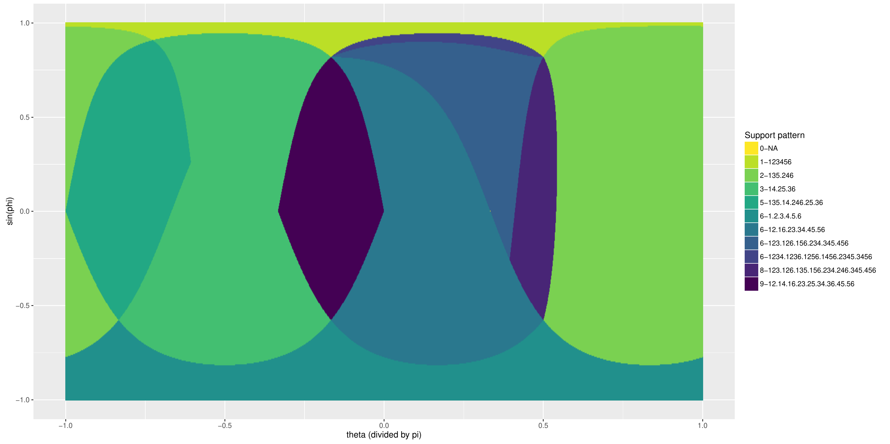
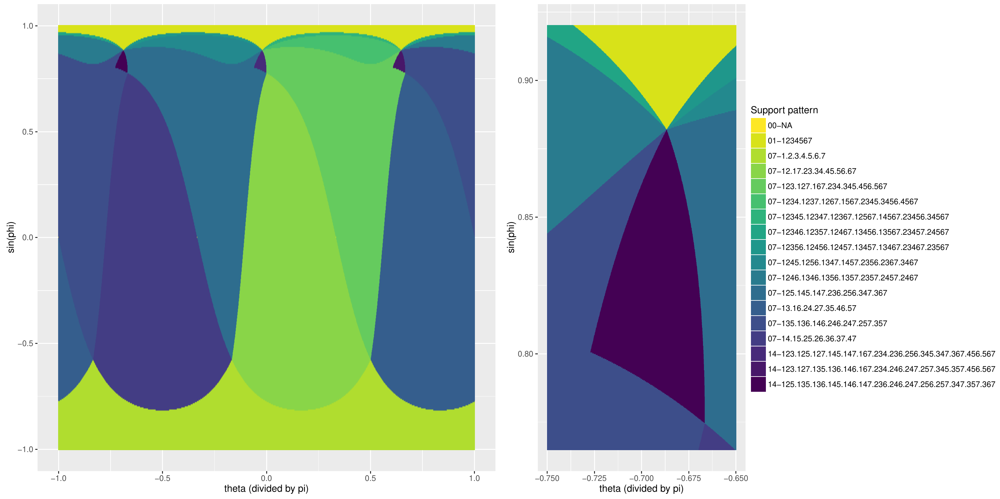
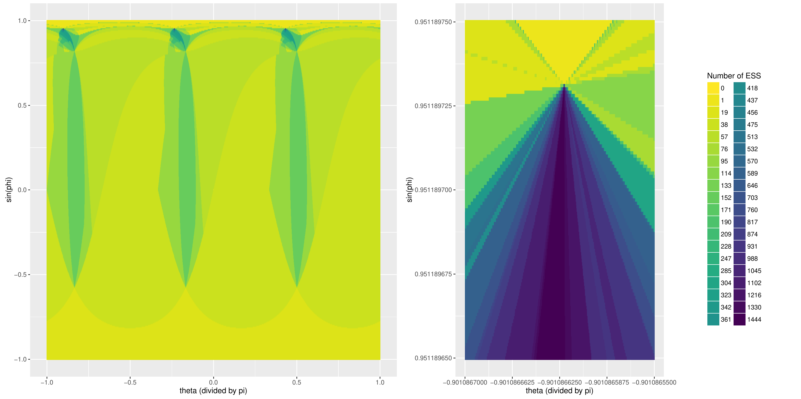
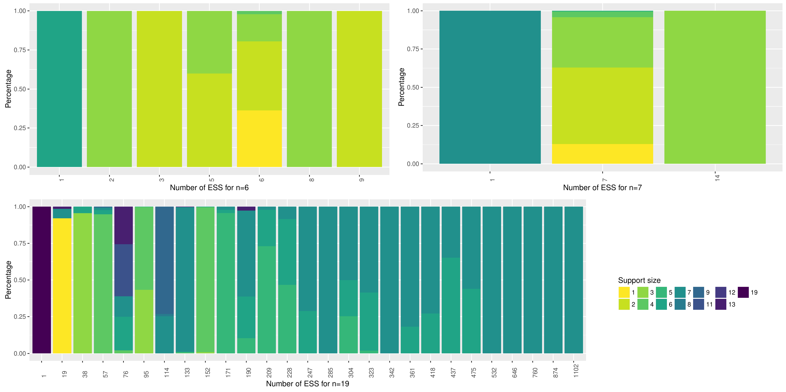
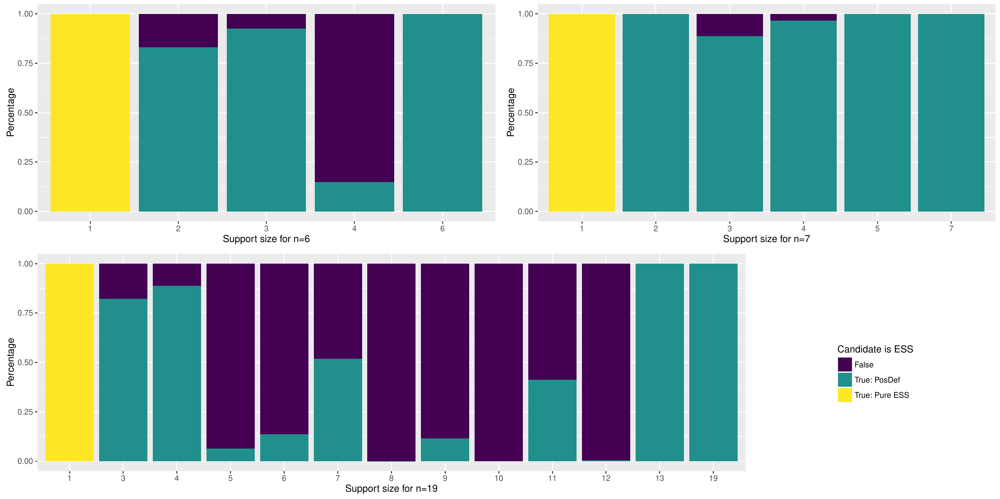

# The Complexity of Simple Models: A Study of Worst and Typical Hard Cases for the Standard Quadratic Optimization Problem

**Authors:** Immanuel M. Bomze, Werner Schachinger, Reinhard Ullrich  
**Affiliation:** University of Vienna, Austria  
**Source version:** Draft PDF created May 19, 2017  
**Source PDF:** [bomze_schachinger_ullrich_2018_complexity_of_simple_models.pdf](bomze_schachinger_ullrich_2018_complexity_of_simple_models.pdf)  
**Exact LaTeX source:** [bomze_schachinger_ullrich_2018_complexity_of_simple_models.tex](bomze_schachinger_ullrich_2018_complexity_of_simple_models.tex)

> Complete text transcription based on the exact LaTeX source that generated the stored PDF. The formulas, theorem and
> equation numbers, tables, figures, and references were checked against the PDF. The PDF uses a *Mathematics of Operations
> Research* submission template, whose printed disclaimer explicitly says that the template does not certify acceptance;
> template furniture, running headers, and page numbers are omitted. The extra comma in the printed author line after
> "Werner" is normalized here.

## Abstract

In a Standard Quadratic Optimization Problem (StQP), a possibly indefinite quadratic form (the simplest nonlinear
function) is extremized over the standard simplex, the simplest polytope. Despite this simplicity, the nonconvex instances
of this problem class allow for remarkably rich patterns of coexisting local solutions, which are closely related to
practical difficulties in solving StQPs globally. In this study, we improve on existing lower bounds for the number of
strict local solutions by a new technique to construct instances with a rich solution structure. Furthermore we provide
extensive case studies where the system of supports (the so-called pattern) of solutions are analyzed in detail. Note that
by naive simulation, in accordance to theory, most of the interesting patterns would not be encountered, since random
instances have, with a high probability, quite sparse solutions (with singleton or doubleton supports), and likewise their
expected numbers are considerably lower than in the worst case. Hence instances with a rich solution pattern are rather
rare. On the other hand, by concentrating on (thin) subsets of promising instances, we are able to give an empirical answer
on the size distribution of supports of strict local solutions to the StQP and their patterns, complementing average-case
analysis of this NP-hard problem class.

## 1. Introduction

### 1.1. Background, Motivation and Organization of the Paper

We consider the *Standard Quadratic Optimization Problem (StQP)* given by $$
\max_{\mathbf x\in \Delta^n} \mathbf x^\top{\mathsf A}\mathbf x
\tag{1}
$$ where ${\mathsf A}$ is a symmetric $n \times n$-matrix and $\Delta^n$ is the standard-simplex $$\Delta^n=\left\{ \mathbf x\in\mathbb{R}^{n}:\sum_{i=1}^{n}x_{i}=1,\, x_{i}\geq0\quad\mbox{for all }i \in N \right\} \mbox{,}$$ where $N=\left\{1,\dots,n \right\}$, also denoted as ${ [\kern-.5pt{1}\kern-.5pt : \kern-.5pt {n}\kern-.5pt]}$. By $${sol}({\mathsf A}) :=\left\{\bar\mathbf x\in \Delta : \bar\mathbf x^\top{\mathsf A}\bar\mathbf x= \max_{\mathbf x\in \Delta^n} \mathbf x^\top{\mathsf A}\mathbf x\right \}$$ we denote the set of all global solutions to (1).

Despite of its simplicity, this model is quite versatile. Applications are numerous, ranging from the famous Markowitz portfolio problem in Finance, Economics (evolutionary game theory) through Machine Learning (background-foreground clustering in image analysis) to life science applications, e.g. in Population Genetics (selection models) and Ecology (replicator dynamics). So it is not too surprising that the following questions are closely related (for detailed explanations and background see e.g. [3; 17; 26; 29]):

How many strict local solutions are there at most in a given StQP ?

How many evolutionarily stable states ($ESS$s) can coexist in a given (partnership) game ?

How many asymptotically stable fixed points can coexist for the replicator dynamics ?

How many stable equilibria can coexist in a one-locus, multi-allelic system ?

How many maximal cliques can coexist in an undirected graph ?

The last question sheds light on an important aspect of StQPs, namely the discrete combinatorial structure of this problem class of continuous optimization models. Indeed, for the subclass of StQPs based upon an adjacency matrix ${\mathsf A}$ of an undirected graph, the answer to the last question is well known by the famous Moon/Moser bound [23]: asymptotically ${\sqrt[3]{3}}^n\approx (1.4422)^n$, a number exponential in the order $n$ of the graph, and this bound is attained at the complete multipartite Turán graph $T(3k,k)$ with $n=3k$.

However, the Moon/Moser bound is not valid for general symmetric matrices ${\mathsf A}$ (with also non-binary entries). In this paper, we will push this exponential bound up, improving, and building, upon earlier investigations [9] where the basis $\approx 1.4592$ was established, to a basis of $\approx 1.4933$, establishing a new world record, to the best of our knowledge. Note that a worst-case *upper* bound on the maximal number of strict local solutions is due to Sperner's theorem (see, e.g. [5, Section 6.3]), and asymptotically equals $\approx \frac{2^n}{1.25\sqrt n}$ (see (7) below), so that the basis necessarily is smaller than two. Relaxing further, one can establish without too much effort a sharp upper bound on the number of isolated critical points (satisfying the KKT condition, i.e., the first-order necessary condition for local optimality, see (5) below; note that no constraint qualifications on (1) are needed as all constraints are linear) which is $2^n-1$, the number of possible supports, an example being ${\mathsf A}={\mathsf I}_n$, the $n\times n$ identity matrix: here, the barycenter of every face of $\Delta^n$ is a KKT point for (1).

To get the bound of $(15120)^{\frac n{24}}\approx (1.4933)^n$, we construct an instance with $n=24$ having 15,120 coexisting strict local solutions, and an accordingly rich pattern structure. The methods employed may serve as good examples of the interaction/feedback loop between experimental and theoretical work in Applied Mathematics. Whether one views the experimental parts rather as empirical work, remains a matter of personal taste, but for sure our experiments add to the empirical evidence on the complexity of StQPs, and as we hope, to a significant extent both from the worst-case and the typical-case point of view as (conditionally random) distributions of hard instances are investigated. In a sense, our experiments are similar to importance sampling technique in advanced simulation studies, in that the search (instance) space is swept thoroughly in interesting parts. See Subsection 1.3 below.

The paper is organized as follows: after setting the scene in the remainder of this section, the central theoretical development is presented in Section 2. This starts with robustness investigations in Subsection 2.1, then combines small instances to larger ones in Subsection 2.2, introduces generating polynomials and perturbation methods in Subsections 2.3 and 2.4 as key ingredients for our arguments, and finally collects the consequences for counting $ESS$s in Subsections 2.5 and 2.6. The last two Subsections 2.7 and 2.8 deal with intricate search strategies without which it would have been quite hard (if possible at all) to detect interesting instances in a systematic way. Thereafter, Section 3 applies the developed theory in an algorithmic approach to generate interesting patterns for several matrix classes, including a discussion of the achieved improvements of the status quo. A detailed study on cyclically symmetric instances of orders exceeding most of the previously investigated cases, including descriptive statistics and illustrations is presented in Section 4. These results shed some light on the "complexity of complexity" in this simplest class of hard optimization problems, and open a new perspective on the notion of an average case beyond naive random simulation.

### 1.2. Looking over the Fence; Basic Definitions and Notation

The above mentioned close relations between the different fields Optimization, game theory and population/selection dynamics; as explained in [3], the optimization problem (1) is closely related to an *evolutionary game* with strategy set $N$ in pairwise contests, with payoff matrix ${\mathsf A}$. If ${\mathsf A}={\mathsf A}^\top$, this means that the row and the column player share the payoff equally, a partnership game. Likewise, the symmetric matrix ${\mathsf A}=[a_{ij}]$ could also collect the (incremental) fitness values for the allelic combination $\left\{i,j\right \} \in N\times N$ where $N$ is the allele set for a single autosomal locus, an aspect we will not pursue further in this paper. Finally we may look a certain population dynamics called *replicator dynamics* defined as a system of coupled autonomous differential equations, a continuous-time dynamical system (a dot $\dot y$ signifies derivative w.r.t. time $t$) and perform the usual qualitative equilibrium analysis: $$
\dot x_i(t) = x_i(t)\left ( [{\mathsf A}\mathbf x(t)]_i - \mathbf x(t)^\top{\mathsf A} \mathbf x(t)\right )\, ,\quad i\in N\, ,\quad \mathbf x(0)=\mathbf x_0\in \Delta^n\, ; \quad t\ge 0\,.
\tag{2}
$$ We have the following equivalences for a point $\mathbf x\in \Delta ^n$, cf. [18; 19]: $$
\left .\begin{array}{rrl} &\mathbf x&\mbox{ is a strict local maximizer of~(1), i.e. strictly maximizes population overall fitness}\\[0.2em]
\Longleftrightarrow\quad &\mathbf x&\mbox{ is an evolutionary stable strategy ($ESS$) for payoff matrix }{\mathsf A}\\[0.2em]
\Longleftrightarrow\quad &\mathbf x&\mbox{ is an asymptotically stable fixed point for the dynamics~(2).}\end{array}\right \}
\tag{3}
$$ For succinct proofs, we refer to [3, Theorem 10] where also equivalences for the weaker versions of solutions are stated and proved: $$
\left .\begin{array}{rrl} &\mathbf x&\mbox{ is a local maximizer of~(1), i.e. maximizes population overall fitness}\\[0.2em]
\Longleftrightarrow\quad &\mathbf x&\mbox{ is a neutrally stable strategy ($NSS$) for payoff matrix }{\mathsf A}\\[0.2em]
\Longleftrightarrow\quad &\mathbf x&\mbox{ is a Lyapunov stable fixed point for the dynamics~(2);}\end{array}\right \}
\tag{4}
$$ and $$
\left .\begin{array}{rrl} &\mathbf x&\mbox{ is a KKT point for~(1): {$({\mathsf A}\mathbf x)_i \le \mathbf x^\top{\mathsf A} \mathbf x$ for all $i\in N$ with equality if $x_i>0$}}\\[0.2em]
\Longleftrightarrow\quad &\mathbf x&\mbox{ is a Nash equilibrium strategy ($NES$) for payoff matrix }{\mathsf A}\\[0.2em]
\Longleftrightarrow\quad &\mathbf x&\mbox{ is a saturated fixed point for the dynamics~(2).}\end{array}\right \}
\tag{5}
$$ For us relevant are the first two equivalences in (3), (4) and (5), and in the following we will use both terms (strict local maximizer/$ESS$; local maximizer/$NSS$; KKT point/$NES$) interchangeably. For the readers' convenience, we will repeat the definitions of $ESS$, $NSS$, $NES$ below (note that these also apply to non-symmetric square matrices ${\mathsf A}\neq{\mathsf A}^\top$, used for modeling non-partnership evolutionary games); to this end, we will introduce a bit of notation first: given any point $\mathbf x\in\Delta^n$, let $$BR_{\mathsf A}(\mathbf x) := \left\{\mathbf y\in \Delta ^n : \mathbf y^\top{\mathsf A}\mathbf x= \max_{\mathbf z\in \Delta^n} \mathbf z^\top{\mathsf A}\mathbf x\right \}$$ be the set of best replies to $\mathbf x$ (the solution set of the LP $\max\left\{\mathbf z^\top{\mathsf A}\mathbf x: \mathbf z\in \Delta^n\right \}$) and $$I(\mathbf x)=\left\{i \in N :x_i>0 \right\}$$ be the *support* of $\mathbf x$. The *extended support* is given by $$J_{{\mathsf A}}(\mathbf x)=\left \lbrace i\in N: [{\mathsf A}\mathbf x]_i = \mathbf x^\top{\mathsf A}\mathbf x\right \rbrace\,.$$

A vector $\mathbf x\in \Delta^n$ is called a (symmetric) *Nash Equilibrium State/Strategy* ($NES$), if $\mathbf x^\top{\mathsf A}\mathbf x\geq \mathbf y^\top{\mathsf A}\mathbf x$ for all $\mathbf y\in \Delta^n$, i.e., if $\mathbf x$ is a best reply to itself, $\mathbf x\in BR_{\mathsf A}(\mathbf x)$. It is easy to see that this implies $I(\mathbf x)\subseteq J_{{\mathsf A}}(\mathbf x)$, and that the set of best replies $\mathbf y$ to $\mathbf x$ is given by $BR_{\mathsf A}(\mathbf x)= \mbox{conv\,}\left\{\mathbf e_j : j\in J_{{\mathsf A}}(\mathbf x)\right \}$, where $\mathbf e_j$ is the $j$-th column of ${\mathsf I}_n$. In other words, all pure strategies actually used by $\mathbf x$, namely all $i\in I(\mathbf x)$, must be alternative best replies.

A *Neutrally Stable State/Strategy* ($NSS$) is a $NES$ which in addition satisfies $\mathbf x^\top{\mathsf A}\mathbf y\ge \mathbf y^\top{\mathsf A}\mathbf y$ for all $\mathbf y\in BR_{\mathsf A}(\mathbf x)$; in words, a state/strategy $\mathbf x$ is *neutrally stable* if it is at least as good a reply to any $\mathbf y$ than that $\mathbf y$ to itself, for any alternative best reply $\mathbf y$ to $\mathbf x$. Finally, an $NSS$ is called *Evolutionarily Stable State/Strategy* ($ESS$), if the last inequality is strict: $\mathbf x^\top{\mathsf A}\mathbf y> \mathbf y^\top{\mathsf A} \mathbf y$ for all $\mathbf y\in BR_{\mathsf A}(\mathbf x)\setminus \left\{\mathbf x\right \}$: any alternative best reply $\mathbf y$ to $\mathbf x$ fares strictly worse against itself than the incumbent $\mathbf x$ performs against $\mathbf y$.

We will use some more convenient notation: Given an $n\times n$ matrix ${\mathsf A}$, we denote by $$ESS({\mathsf A}) :=\left\{\mathbf x\in \Delta ^n : \mathbf x\mbox{ is an $ESS$ for }{\mathsf A}\right \}$$ the set of all strict local maximizers of (1) if ${\mathsf A}^\top={\mathsf A}$, cf. (3); $$NSS({\mathsf A}) :=\left\{\mathbf x\in \Delta ^n : \mathbf x\mbox{ is an $NSS$ for }{\mathsf A}\right \}$$ the set of all local maximizers of (1) if ${\mathsf A}^\top={\mathsf A}$, cf. (4); and $$NES({\mathsf A}) :=\left\{\mathbf x\in \Delta ^n : \mathbf x\mbox{ is an $NES$ for }{\mathsf A}\right \}$$ the set of all KKT points of (1) if ${\mathsf A}^\top={\mathsf A}$, cf. (5). Obviously, $ESS({\mathsf A})\subseteq NSS({\mathsf A}) \subseteq NES({\mathsf A})$. The last two sets are never empty, but they can be infinite, while the first one has to be always finite (but may be empty, e.g. for ${\mathsf A}={\mathsf O}$). However, generically, the first two sets coincide [3, Corollary 14], in which case they are both nonempty and finite. More precisely, for every ${\mathsf A}$ and any $I\subseteq N$ there is at most one $ESS$ $\mathbf x$ with $I(\mathbf x) = I$. This follows immediately from the following non-inclusion result, see, e.g. [1]: $$
(\mathbf x,\mathbf{p}) \in NES({\mathsf A})\times ESS({\mathsf A}) \quad \mbox{and} \quad  I(\mathbf x)\subseteq J_{{\mathsf A}}(\mathbf{p}) \qquad \Longrightarrow \qquad \mathbf x=\mathbf{p}\, .
\tag{6}
$$ Hence we do not only know $|ESS({\mathsf A})|\le 2^n$ but rather, by Sperner's theorem about maximal antichains, $$
|ESS({\mathsf A})|\le  \binom{n} {\left \lfloor \frac{n}{2} \right \rfloor}\sim 2^n/\sqrt{\pi n} \, ,
\tag{7}
$$ using Stirling's approximation formula; cf. [1]. This is a consequence of (6), as the *($ESS$) pattern* of ${\mathsf A}$, $$\textup{pattern}({\mathsf A}):=\left\{I(\mathbf x) : \mathbf x\in ESS({\mathsf A})\right \}$$ forms an antichain w.r.t. set inclusion in the complete lattice of all subsets of $N$, which has $n$ elements. Instances with a rich such pattern (and thus many coexisting strict local solutions) will be the main focus of our paper, extending and improving upon previous studies [9; 10; 11; 12; 27; 28]. Despite its discrete combinatorial nature, the pattern comprises all essential information on the solution set of the instance, at least generically; note that generically we have $ESS({\mathsf A}) = NSS({\mathsf A})$. Indeed, given $I\in \textup{pattern}({\mathsf A})$, it is a mere matter of solving a linear equation system in $|I|$ variables to obtain the unique $ESS$ $\mathbf x$ such that $I(\mathbf x)=I$, see also Section 3.1.

### 1.3. Global Solutions; Worst-Case Complexity and Average-Case Results

Generically, there is only one global solution, but there are instances exhibiting exponentially many different (strict) global solutions. Consider for instance the complete multipartite Turán graph $T(3k,k)$ which has $3^k$ maximum cliques; if the matrix ${\mathsf A}$ is ${\mathsf I}_{3k}$ plus twice the adjacency matrix of $T(3k,k)$, then (1) has $3^k=(\sqrt[3]{3})^n$ strict global solutions, see [6].

Regarding the above equivalence results (3) on coexistence of many solutions we may rephrase them as follows: There is a constant $c\in[\sqrt[3]{3},2]$ such that

At least $\sim  c^n$ strict global solutions can coexist for an StQP in $n$ variables;

At least $\sim  c^n$ distinct $ESS$s realize maximum welfare in a partnership game with $n$ strategies;

At least $\sim  c^n$ distinct selection equilibria with $n$ alleles may yield maximum overall fitness in the population.

W.r.t. replicator dynamics in $n$ state variables, there may coexist at least $\sim  c^n$ asymptotically stable fixed points at which the Lyapunov function attains its global maximum.

It is yet unknown whether the maximal number of strict global solutions grows at the same rate or at a slower rate than the number of strict local solutions. This problem calls for future investigations which are beyond the scope of this paper.

Turning to classical worst-case complexity theory, while StQPs are NP-hard (e.g., by reduction to the maximum clique problem), they form a PTAS [4]. While for general QPs, determining one local solution is already NP-hard [24], this effort is polynomial-time for the StQP, at least in the maximum-clique case as the greedy algorithm is ${\mathcal O} (n)$; in practice, a very efficient local maximization algorithm for the general case was proposed in [25]. Obviously, determining *all* local solutions cannot be easier than solving the StQP. For a thorough discussion of these and related issues, we refer to [15].

So what is a typical hard instance ? Previous work on random instances of StQPs would discourage the naive random generation approach. Already in 1988, Kingman observed [19] that very large polymorphisms (i.e. support sizes exceeding $C\sqrt n$) are atypical. More recently, in a series of papers [20; 21; 22], Kontogiannis and Spirakis looked at several continuous (e.g. Gaussian or uniform) i.i.d. distributions of entries of $n\times n$ instances $\tilde {\mathsf A}$ and proved, among other results, that $\mathbb{E}\left [|\textup{pattern}(\tilde {\mathsf A})|\right ] = \mathbb{E}\left [|ESS(\tilde {\mathsf A})|\right ]$ does not grow faster than $\exp(0.138n)$ (which is way slower than e.g. $\sqrt[3]{3}^n$), and that $$\mathbb{P}\left [\max \left\{|I| : I \in  \textup{pattern}(\tilde {\mathsf A})\right \} \ge n^{2/3} \right ] \to 0 \quad\mbox{ as }n\to\infty\,.$$ So instances with patterns of size $\sim c^n$ with $c\ge\sqrt[3]{3}$ exist, but they become increasingly rare as $n$ gets large. Interesting complex (and therefore large) patterns would likely be missed or occur too rarely in a naive random sampling approach. On a related question, Chen and Peng obtained very recently in [13; 14] even stronger probability bounds, again using i.i.d. continuous distributions of a certain type, including exponential, uniform and Gaussian distribution. Based upon their findings, we now derive probability bounds on the support size $|I(\mathbf x^*(\tilde {\mathsf A}))|$, denoting by $\mathbf x^*({\mathsf A})$ a (generically unique) global solution of (1):

#### Proposition 1

*(a) Under the assumption of [13, Thm 5], there is a constant $C>0$ (independent of $n$) such that $$\mathbb{P}\left [  |I(\mathbf x^*(\tilde {\mathsf A}))| =k \right ]\le e^{-C\,k\log k} \quad\mbox{for all }k\ge 2\, .$$ (b) Under the assumption of [13, Thm 9] that $\tilde{\mathsf A}$ belongs to the Gaussian orthogonal ensemble GOE$(n)$, there is a constant $K>0$ (independent of $n$) such that $$\mathbb{P}\left [  |I(\mathbf x^*(\tilde {\mathsf A}))| \ge 3 \right ]\le K\frac{(\log n)^2}n\, .$$*

*Proof.*
(a) [13, Thm 5] yields for all $\bar k= k-1\ge 1$ the bound $$\mathbb{P}\left [  |I(\mathbf x^*(\tilde {\mathsf A}))| = k \right ] \le \frac{{\bar k}^{\bar k} 2^{\bar k}}{[\bar k !]^2}$$ which does not depend on $n$. Stirling's formula gives constants $C', C''$ and finally $C>0$ such that $$\log \mathbb{P}\left [  |I(\mathbf x^*(\tilde {\mathsf A}))| =  k \right ]  \le C' + {\bar k} \log ( \frac {2e^2}{\bar k} ) + C'' \log \bar k \le - C\, k \log k\, .$$ (b) Consider the estimate given by [13, Thm 9], accumulated across all support sizes $k\ge 3$: $$\begin{array}{rcl}
\sum\limits_{k=3}^\infty \mathbb{P}\left [  |I(\mathbf x^*(\tilde {\mathsf A}))| = k\right ] &\le &\sum\limits_{k=3}^\infty \frac {(2 k-3)!}{(k-1)!} \, e^{-(k - 2)^2/4}\,\frac {\left (\eta^2 \log \frac n{k-1}\right )^{k-1}}{(n+1)^{k -2}}\\[0.2em]
&\le &\eta^4 \frac{(\log n)^2}{n+1}\sum\limits_{r=0}^\infty \frac {(2r+3)!}{(r+2)(r+1)} \, e^{-(r+1)^2/4} \left [\frac {\eta^2 \log \frac n{r+2}}{n+1}\right ]^r\!\!/r!\\[0.2em]
&\le &4\eta^4 \frac{(\log n)^2}{n+1}\sum\limits_{r=0}^\infty \left [\frac {K' \eta^2 \log \frac n{r+2}}{n+1}\right ]^r\!\!/r!\\[0.2em]
&\le &4\eta^4 \frac{(\log n)^2}{n+1} e^{K''}\, ,
\end{array}$$ where $K'\ge \frac{\gamma_{r+1}}{\gamma_r}= (2r+3)(2r+2)e^{-(2r+3)/4}$ with $\gamma_r = (2r+1)!\, e^{-(r+1)^2/4}$ for all integer $r\ge 0$ and $K''\ge {K'}\eta^2 \frac {\log (n/2)}{n+1}$ for all integer $n\ge 1$. The result follows.

Again, this shows that naive random sampling is not very promising; if we know that the support of the global solution is at most a doubleton (and this happens with a high probability), we simply have to search among all such ${\mathcal O}(n^2)$ doubletons and singletons; such instances occur with a high probability, and are no challenge algorithmically. Note that due to (6), also the possible pattern structures are constrained as they cannot contain any supports containing a doubleton already detected as a member of the pattern. Therefore, the worst cases are hidden in regions of small probability, and we will explore that region more systematically than just random searching, exploiting structures guaranteeing complex patterns.

## 2. Constructing Complex $ESS$ Patterns

### 2.1. Some Robustness Results

Denote by $\mathcal{S}^n$ all symmetric matrices of order $n$, and by $\mathcal{F}_n$ those ${\mathsf A}\in\mathcal{S}^n$ such that (1) has only strict local maximizers (and therefore finitely many): $$\mathcal{F}_n := \left\{{\mathsf A}\in {{\mathcal S}^n}: NSS({\mathsf A}) = ESS({\mathsf A})\right \} \, ;$$ by $\mathcal{F}^d_{n}$ those matrices which remain in $\mathcal{F}_n$ upon sufficiently small diagonal perturbations: $$\mathcal{F}^d_{n} := \left\{{\mathsf A}\in \mathcal{F}_n : \mbox{for some }\varepsilon>0\, , \; {\mathsf A}+\textup{Diag}(\mathbf d)\in\mathcal{F}_n \mbox{ for all }\mathbf d\mbox{ with } \| \mathbf d \|< \varepsilon\right \} \, ;$$ and by $\mathcal{F}^r_{n}$ those ${\mathsf A}\in\mathcal{S}^n$ such that all $NES$s are quasistrict in the sense that $\mathbf e_i$ is an alternative best answer to $\mathbf x$ if and only if strategy $i$ is used in $\mathbf x$ with positive frequency/probability: $$\mathcal{F}^r_{n} := \left\{{\mathsf A}\in {{\mathcal S}^n}: I(\mathbf x)=J_{{\mathsf A}}(\mathbf x)\mbox{ for all }\mathbf x\in NES({\mathsf A})\right \} \, .$$ We have $\mathcal{F}^r_{n}\subseteq\mathcal{F}_n$ due to [3, Thm.13], and that $\mathcal{F}^r_{n}$ is dense in ${{\mathcal S}^n}$ [3, Cor.14]. Moreover, $\mathcal{F}^r_{n}$ is open in ${{\mathcal S}^n}$; indeed, considering its complement, suppose that $({\mathsf B}_\ell,\mathbf q_\ell)\to ({\mathsf A},\mathbf q)\in {{\mathcal S}^n}\times \Delta^n$ along a sequence, where ${\mathsf B}_\ell\in {{\mathcal S}^n}\setminus\mathcal{F}^r_{n}$ and $\mathbf q_\ell\in NES ({\mathsf B}_\ell)$ such that $I(\mathbf q_\ell) = I \neq J = J_{{\mathsf B}_\ell}(\mathbf q_\ell)$ for all $\ell$ (and of course $I\subset J$). By continuity, we have for $\ell$ large enough, $I(\mathbf q)\subseteq  I(\mathbf q_\ell) = I \subset J = J_{{\mathsf B}_\ell}(\mathbf q_\ell) \subseteq J_{\mathsf A}(\mathbf q)$ and similarly $$
\mathbf y^\top{\mathsf A}\mathbf q= \lim\limits_{\ell \to\infty} \mathbf y^\top{\mathsf B}_\ell \mathbf q_\ell \le \lim\limits_{\ell \to\infty} \mathbf q_\ell^\top{\mathsf B}_\ell \mathbf q_\ell = \mathbf q^\top{\mathsf A} \mathbf q\quad\mbox{for all }\mathbf y\in \Delta^n\, .
\tag{8}
$$ Hence $\mathbf q\in NES({\mathsf A})$ with $I(\mathbf q)\neq J_{{\mathsf A}}(\mathbf q)$, so ${\mathsf A}\in {{\mathcal S}^n}\setminus \mathcal{F}^r_{n}$, and $\mathcal{F}^r_{n}$ is thus an open set in ${{\mathcal S}^n}$. Therefore we arrive at the inclusions $$\mathcal{F}^r_{n}\subseteq\mathcal{F}^d_{n}\subseteq\mathcal{F}_n\, .$$ However, the set $\mathcal{F}_n$ is not open for $n\ge 3$, as the following slight extension of Example 3 in [3] shows:

#### Example 2

Let ${\mathsf A}\!:=\!\left(\begin{smallmatrix}-{\mathsf E}_n&\mathbf o\\ \mathbf o^\top&0\end{smallmatrix}\right)$ and ${\mathsf B}_\epsilon\!:=\!\left(\begin{smallmatrix}-{\mathsf E}_n&\mathbf o\\ \mathbf o^\top&-\epsilon\end{smallmatrix}\right)$, where ${\mathsf E}_n$ is the all ones matrix of order $n$. Then $NSS({\mathsf A})\!=\!ESS({\mathsf A})\!=\!\left\{\!\left(\!\begin{smallmatrix}\mathbf o\\1\end{smallmatrix}\!\right)\!\right\}$, and for $\epsilon\!>\!0$ we have $NSS({\mathsf B}_\epsilon)\!=\!\left\{\!\frac1{1+\epsilon}\!
\left(\!\begin{smallmatrix}\epsilon\mathbf y\\ 1\end{smallmatrix}\!\right):\,\mathbf y\in\Delta^n \right\}$, an infinite set if $n\ge2$.

Let $\mathcal{F}:=\bigcup_{n\ge1}\mathcal{F}_n$, $\mathcal{F}^d:=\bigcup_{n\ge1}\mathcal{F}^d_{n}$, $\mathcal{F}^r:=\bigcup_{n\ge1}\mathcal{F}^r_{n}$ and $\mathcal{S}:=\bigcup_{n\ge1}\mathcal{S}^n$.

#### Lemma 3

*(a) If ${\mathsf A}\in\mathcal{F}_n$, then for all ${\mathsf B}\in\mathcal{F}_n$ sufficiently close to ${\mathsf A}$ we have $$
|\{K'\!\in\textup{pattern}({\mathsf B}):\,K\subseteq K'\}|\ge1,&\quad \textup{ for all }K\in\textup{pattern}({\mathsf A}),
\tag{9}
$$

$$
|\{K\in\textup{pattern}({\mathsf A}):\,K\subseteq K'\}|\le1,&\quad \textup{ for all }K'\!\in\textup{pattern}({\mathsf B}),
\tag{10}
$$ which implies $$|\textup{pattern}({\mathsf B})|\ge |\textup{pattern}({\mathsf A})|.$$ (b) If ${\mathsf A}\in\mathcal{F}^r_n$, then for all ${\mathsf B}\in\mathcal{F}_n$ sufficiently close to ${\mathsf A}$ we have ${\mathsf B}\in\mathcal{F}^r_n$ and $$\textup{pattern}({\mathsf B})=\textup{pattern}({\mathsf A})\, .$$*

*Proof.*
\(a\) For ${\mathsf A}\in\mathcal{F}_n$ let $f(\mathbf x)=\mathbf x^\top{\mathsf A}\mathbf x$. For $\mathbf{p}\in \Delta^n$ define the set $U_\delta(\mathbf{p})$ to be the connected component of $\{\mathbf x\in\Delta^n:f(\mathbf x)\ge f(\mathbf{p})-\delta\}$ containing $\mathbf{p}$.  Let sets $\tilde U_\delta(\mathbf{p})$ be defined analogously, but with $\tilde f(\mathbf x):=\mathbf x^\top{\mathsf B}\mathbf x$ in place of $f$. For $\delta\ge0$ those sets are nonempty and they shrink towards $\left\{\mathbf{p}\right \}$ as $\delta\searrow 0$. Indeed, the family of sets $(U_\delta(\mathbf{p}))_{\delta>0}$ constitutes a neighborhood basis for $\mathbf{p}$. This is true in the more general setting of $\mathbf{p}$ being a strict local maximizer on $\Delta^n$ of a continuous function $f:\Delta^n\to\mathbb{R}$: To begin with, there is $\epsilon>0$ such that $f(\mathbf x)<f(\mathbf{p})$ for all $\mathbf x\in\Delta^n$ satisfying $0<\|\mathbf x-\mathbf{p}\|\le\epsilon$. Then, for all $\eta\le\epsilon$ we are to find $\delta>0$, such that $U_\delta(\mathbf{p})\subseteq N_\eta(\mathbf{p}):=\{\mathbf x\in\Delta^n:\|\mathbf x-\mathbf{p}\|<\eta\}$. Fix such $\eta$, define the compact set $A_\eta:=\{\mathbf x\in\Delta^n:\,\frac\eta2\le\|\mathbf x-\mathbf{p}\|\le\eta\}$ and observe $m_\eta:=\max_{\mathbf x\in A_\eta}f(\mathbf x)<f(\mathbf{p})$. Now for any $\delta<f(\mathbf{p})-m_\eta$, the set $\{\mathbf x\in\Delta^n:\,f(\mathbf x)\ge f(\mathbf{p})-\delta\}$ is contained in the complement of $A_\eta$, which is the union of two disjoint connected components: $N_{\frac\delta2}$, and an unbounded one. Thus $U_\delta(\mathbf{p})$, the connected component of $\{\mathbf x\in\Delta^n:\,f(\mathbf x)\ge f(\mathbf{p})-\delta\}$ containing $\mathbf{p}$, satisfies $U_\delta(\mathbf{p})\subseteq N_{\frac\delta2}\subseteq N_\delta$. Continuing with the proof, choose $\delta>0$ small enough such that $U_\delta(\mathbf{p})\cap U_\delta(\mathbf q)=\{\}$ for all $\left\{\mathbf{p},\mathbf q\right \} \subseteq ESS({\mathsf A})$ with $\mathbf{p}\ne\mathbf q$, and that $I(\mathbf x)=I(\mathbf{p})$ for all $\mathbf x\in U_\delta(\mathbf{p})$ with $I(\mathbf x)\subseteq I(\mathbf{p})$. Since $\Delta^n$ is compact, for ${\mathsf B}$ close enough to ${\mathsf A}$ we have $\tilde U_{\frac\delta2}(\mathbf{p})\subseteq U_\delta(\mathbf{p})$ for every $\mathbf{p}\in ESS({\mathsf A})$, and $$\max_{\mathbf x\in \tilde U_{\frac\delta2}(\mathbf{p})} \mathbf x^\top{\mathsf B}\mathbf x\ge \mathbf{p}^\top{\mathsf B}\mathbf{p}>\mathbf{p}^\top{\mathsf B}\mathbf{p}-\frac\delta2=\mathbf y^\top{\mathsf B}\mathbf y,$$ for all $\mathbf y\in \Delta^n\cap\partial\tilde U_{\frac\delta 2}(\mathbf{p})$, so that any global maximizer $\tilde \mathbf{p}$ of the latter problem is a local maximizer of $\max_{\mathbf x\in \Delta^n} \mathbf x^\top{\mathsf B}\mathbf x$. So by assumption of ${\mathsf B}\in\mathcal F$, we get $\tilde \mathbf{p}\in ESS({\mathsf B})$. Because of $\tilde U_{\frac\delta2}(\mathbf{p})\cap F_{I(\mathbf{p})}\subseteq U_{\delta}(\mathbf{p})\cap F_{I(\mathbf{p})}\subseteq \textup{relint}(F_{I(\mathbf{p})})$, where $F_K:=\{\mathbf x\in\Delta^n: x_j=0\textup{ for }j\not\in K\}$ denotes a face of the standard simplex, we have $I(\mathbf{p})\subseteq I(\tilde\mathbf{p})$. With $K=I(\mathbf{p})$ and $K'=I(\tilde\mathbf{p})$ we have thus shown (9). Next, for any ${\mathbf{r}}\in ESS({\mathsf B})$, we cannot have two $\left\{\mathbf{p},\mathbf q\right \} \subseteq ESS({\mathsf A})$ with $\mathbf{p}\ne\mathbf q$ such that $I(\mathbf{p})\subseteq I({\mathbf{r}})$ and $I(\mathbf q)\subseteq I({\mathbf{r}})$. Otherwise, define $\mathbf v:=\mathbf{p}-\mathbf q\neq \mathbf o$ and observe that due to $\{\mathbf{p},\mathbf q\}\subseteq ESS({\mathsf A})$ and ${\mathbf{r}}\in ESS({\mathsf B})$ we have $$\frac {d^2}{dh^2}f(\mathbf q+h\mathbf v)=2\mathbf v^\top{\mathsf A}\mathbf v>0\quad\textup{ and }\quad\frac {d^2}{dh^2}\tilde f({\mathbf{r}}+h\mathbf v)=2\mathbf v^\top{\mathsf B}\mathbf v<0\, ,$$ which is absurd if we choose ${\mathsf B}$ so close to ${\mathsf A}$ such that for all of the finitely many pairs $\left\{\mathbf{p},\mathbf q\right \} \subseteq ESS ({\mathsf A})$ with $\mathbf v=\mathbf{p}-\mathbf q\neq \mathbf o$, the strict inequality $\mathbf v^\top{\mathsf A} \mathbf v>0$ implies also $\mathbf v^\top{\mathsf B} \mathbf v>0$. This proves (10) and completes the proof of part (a).

\(b\) The first assertion follows because $\mathcal{F}^r$ is open. Next we show $\textup{pattern}({\mathsf A})\subseteq \textup{pattern}({\mathsf B})$ for ${\mathsf B}\in \mathcal{F}^r$ sufficiently close to ${\mathsf A}$. Indeed, the point $\tilde \mathbf{p}$ constructed in (a) above satisfies $({\mathsf B}\tilde \mathbf{p})_i=\tilde\mathbf{p}^\top{\mathsf B}\tilde \mathbf{p}$ for $i\in I(\mathbf{p})$, because $I(\mathbf{p})\subseteq I(\tilde\mathbf{p})$ for $\delta>0$ small enough, and likewise $({\mathsf B}\tilde \mathbf{p})_i-\tilde\mathbf{p}^\top{\mathsf B}\tilde \mathbf{p}<0$ for $i\not\in I(\mathbf{p})$ follows from a continuity argument, since $({\mathsf A}\mathbf{p})_i-\mathbf{p}^\top{\mathsf A}\mathbf{p}<0$ for $i\not\in I(\mathbf{p})=J_{{\mathsf A}}(\mathbf{p})$ by assumption. Therefore $I(\tilde\mathbf{p})=I(\mathbf{p})$, and $\textup{pattern}({\mathsf A})\subseteq \textup{pattern}({\mathsf B})$ follows. Finally, assume that there would be a sequence of matrices ${\mathsf B}_\ell\in\mathcal{F}^r$ converging to ${\mathsf A}$ with $\mathbf q_\ell\in ESS({\mathsf B}_\ell)$ such that $I(\mathbf q_\ell) = J_{{\mathsf B}_\ell}(\mathbf q_\ell)= K\not\in\textup{pattern}({\mathsf A})$ for all $\ell$. By compactness, we may and do assume without loss of generality that $\lim\limits_{\ell\to\infty}\mathbf q_\ell = \mathbf q\in \Delta^n$ exists. It follows $I(\mathbf q) \subseteq I(\mathbf q_\ell) = J_{{\mathsf B}_\ell}(\mathbf q_\ell) \subseteq J_{{\mathsf A}}(\mathbf q)$ for all $\ell$ large enough. Now $\mathbf q\in NES({\mathsf A})$ by (8), but since ${\mathsf A}\in \mathcal{F}^r$ by assumption, we have $I(\mathbf q)=J_{{\mathsf A}}(\mathbf q)$, and therefore $K=I(\mathbf q_\ell)=J_{{\mathsf B}_\ell}(\mathbf q_\ell)=I(\mathbf q)\in \textup{pattern}({\mathsf A})$ for $\ell$ large enough, which proves $\textup{pattern}({\mathsf B})=\textup{pattern}({\mathsf A})$.

We now give examples showing that in Lemma 3(a) we can have strict inequalities in any of $(9)$ and $(10)$, resulting in $|\textup{pattern}({\mathsf B})|> |\textup{pattern}({\mathsf A})|$, as well as strict inclusion $K\subset K'$ in (9) and (10).

#### Example 4

(a) Let ${\mathsf A}\!:=\!\left(\begin{smallmatrix}-1&-2&0\\-2&-1&0\\0&0&0\end{smallmatrix}\right)$ and ${\mathsf B}_\epsilon\!:=\!\left(\begin{smallmatrix}-1&-2&0\\-2&-1&0\\0&0&-\epsilon\end{smallmatrix}\right)$. Then $NSS({\mathsf A})\!=\!ESS({\mathsf A})\!=\!\left\{\!\left(\!\begin{smallmatrix}0\\0\\1\end{smallmatrix}\!\right)\!\right\}$, and for $\epsilon\!>\!0$ we have $ESS({\mathsf B}_\epsilon)\!=\!\left\{\!\frac1{1+\epsilon}\!\!
\left(\!\begin{smallmatrix}\epsilon\\0\\1\end{smallmatrix}\!\right)\!,\frac1{1+\epsilon}\!\!
\left(\!\begin{smallmatrix}0\\ \epsilon\\1\end{smallmatrix}\!\right)\!\right\}$. For $K:=\{3\}\in\textup{pattern}({\mathsf A})$ the l.h.s. of (9) is $2$.\
(b) Let ${\mathsf A}\!:=\!\left(\begin{smallmatrix}-1&1&0\\1&-1&0\\0&0&1\end{smallmatrix}\right)$ and ${\mathsf B}_\epsilon\!:={\mathsf A}+\epsilon{\mathsf I}_3$. Then $NSS({\mathsf A})\!=\!ESS({\mathsf A})\!=\!\left\{\!\left(\!\begin{smallmatrix}0\\0\\1\end{smallmatrix}\!\right)\!\right\}$, and $ESS({\mathsf B}_\epsilon)\!=\!\left\{\!\left(\!\begin{smallmatrix}0\vphantom{/}\\0\vphantom{/}\\1\end{smallmatrix}\!\right)\!,
\!\left(\!\begin{smallmatrix}1/2\\1/2\\0\end{smallmatrix}\!\right)\!\right\}$ holds for $\epsilon\!>\!0$. For $K':=\{1,2\}\in\textup{pattern}({\mathsf B}_\epsilon)$ the l.h.s. of (10) is $0$.\
(c) Let ${\mathsf A}\!:=\!\left(\begin{smallmatrix}-1&2&8\\2&-4&-16\\8&-16&-66\end{smallmatrix}\right)$ and ${\mathsf B}_\epsilon\!:=\!{\mathsf A}+\epsilon{\mathsf I}_3$. Then $NSS({\mathsf A})\!=\!ESS({\mathsf A})\!=\!\left\{\!\left(\!\begin{smallmatrix}2/3\\1/3\\0\end{smallmatrix}\!\right)\!\right\}$, and for $0\!<\!\epsilon\!\le\!\tfrac1{10}$ we have $ESS({\mathsf B}_\epsilon)\!=\!\left\{\!\frac1{18-130\epsilon+3\epsilon^2}\!\!
\left(\!\begin{smallmatrix}12-80\epsilon+\epsilon^2\\6-53\epsilon+\epsilon^2\\3\epsilon+\epsilon^2\end{smallmatrix}\!\right)\!\right\}$. Thus $K\subset K'$, with $K=\{1,2\}$ and $K'=\{1,2,3\}$.

### 2.2. Pattern Generation by Combining Matrices

We now are in a position to construct complex patterns based upon a collection of given symmetric matrices ${\mathsf A}, {\mathsf B}_1,\ldots,{\mathsf B}_n$ of orders $n,k_1,\ldots,k_n$. These will be used to construct a matrix of order $\bar n:=\sum_{i=1}^n k_i$. Define $$
{\mathsf Q}=
\begin{pmatrix}
\bm{\eta}_{k_1}^\top& \mathbf o^\top& \dots  & \mathbf o^\top\\
\mathbf o^\top& \bm{\eta}_{k_2}^\top& \dots  & \mathbf o^\top\\
\vdots  & \vdots    & \ddots & \vdots \\
\mathbf o^\top& \mathbf o^\top& \dots  & \bm{\eta}_{k_n}^\top
\end{pmatrix}
\tag{11}
$$ where $\bm{\eta}_{k}$ is the all ones vector in $\mathbb{R}^k$, and $\mathbf o$ stands for the zero vector of appropriate dimension. Then both ${\mathsf A}_{{\mathsf Q}}:={\mathsf Q}^\top{\mathsf A}{\mathsf Q}$ and ${\mathsf B}:=\textup{Diag}({\mathsf B}_1,\ldots,{\mathsf B}_n)$ are symmetric matrices of order $\bar n$, and, thinking of $t$ as a large real parameter, we let $${\mathsf G}_t=t{\mathsf A}_{{\mathsf Q}}+{\mathsf B}\, .$$ Note that special cases of this construction have been considered before: The case ${\mathsf A}=\left(\!\begin{smallmatrix}0&1\\1&0\end{smallmatrix}\!\right)$, ${\mathsf B}_1,{\mathsf B}_2$ arbitrary has been used in the proof of [9, Thm. 1], and the case ${\mathsf A}$ arbitrary of order $n$, ${\mathsf B}_1={\mathsf I}_2$, ${\mathsf B}_i={\mathsf I}_1$ for $i{ \in\! [{2}\! : \! {n}]}$, has been used in the proof of [10, Thm. 1].

#### Theorem 5

*(a) Choose arbitrary but fixed $\bar\mathbf{p}_i\in {sol}({\mathsf B}_i) \subseteq \Delta^{k_i}$. Then we have $ESS({\mathsf G}_t)=\bigcup\limits_{K\subseteq {{ [\kern-.5pt{1}\kern-.5pt : \kern-.5pt {n}\kern-.5pt]}}}\mathcal{E}_K$, where $$
\begin{aligned}

\mathcal{E}_K:=\left\{\begin{pmatrix}
\alpha_1\mathbf{p}_1 \\
\vdots \\
\alpha_n\mathbf{p}_n
\end{pmatrix}:{} &{} I(\bm{\alpha})=K,\ \mathbf{p}_i\in ESS({\mathsf B}_i)\textup{ for }i\in K,\ \mathbf{p}_i=\bar\mathbf{p}_i\textup{ for }i\not\in K,\\[-.8cm]
&\bm{\alpha}\in ESS(t{\mathsf A}+\textup{Diag}(\mathbf b)),\textup{ where }{b_i:=\mathbf{p}_i^\top{\mathsf B}_i\mathbf{p}_i\textup{ for }i\in N}
\right\}\, .
\end{aligned}
\tag{12}
$$ (b) With the same assumptions as in (a), we have $NSS({\mathsf G}_t) = \bigcup\limits_{K\subseteq {{ [\kern-.5pt{1}\kern-.5pt : \kern-.5pt {n}\kern-.5pt]}}}\mathcal{N}_K$, where $$
\begin{aligned}

\mathcal{N}_K:=\left\{\begin{pmatrix}
\alpha_1\mathbf{p}_1 \\
\vdots \\
\alpha_n\mathbf{p}_n
\end{pmatrix}:{} &{} I(\bm{\alpha})=K,\ \mathbf{p}_i\in NSS({\mathsf B}_i)\textup{ for }i\in K,\ \mathbf{p}_i=\bar\mathbf{p}_i\textup{ for }i\not\in K,\\[-.8cm]
&\bm{\alpha}\in NSS(t{\mathsf A}+\textup{Diag}(\mathbf b)),\textup{ where }{b_i:=\mathbf{p}_i^\top{\mathsf B}_i\mathbf{p}_i\textup{ for }i\in N}
\right\}\, .
\end{aligned}
\tag{13}
$$ (c) With the same assumptions as in (a), we have $NES({\mathsf G}_t) = \bigcup\limits_{K\subseteq {{ [\kern-.5pt{1}\kern-.5pt : \kern-.5pt {n}\kern-.5pt]}}}\mathcal{Q }_K$, where $$
\begin{aligned}    

\mathcal{Q}_K:=\left\{\begin{pmatrix}
\alpha_1\mathbf{p}_1 \\
\vdots \\
\alpha_n\mathbf{p}_n
\end{pmatrix}:{} &{} I(\bm{\alpha})=K,\ \mathbf{p}_i\in NES({\mathsf B}_i)\textup{ for }i\in K,\ \mathbf{p}_i=\bar\mathbf{p}_i\textup{ for }i\not\in K,\\[-.8cm]
&\bm{\alpha}\in NES(t{\mathsf A}+\textup{Diag}(\mathbf b)),\textup{ where }{b_i:=\mathbf{p}_i^\top{\mathsf B}_i\mathbf{p}_i\textup{ for }i\in N}
\right\}\, .
\end{aligned}
\tag{14}
$$ (d) We have ${sol}({\mathsf G}_t) = \bigcup\limits_{K\subseteq {{ [\kern-.5pt{1}\kern-.5pt : \kern-.5pt {n}\kern-.5pt]}}}\mathcal{G }_K$, where $$
\begin{aligned}

\mathcal{G}_K:=\left\{\begin{pmatrix}
\alpha_1\mathbf{p}_1 \\
\vdots \\
\alpha_n\mathbf{p}_n
\end{pmatrix}:{} &{} I(\bm{\alpha})=K,\ \mathbf{p}_i\in {sol}({\mathsf B}_i)\textup{ for }i\in N\, ,\\[-.8cm]
&\bm{\alpha}\in {sol}(t{\mathsf A}+\textup{Diag}(\mathbf b)),\textup{ where }{b_i:=\mathbf{p}_i^\top{\mathsf B}_i\mathbf{p}_i\textup{ for }i\in N}
\right\}\, .
\end{aligned}
\tag{15}
$$*

*Proof.*
We start with the observation that any $\mathbf y\in\Delta^{\bar n}$ can be written as $\mathbf y=\begin{pmatrix}\alpha_1\mathbf{p}_1 \\ \vdots \\ \alpha_n\mathbf{p}_n \end{pmatrix}$, where $\bm{\alpha}\in\Delta^n$ and $\mathbf{p}_i\in\Delta^{k_i}$ for $i{ \in\! [{1}\! : \! {n}]}$. Further note that ${\mathsf Q}\mathbf y= \bm{\alpha}$ and ${\mathsf B}\mathbf y= [\alpha_i{\mathsf B}_i\mathbf{p}_i]_i$ holds. Let $K=I({\mathsf Q}\mathbf y)=I(\bm{\alpha})$. Next, observe that for $\mathbf z=\begin{pmatrix}\beta_1\mathbf q_1 \\ \vdots \\ \beta_n\mathbf q_n \end{pmatrix}$ we get $$
\begin{array}{rcl}
(\mathbf y-\mathbf z)^\top{{\mathsf G}_t}\mathbf y&= &t({\mathsf Q}\mathbf y-{\mathsf Q}\mathbf z)^\top{\mathsf A}\bm{\alpha} + \sum\limits _{i{{ \in\kern-.5pt [{1}\kern-.5pt : \kern-.5pt {n}]}}} \left[\alpha_i^2\mathbf{p}_i^\top{\mathsf B}_i \mathbf{p}_i - \alpha_i\beta_i{\mathbf q_i}^\top{{\mathsf B}_i}\mathbf{p}_i\right ] \\[0.3em]
&= &t(\bm{\alpha}-\bm{\beta})^\top{\mathsf A}\bm{\alpha} + \sum\limits_{i\in K} {\alpha}_i (\alpha_i-\beta_i)\mathbf{p}_i^\top{\mathsf B}_i\mathbf{p}_i + \sum\limits_{i\in K}\alpha_i\beta_i (\mathbf{p}_i-\mathbf q_i)^\top{\mathsf B}_i \mathbf{p}_i \\[0.3em]
&= & (\bm{\alpha}-\bm{\beta})^\top[ t{\mathsf A}+ \textup{Diag}(\mathbf b) ]\bm{\alpha} +  \sum\limits_{i\in K}\alpha_i\beta_i (\mathbf{p}_i-\mathbf q_i)^\top{\mathsf B}_i \mathbf{p}_i\, ,
\end{array}
\tag{16}
$$ which is nonnegative for any $\mathbf z\in \Delta^{\bar n}$ if $\mathbf y\in {\mathcal Q}_K{\supseteq {\mathcal N}_K \supseteq {\mathcal E}_K}$, and in a similar way, $$
\mathbf y^\top{\mathsf G}_t \mathbf y-\mathbf z^\top{\mathsf G}_t \mathbf z = t\left [\bm{\alpha}^\top{\mathsf A} \bm{\alpha}-  \bm{\beta}^\top{\mathsf A} \bm{\beta}\right] + \sum_{i{{ \in\kern-.5pt [{1}\kern-.5pt : \kern-.5pt {n}]}}} \alpha_i^2\mathbf{p}_i^\top{\mathsf B}_i \mathbf{p}_i - \sum_{i{{ \in\kern-.5pt [{1}\kern-.5pt : \kern-.5pt {n}]}}} \beta_i^2\mathbf q_i^\top{\mathsf B}_i \mathbf q_i\, .
\tag{17}
$$ First suppose $\mathbf y\in {\mathcal{N}_K}$. If $\mathbf z\neq\mathbf y$ as above is close to $\mathbf y$, then $\mathbf q_i$ is close to $\mathbf{p}_i$ for all $i\in K$ while $\mathbf q_i\in\Delta^{k_i}$ is arbitrary for $i\not\in K$, and $\bm{\beta}$ is close to $\bm{\alpha}$. Further, $$\begin{align*}
\mathbf y^\top{\mathsf G}_t\mathbf y&=t\bm{\alpha}^\top{\mathsf A}\bm{\alpha}+\sum_{i{{ \in\kern-.5pt [{1}\kern-.5pt : \kern-.5pt {n}]}}}\alpha_i^2\mathbf{p}_i^\top{\mathsf B}_i\mathbf{p}_i=t\bm{\alpha}^\top{\mathsf A}\bm{\alpha}+\sum_{i\in K}\alpha_i^2\mathbf{p}_i^\top{\mathsf B}_i\mathbf{p}_i+\sum_{i\not\in K}\alpha_i^2\bar\mathbf{p}_i^\top{\mathsf B}_i\bar\mathbf{p}_i\\
&\ge t\bm{\beta}^\top{\mathsf A}\bm{\beta}+\sum_{i\in K}\beta_i^2\mathbf{p}_i^\top{\mathsf B}_i\mathbf{p}_i+\sum_{i\not\in K}\beta_i^2\bar\mathbf{p}_i^\top{\mathsf B}_i\bar\mathbf{p}_i
\ge t\bm{\beta}^\top{\mathsf A}\bm{\beta}+\sum_{i{{ \in\kern-.5pt [{1}\kern-.5pt : \kern-.5pt {n}]}}}\beta_i^2\mathbf q_i^\top{\mathsf B}_i\mathbf q_i=\mathbf z^\top{\mathsf G}_t\mathbf z\, ,
\end{align*}$$ in case of (b), and where at least one of the inequalities is strict in case of (a), so that $\mathbf y$ is a (strict) local maximizer of $\mathbf z^\top{\mathsf G}_t \mathbf z$, and one inclusion is shown. To show the reverse inclusion, let again $K=I({\mathsf Q}\mathbf y)$ and put all $\mathbf q_i=\mathbf{p}_i$, where $\mathbf{p}_i:=\bar\mathbf{p}_i$ for $i\not\in K$, while $\bm{\beta}$ is close to $\bm{\alpha}$. Then obviously $\mathbf y$ is close to $\mathbf z$, and thus (17) yields $${\bm{\alpha}}^\top\left({t{\mathsf A}+ \textup{Diag}(\mathbf b)}\right){\bm{\alpha}}- {\bm{\beta}}^\top\left({t{\mathsf A}+ \textup{Diag}(\mathbf b)}\right){\bm{\beta}}= \mathbf y^\top{\mathsf G}_t \mathbf y-\mathbf z^\top{\mathsf G}_t \mathbf z \ge 0$$ with strict inequality for $\bm{\beta}\neq\bm{\alpha}$ in case of (a), so that $\bm{\alpha}\in NSS(t{\mathsf A}+ \textup{Diag}(\mathbf b))$ in case (b) or $\bm{\alpha}\in ESS(t{\mathsf A}+ \textup{Diag}(\mathbf b))$ in case (a) follows. Similarly, put $\bm{\beta}=\bm{\alpha}$ and all $\mathbf q_j=\mathbf{p}_j$ for all $j\in K\setminus\left\{i\right \}$ while $\mathbf q_i\neq \mathbf{p}_i$ is close to $\mathbf{p}_i$ for some fixed $i\in K$. In this case, (17) implies $$\alpha_i^2 (\mathbf{p}_i^\top{\mathsf B}_i \mathbf{p}_i-\mathbf q_i^\top{\mathsf B}_i \mathbf q_i) =  \mathbf y^\top{\mathsf G}_t \mathbf y-\mathbf z^\top{\mathsf G}_t \mathbf z \ge 0$$ with strict inequality in case of (a), hence the result on $\mathbf{p}_i$ follows. In a similar way, the remaining inclusions in (c) are shown by means of (16). Finally, (d) can be shown by a (much simpler) variant of above arguments. This completes the proof.

### 2.3. The Use of Generating Polynomials

For an $n\times n$ matrix ${\mathsf A}\in\mathcal{S}$ define the *pattern generating* polynomial $p_{{\mathsf A}}$ and the *support size generating* polynomial $q_{{\mathsf A}}$ by $$
p_{{\mathsf A}}(x_1,\ldots,x_n):=\sum_{I\in\textup{pattern}({\mathsf A})}\prod_{i\in I}x_i,\qquad \qquad
q_{{\mathsf A}}(x):=\sum_{I\in\textup{pattern}({\mathsf A})}x^{|I|}=p_{{\mathsf A}}(x,\ldots,x).
\tag{18}
$$ Then we have $|ESS({\mathsf A})|=q_{{\mathsf A}}(1)$, and the mean support size of $ESS({\mathsf A})$ is given by $\frac{q'_{{\mathsf A}}(1)}{q_{{\mathsf A}}(1)}$. Also, if ${\mathsf P}=(\mathbf e_{\pi(1)},\ldots,\mathbf e_{\pi(n)})$ is a permutation matrix, then for ${\mathsf A}':={\mathsf P}^\top{\mathsf A}{\mathsf P}$ we have $\mathbf{p}\in ESS({\mathsf A})\Leftrightarrow {\mathsf P}^\top\mathbf{p}\in ESS({\mathsf A}')$, and therefore $p_{{\mathsf A}'}(x_{\pi(1)},\ldots,x_{\pi(n)})=p_{{\mathsf A}}(x_1,\ldots,x_n)$ and $q_{{\mathsf A}'}(x)=q_{{\mathsf A}}(x)$.

#### Theorem 6

*(a) If $\left\{{\mathsf A}, {\mathsf B}_1,\ldots,{\mathsf B}_n\right \} \subset\mathcal{F}^r$, then for $t$ big enough, we have ${\mathsf G}_t\in\mathcal{F}^r$.\
Moreover, $p_{{\mathsf G}_t}(\mathbf x_1,\ldots,\mathbf x_n)=p_{{\mathsf A}}\big(p_{{\mathsf B}_1}(\mathbf x_1),\ldots,p_{{\mathsf B}_n}(\mathbf x_n)\big)$, where $\mathbf x_i=(x_{i,1},\ldots x_{i,k_i})$ for $i{ \in\! [{1}\! : \! {n}]}$, and $q_{{\mathsf G}_t}(x)=p_{{\mathsf A}}\big(q_{{\mathsf B}_1}(x),\ldots,q_{{\mathsf B}_n}(x)\big)$. In particular we have $|ESS({\mathsf G}_t)|=p_{{\mathsf A}}\big(q_{{\mathsf B}_1}(1),\ldots,q_{{\mathsf B}_n}(1)\big)$.\
(b) If $\left\{{\mathsf A}, {\mathsf B}_1,\ldots,{\mathsf B}_n\right \} \subset\mathcal{F}^d$, then for $t$ big enough, we have ${\mathsf G}_t\in\mathcal{F}^d$ and $|ESS({\mathsf G}_t)|\ge p_{{\mathsf A}}\big(q_{{\mathsf B}_1}(1),\ldots,q_{{\mathsf B}_n}(1)\big)$.*

*Proof.*
\(a\) There is a $T>0$ such that for all $\mathbf b\!\in\!\mathcal{B}\!:=\!\!\!\prod\limits_{i{ \in\kern-.5pt [{1}\kern-.5pt : \kern-.5pt {n}]}}\left[\min\limits_{\mathbf x\in\Delta^{k_i}}\mathbf x^\top{\mathsf B}_i\mathbf x,\max\limits_{\mathbf x\in\Delta^{k_i}}\mathbf x^\top{\mathsf B}_i\mathbf x\right]$, we have $t{\mathsf A}+\textup{Diag}(\mathbf b)=t({\mathsf A}+\tfrac1t\textup{Diag}(\mathbf b))\in \mathcal{F}^r$ for $t\ge T$, by Lemma 3(b). Fix such a $t$ and let $\mathbf y=\begin{pmatrix}\alpha_1\mathbf{p}_1 \\ \vdots \\ \alpha_n\mathbf{p}_n \end{pmatrix}\in NES({\mathsf G}_t)$. Then $I(\mathbf y)\ne J_{{{\mathsf G}_t}}(\mathbf y)$ would imply $I(\bm{\alpha})\ne J_{{t{\mathsf A}+\textup{Diag}(\mathbf b)}}(\bm{\alpha})$ or $I(\mathbf{p}_i)\ne J_{{{\mathsf B}_i}}(\mathbf{p}_i)$ for some $i\in I(\bm{\alpha})$. But this is a contradiction since $\bm{\alpha}$ resp. $\mathbf{p}_i$ are $NES$s of matrices in $\mathcal{F}^r$. Therefore ${\mathsf G}_t\in\mathcal{F}^r$. Again by Lemma 3(b), we have $\textup{pattern}(t{\mathsf A}+\textup{Diag}(\mathbf b))=\textup{pattern}({\mathsf A})$ for all $t\ge T$ and all $\mathbf b\in\mathcal{B}$. For such $t$ we observe $ESS({\mathsf G}_t)=\bigcup\limits_{K\subseteq { [\kern-.5pt{1}\kern-.5pt : \kern-.5pt {n}\kern-.5pt]}}\mathcal{E}_K=\bigcup\limits_{L\in\textup{pattern}({\mathsf A})}\mathcal{E}_L$. It is now convenient to identify ${ [\kern-.5pt{1}\kern-.5pt : \kern-.5pt {\bar n}\kern-.5pt]}$ with $\bigcup_{i{ \in\kern-.5pt [{1}\kern-.5pt : \kern-.5pt {n}]}} \left (\left\{i\right \} \times { [\kern-.5pt{1}\kern-.5pt : \kern-.5pt {k_i}\kern-.5pt]}\right )$. For $\bm{\alpha}$ and $\mathbf y$ as above, we have $I(\mathbf y)=\{\{i\}\times I(\mathbf{p}_{i}): i\in I(\bm{\alpha} )\}$ and conclude $$\begin{align*}
p_{{\mathsf G}_t}(\mathbf x_1,\ldots,\mathbf x_n)&=\sum\limits_{I\in\textup{pattern}({\mathsf G}_t)}\prod\limits_{j\in I}x_j=\sum\limits_{L\in\textup{pattern}({\mathsf A})}\sum\limits_{I\in\{I(\mathbf y):\mathbf y\in\mathcal{E}_L\}}\prod\limits_{j\in I}x_j\\
&=\sum\limits_{L\in\textup{pattern}({\mathsf A})}\prod\limits_{k\in L}\Bigg(\sum\limits_{S\in\textup{pattern}({\mathsf B}_k)}\prod\limits_{\ell\in S}x_{k,\ell}\Bigg)=\sum\limits_{L\in\textup{pattern}({\mathsf A})}\prod\limits_{k\in L}p_{{\mathsf B}_k}(\mathbf x_k)\\
&=p_{{\mathsf A}}\big(p_{{\mathsf B}_1}(\mathbf x_1),\ldots,p_{{\mathsf B}_n}(\mathbf x_n)\big)\, .
\end{align*}$$ (b) Using ${\mathsf B}_i\in\mathcal{F}^d$ for $i{ \in\! [{1}\! : \! {n}]}$, we fix an $\varepsilon>0$ such that for all $\mathbf d=\begin{pmatrix}\mathbf d_1 \\ \vdots \\ \mathbf d_n \end{pmatrix}$ with $\| \mathbf d \|\le \varepsilon$ we have ${\mathsf B}_i+\textup{Diag}(\mathbf d_i)\in \mathcal{F}$ where $\mathbf d_i\in\mathbb{R}^{k_i}$ for $i\in N$. Let now $$\mathcal{\bar B}\!:=\!\!\!\prod\limits_{i{{ \in\kern-.5pt [{1}\kern-.5pt : \kern-.5pt {n}]}}}\left[\min\limits_{\mathbf x\in\Delta^{k_i}, \| \mathbf d \|\le\varepsilon}\mathbf x^\top\Big({\mathsf B}_i+\textup{Diag}(\mathbf d_i)\Big)\mathbf x\, , \,
              \max\limits_{\mathbf x\in\Delta^{k_i}, \| \mathbf d \|\le\varepsilon}\mathbf x^\top\Big({\mathsf B}_i+\textup{Diag}(\mathbf d_i)\Big)\mathbf x\right]\, .$$ Then uniformly in $\mathbf b\!\in\!\mathcal{\bar B}$, $t{\mathsf A}+\textup{Diag}(\mathbf b)=t({\mathsf A}+\tfrac1t\textup{Diag}(\mathbf b))\in \mathcal{F}$ holds for $t$ big enough, since ${\mathsf A}\in\mathcal{F}^d$. We fix such $t$ and assume $\bar{\mathsf G}_t:=t{\mathsf A}_{\mathsf Q}+{\mathsf B}+\textup{Diag}(\mathbf d)\not\in\mathcal{F}$ for some $\mathbf d$ with $\| \mathbf d \|\le\varepsilon$. Then $\mathbf x^\top\bar{\mathsf G}_t\mathbf x$ must have a non-strict local maximizer on $\Delta^{\bar n}$, in particular there have to be $\mathbf y,\mathbf z\subset\Delta^{\bar n}$, such that $\mathbf y\ne\mathbf z$ and all points $\mathbf x_\lambda:=(1-\lambda)\mathbf y+\lambda\mathbf z, 0\le\lambda\le1$, are local maximizers of $\mathbf x^\top\bar{\mathsf G}_t\mathbf x$ on $\Delta^{\bar n}$. Write $\mathbf y=\begin{pmatrix}\alpha_1\mathbf{p}_1 \\ \vdots \\ \alpha_n\mathbf{p}_n \end{pmatrix}$ and $\mathbf z=\begin{pmatrix}\beta_1\mathbf q_1 \\ \vdots \\ \beta_n\mathbf q_n \end{pmatrix}$ (where $\left\{\mathbf{p}_i,\mathbf q_i\right \} \subseteq NSS({\mathsf B}_i+\textup{Diag}(\mathbf d_i)) = ESS({\mathsf B}_i+\textup{Diag}(\mathbf d_i))$ for $i{ \in\! [{1}\! : \! {n}]}$ and $\left\{\bm{\alpha},\bm{\beta}\right \} \subset\Delta^n$), and consider $\mathbf x_{\lambda,i}:=(1-\lambda)\alpha_i\mathbf{p}_i+\lambda\beta_i\mathbf q_i$. We claim that for some $\bar\mathbf{p}\in ESS({\mathsf B}_i+\textup{Diag}(\mathbf d_i))$ we have $\{\mathbf x_{\lambda,i}:0\le\lambda\le1\}\subseteq LH(\bar\mathbf{p})$, the linear hull of that $\bar\mathbf{p}$. This is clear if $\min(\alpha_i,\beta_i)=0$. For $0\le\lambda\le1$ and $\min(\alpha_i,\beta_i)>0$ we have $((1-\lambda)\alpha_i+\lambda\beta_i)^{-1}\mathbf x_{\lambda,i}\in ESS({\mathsf B}_i+\textup{Diag}(\mathbf d_i))$, a finite set, whereas the left-hand side is continuous in $\lambda$ and therefore constant. This implies $\mathbf{p}_i=\mathbf q_i$ and $\{\mathbf x_{\lambda,i}:0\le\lambda\le1\}\subseteq LH(\mathbf{p}_i)$. So we may rewrite $\mathbf z$ as $\mathbf z=\begin{pmatrix}\beta_1\mathbf{p}_1 \\ \vdots \\ \beta_n\mathbf{p}_n \end{pmatrix}$. But then $(1-\lambda)\bm{\alpha}+\lambda\bm{\beta}\in NSS(t{\mathsf A}+\textup{Diag}(\mathbf b))$ for $0\le\lambda\le1$, where $\mathbf b\in\mathcal{\bar B}$ and therefore $t{\mathsf A}+\textup{Diag}(\mathbf b)\in\mathcal{F}$. So $(1-\lambda)\bm{\alpha}+\lambda\bm{\beta}\in ESS(t{\mathsf A}+\textup{Diag}(\mathbf b))$, again a finite set, for $0\le\lambda\le1$. This is only possible if $\bm{\alpha}=\bm{\beta}$. So we have derived $\mathbf y=\mathbf z$, which is a contradiction. Therefore $\bar{\mathsf G}_t\in\mathcal{F}$ whenever $\| \mathbf d \|\le\varepsilon$, and thus ${\mathsf G}_t=t{\mathsf A}_{\mathsf Q}+{\mathsf B}\in\mathcal{F}^d$.

The last assertion of (b) will be proved by demonstrating $|\mathcal{P}|\le|ESS({\mathsf G}_t)|$, where $$

\mathcal{P}:=\Biggl\{\begin{pmatrix}
\alpha_1\mathbf{p}_1 \\
\vdots \\
\alpha_n\mathbf{p}_n
\end{pmatrix}:\, \bm{\alpha}\in ESS({\mathsf A}),\ \mathbf{p}_i\in ESS({\mathsf B}_i)\textup{ for }i\in I(\bm{\alpha}),\ \mathbf{p}_i=\bar\mathbf{p}_i\textup{ for }i\not\in I(\bm{\alpha})
\Biggr\}.
\tag{19}
$$ The set $\mathcal{P}$ need not coincide with $ESS({\mathsf M})$ for some matrix ${\mathsf M}$, but it satisfies $|\mathcal{P}|=p_{{\mathsf A}}\big(q_{{\mathsf B}_1}(1),\ldots,q_{{\mathsf B}_n}(1)\big)$, by (a). By Lemma 3(a), for $t$ big enough and uniformly in $\mathbf b\in\mathcal{B}$ the matrix ${\mathsf B}={\mathsf B}_{t,\mathbf b}={\mathsf A}+\tfrac1t\textup{Diag}(\mathbf b)$ will be close enough to ${\mathsf A}$ to ensure that (9) and (10) hold for $({\mathsf A},\,{\mathsf B})$. We fix such $t$. For $
\mathbf{p}=\begin{pmatrix}
\alpha_1\mathbf{p}_1 \\
\vdots \\
\alpha_n\mathbf{p}_n
\end{pmatrix}
\in \mathcal{P}$ with $\bm{\alpha} \in ESS({\mathsf A})$, $I(\bm{\alpha})=K$ and $\mathbf b$ as in (12) we observe that, by (9), there is $\bm{\beta}\in ESS(t{\mathsf A}+\textup{Diag}(\mathbf b))$ such that $I(\bm{\alpha})\subseteq I(\bm{\beta})$, and $
\mathbf q:=\begin{pmatrix}
\beta_1\mathbf{p}_1 \\
\vdots \\
\beta_n\mathbf{p}_n
\end{pmatrix}
\in ESS({\mathsf G}_t)$ by (12). Clearly $I(\mathbf{p})\subseteq I(\mathbf q)$, and thus $$
|\{K'\!\in\textup{pattern}({\mathsf G}_t):\,K\subseteq K'\}|\ge1,\quad \textup{ for all }K\in\{I(\mathbf{p}):\mathbf{p}\in\mathcal{P}\}.
\tag{20}
$$ Now consider $
\mathbf q=\begin{pmatrix}
\beta_1\mathbf q_1 \\
\vdots \\
\beta_n\mathbf q_n
\end{pmatrix}
\in ESS({\mathsf G}_t)$. By Theorem 5(a) we have $\bm{\beta}\in ESS(t{\mathsf A}+\textup{Diag}(\mathbf b'))$ for some $\mathbf b'\in\mathcal{B}$ defined as in the proof of (a), and $\mathbf q_i\in ESS({\mathsf B}_i)$ for $i{ \in\! [{1}\! : \! {n}]}$. But by (10), there is at most one $\bm{\alpha}\in ESS({\mathsf A})$ such that $I(\bm{\alpha})\subseteq I(\bm{\beta})$. If there exists such $\bm{\alpha}$, then $
\mathbf{p}=\begin{pmatrix}
\alpha_1\mathbf{p}_1 \\
\vdots \\
\alpha_n\mathbf{p}_n
\end{pmatrix}
\in \mathcal{P}$, where $\mathbf{p}_i=\mathbf q_i$ for $i\in I(\bm{\alpha})$ and $\mathbf{p}_i=\bar\mathbf{p}_i$ for $i\not\in I(\bm{\alpha})$, satisfies $I(\mathbf{p})\subseteq I(\mathbf q)$, and for any $\tilde\mathbf{p}\in\mathcal{P}$ with $\tilde\mathbf{p}\ne\mathbf{p}$ we have $I(\tilde\mathbf{p})\not\subseteq I(\mathbf q)$ (otherwise $I(\tilde \mathbf{p})\subseteq I(\mathbf{p})$ implied $I(\tilde{\bm{\alpha}})\subseteq  I(\bm{\beta})$ and $\tilde{\bm{\alpha}}\in ESS({\mathsf A})$). Therefore $$
|\{K\in\{I(\mathbf{p}):\mathbf{p}\in\mathcal{P}\}:\,K\subseteq K'\}|\le1,\quad \textup{ for all }K'\!\in\textup{pattern}({\mathsf G}_t)\, .
\tag{21}
$$ Relations (20) and (21) together culminate in $|\{I(\mathbf{p}):\mathbf{p}\in\mathcal{P}\}|\le|\textup{pattern}({\mathsf G}_t)|$, which is equivalent to $|\mathcal{P}|\le|ESS({\mathsf G}_t)|$, and thus the proof is complete.

An obvious modification of Theorem 6 concerns dropping the $i$th row and column, i.e. considering the case $k_i=0$ in (11); in this case, the term $p_{{\mathsf B}_i}$ in the formula for $p_{{\mathsf A}}$ should be replaced with zero.

We can also replace some of the assumptions in Theorem 6 by weaker variants; indeed, the following implications hold true for $t$ large enough:

\(a\) ${\mathsf A}\in {\mathcal F}^r$ and ${\mathsf B}_i\in {\mathcal H}\;\Longrightarrow \;{\mathsf G}_t\in {\mathcal H}$, where ${\mathcal H}\in \left\{{\mathcal F}^r,{\mathcal F}^d,{\mathcal F}\right \}$;

\(b\) ${\mathsf A}\in {\mathcal F}^d$ and ${\mathsf B}_i\in {\mathcal H}\;\Longrightarrow \; {\mathsf G}_t\in {\mathcal H}$, where ${\mathcal H}\in \left\{{\mathcal F}^d,{\mathcal F}\right \}$;

\(c\) ${\mathsf A}\in {\mathcal F}^r$ and ${\mathsf B}_i\in {\mathcal S}\;\Longrightarrow \; p_{{\mathsf G}_t} (\mathbf x_1, \ldots , \mathbf x_n)) = p_{{\mathsf A}} ( p_{{\mathsf B}_1}(\mathbf x_1), \ldots,  p_{{\mathsf B}_n}(\mathbf x_n))$;

\(d\) ${\mathsf A}\in {\mathcal F}^d$ and ${\mathsf B}_i\in {\mathcal S}\;\Longrightarrow \; |ESS({{\mathsf G}_t})|\ge p_{{\mathsf A}} (q_{{\mathsf B}_1}(1), \ldots,  q_{{\mathsf B}_n}(1))$.

However, Example 2 shows that $\left\{{\mathsf A},{\mathsf B}_i\right \} \subset{\mathcal F}$ does *neither* imply ${\mathsf G}_t\in {\mathcal F}$ *nor* $|ESS({{\mathsf G}_t})|\ge p_{{\mathsf A}} (q_{{\mathsf B}_1}(1), \ldots,  q_{{\mathsf B}_n}(1))$ for all large $t$ in general.

Another modification builds upon the observation that for ${\mathsf A}\in\mathcal F$ the set $sol({\mathsf A})$ is finite. Being able to determine the cardinality of that set, or lower bounds for it, would again be desirable. More generally it makes sense to consider analogues of the polynomials $p_{\mathsf A}$ and $q_{\mathsf A}$ that deal with the supports of isolated members of $sol({\mathsf A})$. Define for ${\mathsf A}\in\mathcal S$ the sets $isol({\mathsf A}):=sol({\mathsf A})\cap ESS({\mathsf A})$ and ${\mathcal I}({\mathsf A}) := \left\{I(\mathbf x) : \mathbf x\in isol({\mathsf A})\right \}$ as well as the following polynomials $$p^{sol}_{{\mathsf A}}(x_1,\ldots,x_n):=\sum_{I\in {\mathcal I}({\mathsf A})}\prod_{i\in I}x_i \qquad \mbox{and}\qquad q^{sol}_{{\mathsf A}}(x):=p^{sol}_{{\mathsf A}}(x,\ldots,x)\, .$$ Then the following implications hold true for $t$ large enough:\
(c') ${\mathsf A}\in {\mathcal F}^r$ and ${\mathsf B}_i\in {\mathcal S}\;\Longrightarrow \; p^{sol}_{{\mathsf G}_t} (\mathbf x_1, \ldots , \mathbf x_n)  = p^{sol}_{{\mathsf A}} ( p^{sol}_{{\mathsf B}_1}(\mathbf x_1), \ldots,  p^{sol}_{{\mathsf B}_n}(\mathbf x_n))\textup{ and }|sol({{\mathsf G}_t})|=q^{sol}_{{\mathsf G}_t} (1)$;\
(d') ${\mathsf A}\in {\mathcal F}^d$ and ${\mathsf B}_i\in {\mathcal S}\;\Longrightarrow \; |sol({{\mathsf G}_t})|\ge p^{sol}_{{\mathsf A}} (q^{sol}_{{\mathsf B}_1}(1), \ldots,  q^{sol}_{{\mathsf B}_n}(1))$.

### 2.4. Emergence of Complex Patterns by Explicit Perturbation

The following corollary deals with a case where an explicit lower bound for $t$ ensuring validity of the assertion of Theorem 6(a) can easily be constructed.

#### Corollary 7

*Let ${\mathsf A}={\mathsf E}_n-{\mathsf I}_n$ and ${\mathsf B}_i\in\mathcal{F}_{k_i}$ for $i{ \in\! [{1}\! : \! {n}]}$, with $p_i:=|ESS({\mathsf B}_i)|$. Let $b:=\max\limits_{i{ \in\kern-.5pt [{1}\kern-.5pt : \kern-.5pt {n}]}}\max\limits_{\mathbf x\in\Delta^{k_i}}\mathbf x^\top{\mathsf B}_i\mathbf x$. Then for $t>b$ the matrix ${\mathsf G}_t$ satisfies ${\mathsf G}_t\in\mathcal{F}$ and $|ESS({\mathsf G}_t)|=\prod\limits_{i{{ \in\kern-.5pt [{1}\kern-.5pt : \kern-.5pt {n}]}}}p_i$. If even ${\mathsf B}_i\in\mathcal{F}^r_{k_i}$ holds for $i{ \in\! [{1}\! : \! {n}]}$, then ${\mathsf G}_t\in\mathcal{F}^r$.*

*Proof.*
Consider $\mathbf y=\begin{pmatrix}\alpha_1\mathbf{p}_1 \\ \vdots \\ \alpha_n\mathbf{p}_n \end{pmatrix}\in\Delta^{\bar n}$, where $\bm{\alpha}\in\Delta^n$, $\mathbf{p}_i\in\Delta^{k_i}$ for $i{ \in\! [{1}\! : \! {n}]}$, and $\bar n=\sum_{i=1}^nk_i$. Then we have $$
\mathbf y^\top{\mathsf G}_t\mathbf y=t-\sum_{i=1}^{n}\sigma_i\alpha_i^2=\bm{\alpha}^\top\big(t{\mathsf E}_n-\textup{Diag}(\bm{\sigma})\big)\bm{\alpha}
\tag{22}
$$ with $\sigma_i:= t-\mathbf{p}_i^\top{\mathsf B}_i\mathbf{p}_i >0$, all $i{ \in\! [{1}\! : \! {n}]}$. This shows that $\mathbf y\in ESS({\mathsf G}_t)$ if and only if, for every $i{ \in\! [{1}\! : \! {n}]}$, $\mathbf{p}_i\in ESS({\mathsf B}_i)$, and for every choice of $(\mathbf{p}_1,\ldots,\mathbf{p}_n)$, $\bm{\alpha}$ is the unique $ESS$ of $t{\mathsf E}_n-\textup{Diag}(\bm{\sigma})$, namely given by $\alpha_i = \frac \mu{\sigma_i}$ with $\mu=(\sum \sigma_i^{-1})^{-1}>0$, hence $\bm{\alpha}$ has full support by the choice of $t$ which ensures $NSS(t{\mathsf E}_n-\textup{Diag}(\bm{\sigma}))=ESS(t{\mathsf E}_n-\textup{Diag}(\bm{\sigma}))= \left\{\bm{\alpha}\right \}$ by (6). Using now $NSS({\mathsf B}_i)=ESS({\mathsf B}_i)$ for $i{ \in\! [{1}\! : \! {n}]}$, we readily obtain $NSS({\mathsf G}_t)=ESS({\mathsf G}_t)$, i.e. ${\mathsf G}_t\in \mathcal{F}$, from Theorem 5(a),(b). We further observe that $\textup{pattern}(t{\mathsf E}_n-\textup{Diag}(\bm{\sigma}))=\textup{pattern}({\mathsf A})=\{{ [\kern-.5pt{1}\kern-.5pt : \kern-.5pt {n}\kern-.5pt]}\}$, and thus $t{\mathsf E}_n-\textup{Diag}(\bm{\sigma})\in\mathcal{F}^r$, holds for $t>b$. Finally, along the lines of the proof of Theorem 6(a), we deduce $|ESS({\mathsf G}_t)|=\prod\limits_{i{{ \in\kern-.5pt [{1}\kern-.5pt : \kern-.5pt {n}]}}}p_i$, and ${\mathsf G}_t\in \mathcal{F}^r$ in case of ${\mathsf B}_i\in\mathcal{F}^r_{k_i}$ for $i{ \in\! [{1}\! : \! {n}]}$.

#### Example 8

Let ${\mathsf A}\!:=\!\left(\begin{smallmatrix}0&1\\1&0\end{smallmatrix}\right)$, ${\mathsf B}_1\!:=\!\left(\begin{smallmatrix}1&0&3\\0&1&3\\3&3&0\end{smallmatrix}\right)$ and ${\mathsf B}_2\!:=\!\left(\begin{smallmatrix}1&0\\0&1\end{smallmatrix}\right)$, so that $ESS({\mathsf B}_1)\!=\!\left\{\!\left(\!\begin{smallmatrix}3/5\\0\\2/5\end{smallmatrix}\!\right)\!,\!\left(\begin{smallmatrix}0\\3/5\\2/5\end{smallmatrix}\!\right)\!\right\}$. There is only one more $NES$ of ${\mathsf B}_1$, namely $\frac 1{11}(3,3,5)^\top$ with full support, so that ${\mathsf B}_1\in {\mathcal F}^r_3$. Likewise, $ESS({\mathsf B}_2)\!=\!\left\{\!\left(\!\begin{smallmatrix}1\\0\end{smallmatrix}\!\right)\!,\!\left(\!\begin{smallmatrix}0\\1\end{smallmatrix}\!\right)\!\right\}$ with only one more $NES$, namely $\frac 12 {\bm\eta}_2$, and ${\mathsf B}_2\in  {\mathcal F}^r_2$. On the other hand, $NES({\mathsf A})=ESS({\mathsf A}) = \left\{\frac 12 {\bm\eta}_2\right \}$ with full support, so also ${\mathsf A}\in  {\mathcal F}^r_2$. Moreover $\max\limits_{\mathbf x\in\Delta^{3}}\mathbf x^\top{\mathsf B}_1\mathbf x=\tfrac95$, $\max\limits_{\mathbf x\in\Delta^{2}}\mathbf x^\top{\mathsf B}_2\mathbf x=1$ and $b:=\max(\tfrac95,1)=\tfrac95$. Then $t:=2>b$ yields ${\mathsf G}_2=\left(\begin{smallmatrix}1&0&3&2&2\\0&1&3&2&2\\3&3&0&2&2\\2&2&2&1&0\\2&2&2&0&1\end{smallmatrix}\right)$, and from Corollary 7 we get $|ESS({\mathsf G}_2)|=2\cdot2=4$. With $p_{\mathsf A}(x_1,x_2)=x_1x_2$, $p_{{\mathsf B}_1}(x_1,x_2,x_3)=x_1x_3+x_2x_3$, $q_{{\mathsf B}_1}(x)=2x^2$, $p_{{\mathsf B}_2}(x_1,x_2)=x_1+x_2$ and $q_{{\mathsf B}_2}(x)=2x$, Theorem 6(a) readily provides $p_{{\mathsf G}_2}(x_1,x_2,x_3,x_4,x_5)=(x_1x_3+x_2x_3)(x_4+x_5)$ and $q_{{\mathsf G}_2}(x)=2x^2\cdot2x=4x^3$, telling that ${\mathsf G}_2$ has 4 $ESS$s, each of support size 3.

The next corollary shows that $t=1$ is in some cases sufficiently large for the last assertion of Theorem 6(a) to hold, however ${\mathsf G}_1\in\mathcal{F}^r$ can not be guaranteed, even if we assume ${\mathsf A}\in\mathcal{F}^r$ and ${\mathsf B}_i\in\mathcal{F}^r$ for $i{ \in\! [{1}\! : \! {n}]}$, see Example 10(b) below.

#### Corollary 9

*Let ${\mathsf A}\in\mathcal{F}_n$ and ${\mathsf B}_i\in\mathcal{F}_{k_i}$ for $i{ \in\! [{1}\! : \! {n}]}$, with $\mathbf{p}_i^\top{\mathsf B}_i\mathbf{p}_i=0$ for every $i{ \in\! [{1}\! : \! {n}]}$ and every $\mathbf{p}_i\in ESS({\mathsf B}_i)$. Then for any $t>0$ the matrix ${\mathsf G}_t$ satisfies ${\mathsf G}_t\in\mathcal{F}$ and $|ESS({\mathsf G}_t)|=p_{{\mathsf A}}\big(q_{{\mathsf B}_1}(1),\ldots,q_{{\mathsf B}_n}(1)\big)$.\
If in addition $\mathbf{p}^\top{\mathsf A}\mathbf{p}=0$ for every $\mathbf{p}\in ESS({\mathsf A})$, then this property is also shared by ${\mathsf G}_t$: $\mathbf q^\top{\mathsf G}_t\mathbf q=0$ for every $\mathbf q\in ESS({\mathsf G}_t)$.*

*Proof.*
Let $t>0$ and consider $\mathbf y$ as in the proof of Theorem 5, and as above. By (12), we have $\mathbf y\in ESS({\mathsf G}_{t})$ only if $\mathbf{p}_i\in ESS({\mathsf B}_i)$ for all $i{ \in\! [{1}\! : \! {n}]}$. Under the assumption of the corollary, we get, cf. (17), $\mathbf y^\top{\mathsf G}_t\mathbf y=t\bm{\alpha}^\top{\mathsf A}\bm{\alpha}$ with $\bm{\alpha}\in ESS({\mathsf A})$. Thus, in this case, $ESS({\mathsf G}_t)=\mathcal{P}$, with $\mathcal{P}$ given in (19). Therefore $|ESS({\mathsf G}_t)|=|\mathcal{P}|=p_{{\mathsf A}}\big(q_{{\mathsf B}_1}(1),\ldots,q_{{\mathsf B}_n}(1)\big)$. As we have $NSS({\mathsf A})=ESS({\mathsf A})$ and $NSS({\mathsf B}_i)=ESS({\mathsf B}_i)$ for $i{ \in\! [{1}\! : \! {n}]}$, we readily obtain $NSS({\mathsf G}_t)=ESS({\mathsf G}_t)$, i.e. ${\mathsf G}_t\in \mathcal{F}$, from Theorem 5(a),(b). Furthermore, the last assertion is a straightforward consequence of $\mathbf y^\top{\mathsf G}_t\mathbf y=t\bm{\alpha}^\top{\mathsf A}\bm{\alpha}$.

#### Example 10

(a) Let ${\mathsf A}\!:=\!\left(\begin{smallmatrix}-1&1\\1&-1\end{smallmatrix}\right)$, ${\mathsf B}_1\!:=\!\left(\begin{smallmatrix}0&-1&-1\\-1&0&-1\\-1&-1&0\end{smallmatrix}\right)$ and ${\mathsf B}_2\!:=\!\left(\begin{smallmatrix}0&-1\\-1&0\end{smallmatrix}\right)$. As in the previous example it can be checked that all three matrices belong to ${\mathcal F}^r$, that $ESS({\mathsf A}) = \left\{\frac 12 {\bm\eta}_2\right \}$, $ESS({\mathsf B}_1)\!=\!\left\{\!\left(\!\begin{smallmatrix}1\\0\\0\end{smallmatrix}\!\right)\!,\!\left(\begin{smallmatrix}0\\1\\0\end{smallmatrix}\!\right)\!,
\!\left(\begin{smallmatrix}0\\0\\1\end{smallmatrix}\!\right)\right\}$ and $ESS({\mathsf B}_2)\!=\!\left\{\!\left(\!\begin{smallmatrix}1\\0\end{smallmatrix}\!\right)\!,\!\left(\begin{smallmatrix}0\\1\end{smallmatrix}\!\right)\!\right\}.$ All the local maximizers of the three corresponding StQPs are global maximizers, and the global maximum equals $0$ in all three cases. Therefore, by Corollary 9, all of the local maximizers (there are $p_{\mathsf A}(3,2)=3\cdot2=6$ of them) of the StQP corresponding to $G_1=\left(\begin{smallmatrix}-1&-2&-2&1&1\\-2&-1&-2&1&1\\-2&-2&-1&1&1\\1&1&1&-1&-2\\1&1&1&-2&-1\end{smallmatrix}\right)$ are also global maximizers, and the global maximum equals $0$.\
(b) Let ${\mathsf A}\!:=\!\left(\begin{smallmatrix}0&-1\\-1&0\end{smallmatrix}\right)$ and ${\mathsf B}_1={\mathsf B}_2:=2{\mathsf A}$. Then all three matrices belong to ${\mathcal F}^r$, and by Corollary 9 we have $|ESS({\mathsf G}_1)|=p_{{\mathsf A}}\big(q_{{\mathsf B}_1}(1),\ldots,q_{{\mathsf B}_n}(1)\big)=2+2=4$. Still ${\mathsf G}_1\!=\!\left(\begin{smallmatrix}0&-2&-1&-1\\-2&0&-1&-1\\-1&-1&0&-2\\-1&-1&-2&0\end{smallmatrix}\right)\!\not\in\!\mathcal{F}^r$, since $\mathbf{p}\!=\!\left(\begin{smallmatrix}1/2\\1/2\\0\\0\end{smallmatrix}\right)\!\in\! NES({\mathsf G}_1)$ satisfies $I(\mathbf{p})=\{1,2\}\ne\{1,2,3,4\}=J_{{\mathsf G}_1}(\mathbf{p})$. Clearly for $t$ large enough, ${\mathsf G}_t\in\mathcal{F}^r$ will hold.

### 2.5. Special Pattern Classes

#### Corollary 11

*Let ${\mathsf A}\in\mathcal{F}^r_n$ and ${\mathsf B}_i\in\mathcal{F}^r_{k_i}$ for $i{ \in\! [{1}\! : \! {n}]}$ be given. Assume that each of these matrices has the property that its set of $ESS$ consists of points that all have the same support size, i.e., the support size generating polynomials of those matrices are monomials. Then ${\mathsf G}_t$ will have that same property if $t$ is large enough, and any of the following conditions is satisfied:*

1.  *$q_{\mathsf A}(x)=x^n$,*

2.  *There are $m,p_1,\ldots,p_n\in\mathbb{N}$ such that $q_{{\mathsf B}_i}(x)=p_ix^m$ holds for $i{ \in\! [{1}\! : \! {n}]}$.*

*Proof.*
Let $p_i,m_i\in\mathbb{N}$ be such that $q_{{\mathsf B}_i}(x)=p_ix^{m_i}$ holds for $i{ \in\! [{1}\! : \! {n}]}$ and assume that $t$ is large enough to ensure validity of the assertion of Theorem 6 (a). In case (a) we have $p_{\mathsf A}(x_1,\ldots,x_n)=\prod_{i=1}^nx_i$ and therefore $q_{{\mathsf G}_t}(x)=\prod_{i=1}^nq_{{\mathsf B}_i}(x)=\big(\prod_{i=1}^np_i\big)x^{\sum_{i=1}^nm_i}$, and in case (b) we have $q_{\mathsf A}(x)=rx^\ell$ for some $r,\ell\in\mathbb{N}$, which means that $p_{\mathsf A}$ is homogeneous of degree $\ell$, and therefore $q_{{\mathsf G}_t}(x)=p_{\mathsf A}(p_1x^m,p_2x^m,\ldots,p_nx^m)=p_{\mathsf A}(p_1,p_2,\ldots,p_n)x^{m\ell}$. As $q_{{\mathsf G}_t}(x)$ turns out to be a monomial in both cases, the proof is complete.

#### Example 12

Let ${\mathsf A}=(a_{i,j})\in{\mathcal S}^9$ be defined by $a_{i,i}=0, a_{i,i\oplus1}=35, a_{i,i\oplus2}=12, a_{i,i\oplus3}=a_{i,i\oplus4}=20$, for $i{ \in\! [{1}\! : \! {9}]}$, where $\oplus$ is addition modulo $9$, but with $0$ represented by $9$, so that e.g. $2\oplus8\oplus8=9$. The matrix ${\mathsf A}$ is an instance of a *cyclically symmetric matrix*, which are considered in detail in the next section. It can be checked that ${\mathsf A}\in{\mathcal F}^r_9$, and that $$\textup{pattern}({\mathsf A})=\{\{1,2,3,4,5\}\oplus i:i{ \in\! [{1}\! : \! {9}]}\}\cup\{\{1,2,3,4,7\}\oplus i:i{ \in\! [{1}\! : \! {9}]}\}
\cup\{\{1,2,3,6,7\}\oplus i:i{ \in\! [{1}\! : \! {9}]}\},$$ where we denote $K\oplus i:=\{k\oplus i:k\in K\}$. So $|ESS({\mathsf A})|=27$, with all $ESS$s of the same support size $5$, i.e. $q_{\mathsf A}(x)=27x^5$. We want to construct a matrix $G_t\in{\mathcal F}^r_{12}$ having many $ESS$s with common support size $5$, using for ${\mathsf B}_1,\ldots,{\mathsf B}_9$ the matrices ${\mathsf I}_1,{\mathsf I}_1,{\mathsf I}_1,{\mathsf I}_1,{\mathsf I}_1,{\mathsf I}_1,{\mathsf I}_2,{\mathsf I}_2,{\mathsf I}_2$ in some order. Thus $q_{{\mathsf B}_i}(x)\in\{x,2x\}$, and so condition (b) of Corollary 11 is satisfied with $m=1$. As it turns out, for $t=3$ and the order specified above we have ${\mathsf G}_t\in\mathcal{F}^r$ and $104=p_{{\mathsf A}}(1,1,1,1,1,1,2,2,2)=
\max\{p_{{\mathsf A}}(\mathbf x):\mathbf x\in\{1,2\}^9,\bm{\eta}_{9}^\top\mathbf x=12\}$. Accordingly $q_{{\mathsf G}_t}(x)=104x^5$.

Knowing $q_{\mathsf A}(x)$ and $q_{{\mathsf B}_i}(1), q'_{{\mathsf B}_i}(1)$ for $i{ \in\! [{1}\! : \! {n}]}$ (but not $p_{\mathsf A}(x_1,\ldots,x_n)$), does in general not allow to determine $q_{{\mathsf G}_t}(1)$ and $q'_{{\mathsf G}_t}(1)$ for $t$ large enough. There are however some cases where we can obtain partial results, which we now present.

#### Corollary 13

*Let ${\mathsf A}\in\mathcal{F}^r_n$ and ${\mathsf B}_i\in\mathcal{F}^r_{k_i}$ for $i{ \in\! [{1}\! : \! {n}]}$ be given, and let $t$ large enough to ensure validity of the assertion of Theorem 6(a) for all matrices ${\mathsf G}_{t,\pi}:=t{\mathsf A}_{\mathsf Q}+\textup{Diag}({\mathsf B}_{\pi(1)},\ldots,{\mathsf B}_{\pi(n)})$, with $\pi\in\mathcal{S}_n$, where $\mathcal{S}_n$ is the set of permutations of ${ [\kern-.5pt{1}\kern-.5pt : \kern-.5pt {n}\kern-.5pt]}$, and ${\mathsf G}_t$ clearly is one of those ${\mathsf G}_{t,\pi}$.*

1.  *Assume $q_{\mathsf A}(x)=x^n$. Then $q_{{\mathsf G}_t}(1)=\prod\limits_{i=1}^nq_{{\mathsf B}_i}(1)$ and $\frac{q'_{{\mathsf G}_t}(1)}{q_{{\mathsf G}_t}(1)}=\sum\limits_{i=1}^n\frac{q'_{{\mathsf B}_i}(1)}{q_{{\mathsf B}_i}(1)}.$*

2.  *Assume that $q_{\mathsf A}(x)=rx^\ell$ for some $r,\ell\in\mathbb{N}$, and that there is $m>0$ such that $\frac{q'_{{\mathsf B}_i}(1)}{q_{{\mathsf B}_i}(1)}=m$ for all $i{ \in\! [{1}\! : \! {n}]}$. Then we have $\frac{q'_{{\mathsf G}_t}(1)}{q_{{\mathsf G}_t}(1)}=m\ell$.*

3.  *Assume that there are $a,b\in\mathbb{N}$ such that $q_{{\mathsf B}_i}(1)=a$ and $q'_{{\mathsf B}_i}(1)=b$ for $i{ \in\! [{1}\! : \! {n}]}$, and let $m:=\frac ba$. Then $q_{{\mathsf G}_t}(1)=q_{\mathsf A}(a)$ and $\frac{q'_{{\mathsf G}_t}(1)}{q_{{\mathsf G}_t}(1)}=m\frac{aq'_{{\mathsf A}}(a)}{q_{{\mathsf A}}(a)}\ge m\frac{q'_{{\mathsf A}}(1)}{q_{{\mathsf A}}(1)}.$*

4.  *In general, there is $\pi\in\mathcal{S}_n$ such that $q_{{\mathsf G}_{t,\pi}}(1)\ge q_{\mathsf A}\left(\sqrt[n]{\prod_{i=1}^nq_{{\mathsf B}_i}(1)}\right)$.*

5.  *Assume that $q_{\mathsf A}(x)=rx^\ell$ for some $r,\ell\in\mathbb{N}$, and $q_{{\mathsf B}_1}(1)\ge\cdots\ge q_{{\mathsf B}_n}(1)$. Then there is $\pi\in\mathcal{S}_n$ such that $q_{{\mathsf G}_{t,\pi}}(1)\ge \lceil \frac{r\ell}n\rceil q_{{\mathsf B}_1}(1)\left({\prod_{i=2}^nq_{{\mathsf B}_i}(1)}\right)^{\frac{\ell-1}{n-1}}+
    \left(r-\lceil \frac{r\ell}n\rceil\right)\left({\prod_{i=2}^nq_{{\mathsf B}_i}(1)}\right)^{\frac{\ell}{n-1}}$.*

*Proof.*
For the proof of (a), note that $p_{\mathsf A}(\mathbf x)=\prod\limits_{i=1}^nx_i$, and therefore $q_{{\mathsf G}_t}(1)=\prod\limits_{i=1}^nq_{{\mathsf B}_i}(1)$. Moreover, $x_i\frac{\partial p_{\mathsf A}}{\partial x_i}(\mathbf x)=p_{\mathsf A}(\mathbf x)$ for $i{ \in\! [{1}\! : \! {n}]}$, and thus $$q'_{{\mathsf G}_t}(1)=\sum_{i=1}^n\frac{\partial p_{\mathsf A}}{\partial x_i}(q_{{\mathsf B}_1}(1),\ldots,q_{{\mathsf B}_n}(1))q'_{{\mathsf B}_i}(1)=p_{\mathsf A}(q_{{\mathsf B}_1}(1),\ldots,q_{{\mathsf B}_n}(1))\sum_{i=1}^n\frac{q'_{{\mathsf B}_i}(1)}{q_{{\mathsf B}_i}(1)}
=q_{{\mathsf G}_t}(1)\sum_{i=1}^n\frac{q'_{{\mathsf B}_i}(1)}{q_{{\mathsf B}_i}(1)}.$$ Regarding (b), recall that $p_{\mathsf A}$ is homogeneous of degree $\ell$, and we use that, together with $q'_{{\mathsf B}_i}(1)=m\,q_{{\mathsf B}_i}(1)$ for $i{ \in\! [{1}\! : \! {n}]}$, in $$\begin{align*}
q'_{{\mathsf G}_t}(1)&{}=\sum_{i=1}^n\frac{\partial p_{\mathsf A}}{\partial x_i}(q_{{\mathsf B}_1}(1),\ldots,q_{{\mathsf B}_n}(1))q'_{{\mathsf B}_i}(1)
=m\sum_{i=1}^n\frac{\partial p_{\mathsf A}}{\partial x_i}(q_{{\mathsf B}_1}(1),\ldots,q_{{\mathsf B}_n}(1))q_{{\mathsf B}_i}(1)\\
&{}=m\,\ell\, p_{\mathsf A}(q_{{\mathsf B}_1}(1),\ldots,q_{{\mathsf B}_n}(1))=m\ell\,q_{{\mathsf G}_t}(1).
\end{align*}$$ For (c) we use $\sum_{i=1}^n\frac{\partial p_{\mathsf A}}{\partial x_i}(a,\ldots,a)=q'_{{\mathsf A}}(a)$, and the fact, that $\frac{aq'_{{\mathsf A}}(a)}{q_{{\mathsf A}}(a)}$ is increasing for $a\ge0$. We turn to (d), choose $\pi\in\mathcal{S}_n$ randomly according to the uniform distribution, and consider the random variable $q_{{\mathsf G}_{t,\pi}}(1)$. Fix $k$, let $Y$ be uniformly distributed on $\{\mathbf y\in\{0,1\}^n:\bm{\eta}_n^\top\mathbf y=k\}$, and note that, by Jensen's inequality, $$\begin{align*}
{\rm I\!E\,}\prod_{i=1}^kq_{{\mathsf B}_{\pi(i)}}(1)={}&{\rm I\!E\,}\prod_{i=1}^n\big(q_{{\mathsf B}_i}(1)\big)^{Y_i}={\rm I\!E\,}\exp\left(\sum_{i=1}^nY_i\log\big(q_{{\mathsf B}_i}(1)\big)\right)\\
\ge{}&\exp\left({\rm I\!E\,}\sum_{i=1}^nY_i\log\big(q_{{\mathsf B}_i}(1)\big)\right)=\exp\left(\sum_{i=1}^n\frac kn\log\big(q_{{\mathsf B}_i}(1)\big)\right)=\left(\prod_{i=1}^nq_{{\mathsf B}_i}(1)\right)^{\frac kn}.
\end{align*}$$ Using now linearity of expectation in (18), we arrive at $E:={\rm I\!E\,}q_{{\mathsf G}_{t,\pi}}(1)\ge q_{\mathsf A}\left(\sqrt[n]{\prod_{i=1}^nq_{{\mathsf B}_i}(1)}\right)$. Since clearly there has to be $\pi\in\mathcal{S}_n$ satisfying $q_{{\mathsf G}_{t,\pi}}(1)\ge E$, this finishes the proof of d).\
For the proof of (e), note that from $r\ell=\sum_{i=1}^n|\{s\in\textup{pattern}({\mathsf A}):i\in s\}|$ we may deduce that there is $i^*{ \in\! [{1}\! : \! {n}]}$ that is contained in at least $\lceil \frac{r\ell}n\rceil$ elements of $\textup{pattern}({\mathsf A})$. Choose $\pi\in\{\tau\in\mathcal{S}_n:\tau(i^*)=1\}$ randomly according to the uniform distribution. Then, as before, $${\rm I\!E\,}q_{{\mathsf G}_{t,\pi}}(1)\ge \sum_{i^*\in s\in\textup{pattern}({\mathsf A})}q_{{\mathsf B}_1}(1)\left({\prod_{i=2}^nq_{{\mathsf B}_i}(1)}\right)^{\frac{\ell-1}{n-1}}
+ \sum_{i^*\not\in s\in\textup{pattern}({\mathsf A})}\left({\prod_{i=2}^nq_{{\mathsf B}_i}(1)}\right)^{\frac{\ell}{n-1}},$$ and putting everything together, (e) is proved.

#### Example 14

Assume we are told that there is ${\mathsf A}\in{\mathcal F}^r_{10}$ satisfying $q_{{\mathsf A}}(x)=10x^8$, but $\textup{pattern}({\mathsf A})$ is not revealed. We want to use that information to infer the existence of a matrix $G_t\in{\mathcal F}^r_{21}$ having many $ESS$s with common support size $8$. For $({\mathsf B}_i)_{i{ \in\kern-.5pt [{1}\kern-.5pt : \kern-.5pt {10}]}}$ we are going to use ${\mathsf I}_3$ and 9 copies of ${\mathsf I}_2$ in some order. From Corollary 13(e) we deduce that for $t$ large enough and some order of the matrices ${\mathsf B}_i$ we can have $|ESS({\mathsf G}_t)|\ge8\cdot3\cdot2^7+2\cdot2^8=3584$.\
Now there is a cyclically symmetric matrix ${\mathsf A}\in{\mathcal F}^r_{10}$, defined by $a_{i,i}=0, a_{i,i\oplus1}=a_{i,i\oplus2}=a_{i,i\oplus3}=13, a_{i,i\oplus4}=a_{i,i\oplus5}=8$, for $i{ \in\! [{1}\! : \! {10}]}$. We have $\textup{pattern}({\mathsf A})=\{{ [\kern-.5pt{1}\kern-.5pt : \kern-.5pt {8}\kern-.5pt]}\oplus i:\,i{ \in\! [{1}\! : \! {10}]}\}$ and moreover, for $t$ large enough, $p_{{\mathsf G}_t}(\mathbf x)=3584$ for any $\mathbf x\in\{2,3\}^{10}$, such that $\bm{\eta}_{10}^\top\mathbf x=21$, which shows that the inequality in Corollary 13(e) can be sharp in some cases.

### 2.6. Consequences for Counting $ESS$s

While in Section 3 we will employ the results of this section to find matrices of orders $10$ to $24$ with very large numbers of $ESS$s, we use them now to obtain exponential growth (in $n$) of the maximal number of $ESS$s of matrices in certain subclasses of $\mathcal{F}$.

We first recall some results from [9]. Define $U_n$ to be the *largest number of $ESS$s* that any $n \times n$-matrix can have: $$U_n := \max \left\{|ESS({\mathsf A})| : {\mathsf A}\in {{\mathcal S}^n}\right \}$$ where ${{\mathcal S}^n}$ denotes the set of all symmetric $n\times n$ matrices. We are interested in lower bounds for $U_n$, and we will exploit the following theorem from [9].

#### Theorem 15

*The sequence $\{U_n\}$ is such that $\lim_{n \rightarrow \infty} U^{\frac 1 n}_n$ exists. Furthermore, denoting this limit by $\gamma$, $U^{\frac 1 n}_n \leq \gamma$ for all $n$.*

*Proof.*
See [9, Thm. 2]. The proof technique in [9] builds upon the inequality $U_{n+m}\ge U_nU_m$ and Fekete's Subadditivity Lemma (in its superadditive variant). It can also be used to establish the following results.

#### Theorem 16

*Let $$\begin{align*}
U_n^{(d)} &:= \max \left\{|ESS({\mathsf A})| : {\mathsf A}\in \mathcal{F}_n^d\right \} ,\\
 U_n^{(r)} &:= \max \left\{|ESS({\mathsf A})| : {\mathsf A}\in \mathcal{F}_n^r\right \} ,\\
 U_n^{(g)} &:= \max \left\{|ESS({\mathsf A})| : {\mathsf A}\in \mathcal{F}_n^r, \textup{ every }\mathbf{p}\in ESS({\mathsf A})\textup{ is a global solution of }(1)\right \} ,\\
 U_n^{(s)} &:= \max \left\{|ESS({\mathsf A})| : {\mathsf A}\in \mathcal{F}_n^r, |\{|K|:\,K\in\textup{pattern}({\mathsf A})\}|=1\right \} .
\end{align*}$$ (a) For any $\bullet\in\{d,r,g,s\}$ there is $\gamma^{(\bullet)}\le\gamma$ such that $\lim\limits_{n \rightarrow \infty} (U_n^{(\bullet)})^{\frac 1 n}=\gamma^{(\bullet)}$, and $(U_n^{(\bullet)})^{\frac 1 n}\le\gamma^{(\bullet)}$ holds for all $n$.\
(b) If $(U_n^{(\bullet)})^{\frac 1 n}\ge c$ for $n\in\{n_1,\ldots,n_k\}$, and for some $N$ every integer $\ge N$ is in the sumset $n_1\mathbb{N}_0+\cdots+n_k\mathbb{N}_0$, then $(U_n^{(\bullet)})^{\frac 1 n}\ge c$ for all $n\ge N$.*

*Proof.*
\(a\) To establish $U_{n+m}^{(\bullet)}\ge U_n^{(\bullet)}U_m^{(\bullet)}$ we choose ${\mathsf B}_1$ of order $n$ and ${\mathsf B}_2$ of order $m$ such that $|ESS({\mathsf B}_1)|=U_n^{(\bullet)}$ and $|ESS({\mathsf B}_2)|=U_m^{(\bullet)}$. Furthermore we let ${\mathsf A}={\mathsf E}_2-2{\mathsf I}_2$ (with ${\mathsf A}\in\mathcal{F}^r$ and $p_{\mathsf A}(\mathbf x)=x_1x_2$), construct ${\mathsf G}_t$ of order $n+m$, and observe that for $t$ large enough we will have $U_{n+m}^{(\bullet)}\ge |ESS({\mathsf G}_t)|\ge U_n^{(\bullet)}U_m^{(\bullet)}$, by invoking Theorem 6 b) in case of $\bullet=d$, Theorem 6 a) in case of $\bullet=r$, Corollary 9 in case of $\bullet=g$ (here we may w.l.o.g. assume, by adding multiples of the all ones matrix to the matrices ${\mathsf B}_i$, that $\mathbf{p}^\top{\mathsf B}_i\mathbf{p}=0$ for all $\mathbf{p}\in ESS({\mathsf B}_i)$, also note that $\mathbf q=\left(\!\begin{smallmatrix}1\\1\end{smallmatrix}\!\right)$ is the only $ESS$ of ${\mathsf A}$ and satisfies $\mathbf q^\top{\mathsf A}\mathbf q=0$), and Corollary 11 in case of $\bullet=s$. Now use Fekete's Subadditivity Lemma. Since the feasible sets in the maximization problems defining the constants $\gamma^{(\bullet)}$ are all subsets of $\mathcal{S}^n$, it is clear that we have $\gamma^{(\bullet)}\le\gamma$.\
(b) Let $n\ge N$. Then, for some $\ell_1,\ldots,\ell_k\in\mathbb{N}_0$ we have $n=\sum_{i=1}^k\ell_i n_i$. Denote $m:=\sum_{i=1}^k\ell_i$, let ${\mathsf A}:={\mathsf E}_k-{\mathsf I}_k$ and let ${\mathsf B}_1,\ldots,{\mathsf B}_m$ consist of $\ell_i$ copies of ${\mathsf C}_i$ for $i{ \in\! [{1}\! : \! {k}]}$, where ${\mathsf C}_i$ is of order $n_i$ and satisfies $|ESS({\mathsf C}_i)|\ge c^{n_i}$. Then, for $t$ large enough, $U_n^{(\bullet)}\ge|ESS({\mathsf G}_t)|\ge \prod_{i=1}^k|ESS({\mathsf C}_i)|^{\ell_i}\ge c^n$, by Theorem 6. We remark that besides the obvious $\max(\gamma^{(g)},\gamma^{(s)})\le\gamma^{(r)}\le\gamma^{(d)}\le\gamma$ we do not know of further inequalities relating these constants, and in particular not, if any of the stated inequalities is strict.

### 2.7. Cyclically Symmetric Matrices

We will employ symmetry transformations of the coordinates of vectors given by cyclic permutation (see also [7], where this notation has been introduced), denoting by $a\oplus b$, $a\ominus b$ and $a \odot b$ the result of addition, subtraction and multiplication modulo $n$. To keep in line with standard notation, we consider the remainders $[1\!:\! n]$ instead of $[0\!:\! n-1]$, e.g. $1\oplus (n-1) = n$, see also Example 12. To be more precise, let ${\mathsf P}_i$ be the square $n\times n$ permutation matrix which effects ${\mathsf P}_i\mathbf x= [x_{i\oplus j}]_{j{ \in\kern-.5pt [{1}\kern-.5pt : \kern-.5pt {n}]}}$ for all $\mathbf x\in \mathbb R^n$ (for example, if $n=3$ then ${\mathsf P}_2\mathbf x= [x_3,x_1,x_2]^\top$). Obviously ${\mathsf P}_i=({\mathsf P}_1)^i$ for all integers $i$ (recall ${\mathsf P}^{-3}$ is the inverse matrix of ${\mathsf P}{\mathsf P}{\mathsf P}$), ${\mathsf P}_i^\top= {\mathsf P}_{n-i}= {\mathsf P}_i^{-1}$ and ${\mathsf P}_n= {\mathsf I}_n$. A *circulant matrix* ${\mathsf S}={\mathsf C}(\mathbf a)$ based on a vector $\mathbf a\in \mathbb R^n$ (as its last column rather than the first) is given by $${\mathsf S}=[{\mathsf P}_ {n-1}\mathbf a,{\mathsf P}_ {n-2}\mathbf a, \ldots, {\mathsf P}_ 1\mathbf a, \mathbf a]\, .$$ If ${\mathsf S}={\mathsf C}(\mathbf a)$ is symmetric it is called *cyclically symmetric*, and that holds whenever $$
a_i=a_{n-i}\quad\mbox{for all }i\in[1\!:\! n-1]\, .
\tag{23}
$$

It is easy to see that any circulant matrix ${\mathsf S}= {\mathsf C}(\mathbf a)$ satisfies ${\mathsf P}_i^\top{\mathsf S}{\mathsf P}_i={\mathsf S}$ for all $i\in [1\!:\! n]$, and this is the key to their use in finding matrices with many $ESS$s.

#### Lemma 17

*Let a problem $\max_{\mathbf x\in \Delta^n}\mathbf x^\top{\mathsf S}\mathbf x$ be given and, let ${\mathsf M}$ be an arbitrary permutation matrix with ${\mathsf M}^\top{\mathsf S}{\mathsf M}={\mathsf S}$. If $\mathbf x^*$ is a solution to the problem, then ${\mathsf M}\mathbf x^*$ is also a solution of the problem. The two vectors need not differ from each other, though, if additional symmetry prevails.*

*Proof.*
$({\mathsf M}\mathbf x^*)^\top{\mathsf S}({\mathsf M}\mathbf x^*)=(\mathbf x^*)^\top({\mathsf M}^\top{\mathsf S}{\mathsf M})\mathbf x^*=(\mathbf x^*)^\top{\mathsf S}\mathbf x^*$.

Due to the structure of the matrices ${\mathsf C}(\mathbf a)$ any found $ESS$ leads to potentially another $n-1$ $ESS$s, where the involved permutation matrices are ${\mathsf P}_1,\dots, {\mathsf P}_{n-1}$, if we are cautious enough to break above-mentioned symmetry. Then the number of $ESS$s found in a game with a cyclically symmetric matrix must be a sum of multiples of the prime factors of $n$ (or $0$ or $1$). When $n$ is prime, this leads to the nice property that the game has $0$,$1$ or a multiple of $n$ $ESS$s. We add here a result linking our construction of matrices ${\mathsf G}_t$ to cyclic symmetry.

#### Proposition 18

*Let ${\mathsf A}\in\mathcal{F}^r_n$ and $\bar{\mathsf B}\in\mathcal{F}^r_{k}$, with ${\mathsf A}$, $\bar{\mathsf B}$ both cyclically symmetric, and let ${\mathsf B}_i:=\bar{\mathsf B}$ for $i{ \in\! [{1}\! : \! {n}]}$. Then ${\mathsf G}_t$ is congruent to a cyclically symmetric matrix via a permutation matrix.*

*Proof.*
Let $N:=nk$ and define the $N\times N$ matrix ${\mathsf M}:=\sum_{i=0}^{n-1}\sum_{j=0}^{k-1}{\mathsf E}_{1+ik+j,1+i+jn}$, where ${\mathsf E}_{\ell,m}:=\mathbf e_\ell\mathbf e_m^\top$ has a single entry $1$ in row $\ell$ and column $m$ and $0$s elsewhere. Note that ${\mathsf M}$ is a permutation matrix, since $\{1+ik+j:\,i{ \in\! [{0}\! : \! {n-1}]},\,j{ \in\! [{0}\! : \! {k-1}]}\}=\{1+i+jn:\,i{ \in\! [{0}\! : \! {n-1}]},\,j{ \in\! [{0}\! : \! {k-1}]}\}={ [\kern-.5pt{1}\kern-.5pt : \kern-.5pt {N}\kern-.5pt]}$. Let ${\mathsf H}_t:={\mathsf M}^\top{\mathsf G}_t{\mathsf M}$. Clearly, ${\mathsf H}_t$ is symmetric. ${\mathsf H}_t$ is indeed cyclically symmetric, since we can prove $({\mathsf H}_t)_{\ell,m}=({\mathsf H}_t)_{\ell\oplus{}_{N}1,m\oplus{}_{N}1}$ for any $\ell,m{ \in\! [{1}\! : \! {N}]}$, where $\oplus{}_m$ denotes addition modulo $m$ with remainders in ${ [\kern-.5pt{1}\kern-.5pt : \kern-.5pt {m}\kern-.5pt]}$: Let $\ell:=1+i+jn$ and $m:=1+\imath+\jmath n$, with $i,\imath\in[0:n-1]$ and $j,\jmath\in[0:k-1]$. Then $$
({\mathsf H}_t)_{\ell,m}=\mathbf e^\top_{1+i+jn}{\mathsf M}^\top{\mathsf G}_t{\mathsf M}\mathbf e_{1+\imath+\jmath n}=\mathbf e^\top_{1+ik+j}(t{\mathsf Q}^\top{\mathsf A}{\mathsf Q}+{\mathsf B})\mathbf e_{1+\imath k+\jmath}=t\mathbf e^\top_{1+i}{\mathsf A}\mathbf e_{1+\imath}+\delta_{i,\imath}\mathbf e^\top_{1+j}\bar{\mathsf B}\mathbf e_{1+\jmath},
\tag{24}
$$ where $\delta_{\cdot,\cdot}$ denotes the Kronecker delta. We now distinguish three cases:\
a) $i\!<\!n\!-\!1,\imath\!<\!n\!-\!1$ implies $({\mathsf H}_t)_{\ell+1,m+1}\!=\!t\mathbf e^\top_{2+i}{\mathsf A}\mathbf e_{2+\imath}\!+\!\delta_{i,\imath}\mathbf e^\top_{1+j}\bar{\mathsf B}\mathbf e_{1+\jmath}\!=\!({\mathsf H}_t)_{\ell,m}$, because of cyclic symmetry of ${\mathsf A}$.\
b) $i\!=\!n\!-\!1,\imath\!<\!n\!-\!1$: In this case $\ell\!+\!1\!=\!1\!+\!0\!+\!(j\!+\!1)n$, $\delta_{i,\imath}\!=\! \delta_{0,\imath+1}\!=\!0$ and $({\mathsf H}_t)_{\ell\oplus{}_N 1,m+1}\!=\!t\mathbf e^\top_{2\oplus{}_n i}{\mathsf A}\mathbf e_{2+\imath}\!=\!({\mathsf H}_t)_{\ell,m}$, again by cyclic symmetry of ${\mathsf A}$. The case $i<n-1,\imath=n-1$ is treated analogously.\
c) $i=\imath=n-1$ implies $({\mathsf H}_t)_{\ell\oplus{}_N 1,m\oplus{}_N 1}\!=\!t\mathbf e^\top_{2\oplus{}_n i}{\mathsf A}\mathbf e_{2\oplus{}_n \imath}\!+\!\mathbf e^\top_{2\oplus{}_k j}\bar{\mathsf B}\mathbf e_{2\oplus{}_k \jmath}\!=\!({\mathsf H}_t)_{\ell,m}$, because of cyclic symmetry of ${\mathsf A}$ and $\bar{\mathsf B}$. Equation (24) with $m=N$ and therefore $\imath=n-1,\jmath=k-1$ can be used to find the last column of the cyclically symmetric matrix ${\mathsf H}_t$, see the following example.

#### Example 19

Let ${\mathsf A}:={\mathsf C}([3,7,7,3,1]^\top)$ and $\bar{\mathsf B}:={\mathsf I}_3-{\mathsf E}_3={\mathsf C}([-1,-1,0]^\top)$. Then ${\mathsf G}_1$ and the cyclically symmetric matrix ${\mathsf H}_1\!=\!{\mathsf C}([3,7,7,3,1\!+\!(\!-1),3,7,7,3,1\!+\!(\!-1),3,7,7,3,1\!+\!0]^\top)\!=\!{\mathsf C}([3,7,7,3,0,3,7,7,3,0,3,7,7,3,1]^\top)$ have equal numbers of $ESS$. Verifying ${\mathsf A},\bar{\mathsf B}\in\mathcal{F}^r$ as well as $q_{\mathsf A}(x)=5x^3,\,q_{\bar{\mathsf B}}(x)=3x$, and invoking Corollary 9, we deduce $|ESS({\mathsf H}_1)|=q_{{\mathsf G}_1}(1)=5\cdot3^3=135$.

In the vein of Theorem 16 we define $U_n^{(c)} := \max \left\{|ESS({\mathsf A})| : {\mathsf A}\in \mathcal{F}_n^r, {\mathsf A}\textup{ is cyclically symmetric}\right \}$, but unfortunately do not know, if $U_{n+m}^{(c)}\ge U_n^{(c)}U_m^{(c)}$ holds in general (we doubt it), or if $\lim\limits_{n \rightarrow \infty} (U_n^{(c)})^{\frac 1 n}$ exists. Still we can define $\gamma^{(c)}:=\limsup_{n\to\infty}(U_n^{(c)})^{\frac 1 n}$, which satisfies $\gamma^{(c)}\le\gamma$. Also, if $(U_k^{(c)})^{\frac 1 k}\ge \bar\gamma$ for some $k$, then $(U_n^{(c)})^{\frac 1 n}\ge \bar\gamma$ for all $n\in k\mathbb{N}$.

### 2.8. Restricting the Search Space

We started experimenting to search cyclically symmetric matrices ${\mathsf C}(\mathbf a)$ for $ESS$s on different $n$, where we set $a_n=0$ in every case. This reduces the degrees of freedom and does not do any harm, since multiples of ${\mathsf E}_n$ can be added to or subtracted from the game matrix without changing the game. So in total we have $\left \lfloor \frac{n}{2} \right \rfloor$ variables for every $n$, and for these variables we allowed integers.

This approach leads to good results for smaller $n$ (say $\leq 12$), but for larger $n$ this procedure became prohibitively slow. For these instances, our idea is not only to exploit cyclic permutations inherent to the matrices ${\mathsf C}(\mathbf a)$, but to enforce ${\mathsf M}^\top{\mathsf C}(\mathbf a){\mathsf M}={\mathsf C}(\mathbf a)$ for one or more additional permutation matrices ${\mathsf M}$. This leads to more restrictions on the degrees of freedom for constructing the vector $\mathbf a$.

Empirically for $n\in [13:24]$ it turned out that using the following construction is a good choice. Define $n \times n$ matrices ${\mathsf E}_{i,j}=\mathbf e_i \mathbf e_j^\top$, let $k$ and $n$ be mutually prime and define $${\mathsf M}_k =\sum_{i=1}^n {\mathsf E}_{k \odot i,i}.$$

#### Example 20

For $n=5$ and $k=3$ we get ${\mathsf M}_3=
\left(\begin{smallmatrix}
0 & 1 & 0 & 0 & 0\\0 & 0 & 0 & 1 & 0\\1 & 0 & 0 & 0 & 0\\0 & 0 & 1 & 0 & 0\\0 & 0 & 0 & 0 & 1\\
\end{smallmatrix}\right)$.

If we require ${\mathsf M}_k^\top{\mathsf C}(\mathbf a){\mathsf M}_k={\mathsf C}(\mathbf a)$, then further restrictions on the $a_i$ result. Therefore, if too many restrictions are imposed, then $\mathbf a$ becomes trivial in that $a_i$ is constant across all $i { \in\! [{1}\! : \! {n-1}]}$, and if we do not use enough restrictions by this construction, all $a_i$ may have different values.

#### Example 21

Consider $n=15$ and ${\mathsf M}_2$. By cyclical symmetry it is required that $a_i=a_{15-i}$ for $i{ \in\! [{1}\! : \! {14}]}$. Since ${\mathsf C}(\mathbf a)={\mathsf M}_2^\top{\mathsf C}(\mathbf a){\mathsf M}_2$, we can calculate the further restrictions $a_i=a_{2i}$ for $i{ \in\! [{1}\! : \! {14}]}$. These result in $\mathbf a=(a_1,a_1,a_3,a_1,a_5,a_3,a_1,a_1,a_3,a_5,a_1,a_3,a_1,a_1,0)^\top$ by keeping the smallest indices.

A careful choice of these further restrictions was successfully applied to various cyclically symmetric matrices for different $n$, which lead to good results, see Subsection 3.2 for details.

## 3. Coexistence of Many $ESS$s for Several Matrix Classes

### 3.1. The Challenge of Finding All $ESS$s

An algorithm to detect all $ESS$s of a given game (i.e., matrix) was already sketched in [2]. We briefly summarize its implementation here, focusing on the necessary modifications.

Since for every support set $I \in 2^{{ [\kern-.5pt{1}\kern-.5pt : \kern-.5pt {n}\kern-.5pt]}}  \setminus \emptyset$ there exists at most one $ESS$ $\mathbf x$ with $I(\mathbf x)=I$, the idea of the algorithm is to search for $ESS$s on (potentially) all the $2^{n}-1$ supports of the game. This is done exploiting equation (6), so a full support search only happens when the game does not exhibit any $ESS$s at all.

On every searched support the following two steps are carried out:

FINDEQ - Find a serious candidate for a strict local maximizer.

CHECKSTAB - Check if the candidate is really a strict local maximizer.

The algorithm we implemented differs from the original approach in two points. The original algorithm suggests to search the whole power set of ${ [\kern-.5pt{1}\kern-.5pt : \kern-.5pt {n}\kern-.5pt]}$ by selecting sets $\mathcal{J}_{\min}$ and $\mathcal{J}_{\max}$, being minimal (maximal) with respect to the set inclusion, and this is done iteratively (see p.317 in [2]). From a computational point of view - especially when one expects to find many $ESS$s - it is faster to search only "from the smallest supports upwards" (i.e. neglecting the $\mathcal{J}_{\max}$-sets), since it is cheaper to run FINDEQ on small supports. The second difference is the way the sets are chosen - not by them being minimal with respect to the set inclusion - but by them having the minimal number of elements.

We coded this algorithm as multi-threaded for rational matrices using exact arithmetics, thus avoiding any roundoff errors. Our system setup is an Intel i7-4930K CPU with 6 kernels, 16GB RAM and a SSD hard disk, where the output of the algorithm is stored in a database.

Note that this implementation has been utilized in the literature before, see [7] and [8], although in a slightly different context.

To give an estimate, this setup can search and record up to $5000$ matrices of order $n=9$ per second, but this depends largely on the complexity of the rational numbers and on the pattern of the game.

#### FINDEQ - Finding a Serious Candidate for an $ESS$

The question is how to find a suitable candidate for an $ESS$. Admitting *all* $NES$ as candidates is too much (since there could be infinitely many), and also from a computational point of view it is wise to restrict the set of candidates of a game-matrix ${\mathsf A}$, denoted $K({\mathsf A})$, such that $ESS({\mathsf A})\subseteq K({\mathsf A}) \subseteq NES({\mathsf A})$.

In the original paper [2] the characterization of extremal equilibria with the help of polyhedra is used. To this end the vertices of a polyhedron have to be found, which can be accomplished by linear programming techniques. This original method is far too slow for practical applications, so we adapted it by introducing Proposition 22, admitting every $NES$ as candidate for an $ESS$, if it is the only $NES$ on the currently considered support.

Define the restriction of a matrix ${\mathsf A}$ on an index set $I$ as ${\mathsf A}_I$, i.e. ${\mathsf A}_I=(a_{ij})$ for $i,j \in I$, and analogously the restriction of a vector $\mathbf x$ on $I$ is defined as $\mathbf x_I$.

#### Proposition 22

*Let a $n \times n$ game-matrix ${\mathsf A}$ and a support $I\subseteq{ [\kern-.5pt{1}\kern-.5pt : \kern-.5pt {n}\kern-.5pt]}$ be given.*

1.  *Then $\mathbf{p}\in NES({\mathsf A})$ with $I(\mathbf{p})=I$ if and only if $(\mathbf{p}_I,\mathbf{p}^\top{\mathsf A}\mathbf{p})$ is a solution to the linear system $$
\begin{split}
    {\mathsf A}_I \mathbf x_I -v\bm{\eta}_{|I|}=0 \\
    \bm{\eta}_{|I|}^\top\mathbf x_I=1
    \end{split}
\tag{25}
$$ in variables $(\mathbf x_I,v)\in \mathbb R^{|I|}\times\mathbb R$, that also satisfies the inequalities $$
\begin{aligned}
    
    x_i&>0 \quad \forall i \in I \quad \mbox{ as well as } \\
    ({\mathsf A}\mathbf x)_j &\leq v \quad \forall j { \in\! [{1}\! : \! {n}]} \setminus I \mbox{.}
    \end{aligned}
\tag{26}
$$*

2.  *If $\mathbf{p}\in ESS({\mathsf A})$ with $I(\mathbf{p})=I$, then the solution to equation (25) is unique.*

*Proof.*
\(a\) Recall that $\mathbf x\in \Delta^n$ with $I(\mathbf x)=I$ is a $NES$ if and only if $({\mathsf A}\mathbf x)_i=\mathbf x^\top{\mathsf A}\mathbf x\ \ \forall i \in I$ and $({\mathsf A}\mathbf x)_i \leq \mathbf x^\top{\mathsf A}\mathbf x\ \ \forall i { \in\! [{1}\! : \! {n}]}\setminus I$, then (a) is just a reformulation of this statement.\
(b) Applying the non inclusion result of (6) it is clear that existence of a unique solution of the system of equations (25) and inequalities (26) is a necessary condition for there being an $ESS$ $\mathbf{p}$ with $I(\mathbf{p})=I$. It remains to show that it is impossible to happen that the system of equations (25) has infinitely many solutions which then get reduced to exactly one by inequalities (26).

Let $\mathcal{L}_I\subseteq\mathbb R^{|I|}$ denote the set of $\mathbf x_I$ such that $(\mathbf x_I,v)$ is a solution of equations (25) for some $v\in\mathbb R$. Assuming that $\mathcal{L}_I$ is infinite implies $|I|>1$. For an $ESS$ $\mathbf{p}$ with $I(\mathbf{p})=I$ there are only two possibilities: either $\mathcal{L}_I\cap{\Delta^{|I|}}=\{{\mathbf{p}_I}\}$ or $|\mathcal{L}_I\cap{\Delta^{|I|}}|=\infty$. In the first case every neighborhood of ${\mathbf{p}_I}$ would contain further points of $\mathcal{L}_I\cap{\Delta^{|I|}}$ contradicting $|\mathcal{L}_I\cap{\Delta^{|I|}}|=1$. In the second case there will be a line segment $L$ such that ${\mathbf{p}_I}\in L\subseteq\mathcal{L}_I\cap{\Delta^{|I|}}$, and there will be $v\in\mathbb R$ such that $\mathbf q^\top{{\mathsf A}_I}\mathbf q=v$ for all $\mathbf q\in L$, which means that $\mathbf{p}$ is not a strict local maximizer, contradicting $\mathbf{p}\in ESS({\mathsf A})$.

Proposition 22 gives us an efficient method to find the candidates in $K({\mathsf A})$: for the considered support set solve the linear system in (25), if there exists a unique solution check the inequalities, if they hold then the solution is in $K({\mathsf A})$. If there is no unique solution to the system (25) then there exists no (reasonable) candidate for an ESS with support $I$.

Note that whenever for all nonempty $I\subseteq { [\kern-.5pt{1}\kern-.5pt : \kern-.5pt {n}\kern-.5pt]}$ the determinant of system (24) is nonzero, then $A \in {\mathcal F}^d$.

#### CHECKSTAB - Checking Which Candidates Are Really $ESS$s

Verification of the $ESS$ property of the candidates is a quite cumbersome task, since it potentially involves checks for copositivity [2, Section 3]. It is interesting to note that empirically only a very small percentage of $ESS$s are detected by copositivity checks, a check for positive definiteness is sufficient in almost all cases, see Section 4.2. This is in line with genericity (i.e. the considered matrix being $\in \mathcal{F}_n$), but since we are working on discrete data, it is not straightforward.

One remark from a computational point of view: for generic matrices, the method of [2, Thm.3.3] is a recursive version of Sylvester's minorant criterion. This approach gets very slow for large $n$, so it is advantageous to use a Cholesky decomposition instead for checking positive definiteness in these cases.

### 3.2. Methods and Results

A first lower bound for $\gamma$, as defined in Theorem 15, has been given in [16] (due to the above mentioned connection with the Moon/Moser result [23]) with $\gamma \geq 3^\frac 1 3$, and it was conjectured that this holds with equality. However, it was shown in [27] that this is not the case: a $7 \times 7$-*cyclically symmetric* matrix (see Section 2.7) was found which showed $14$ $ESS$s instead of $12$ predicted by the conjecture.

The latest improvement of the lower bound (to our knowledge) is $\gamma \geq 30^\frac 1 9$ and was stated in [9], there a $9\times 9$ principal submatrix of an $11\times 11$-cyclically symmetric matrix with $30$ $ESS$s was presented.

    $n$ $\mathbf x$               $U_n \geq$  $\gamma \geq$   $|I|$    $n$ $\mathbf x$                                                        $U_n \geq$  $\gamma \geq$   $|I|$
  ----- ----------------------- ------------ --------------- ------- ----- ---------------------------------------------------------------- ------------ --------------- -------
      5 1,3                                5     1.37973        3       15 9,9,5,9,3,5,9                                                             360     1.48054        7
      6 1,-1,1                             9     1.44225        2       16 7,5,4,4,4,5,7,-1                                                          512     1.47683        6
      7 1,5,8                             14     1.45792        3       17 $\alpha,\beta,\gamma,\delta,\gamma,\beta,\alpha,\epsilon$ [^1]            493     1.44013        9
      8 5,5,13,11                         20     1.45422        4       18 8,7,5,5,5,5,7,8,-1                                                       1152     1.47938        7
      9 1,5,10,13                         30     1.45923        3       19 13,31,31,27,31,27,13,13,27                                               1444     1.46654        7
     10 13,19,25,7,5                      50     1.47876        4       20 13,13,13,8,8,8,13,13,13,-1                                               2560     1.48051        8
     11 1,4,6,6,5                         66     1.46357        5       21 15,15,7,15,15,7,7,15,7,15                                                4410     1.49123        9
     12 293,64,179,196,64,262            105     1.47378        4       22 2,2,4,4,5,5,4,4,2,2,-1                                                   5632     1.48076        9
     13 7,18,18,10,7,10                  143     1.46486        5       23 $a,b,c,d,e,e,d,c,b,a,f$ [^2]                                             2507     1.40537       13
     14 4,3,2,2,3,4,-1                   224     1.47189        5       24 15,15,7,15,15,7,15,7,7,15,15,7                                          15120     1.4933        10

  : Results of using the algorithm on cyclically symmetric matrices.

We used the methods described in Section 2.8 on cyclically symmetric matrices, and the results for $n \in [5:24]$ can be found in Table 1. The first three columns show the maximal number of $ESS$s we found together with the smallest vector $\mathbf x$ which generates the matrix ${\mathsf C}(\mathbf a)$ for every $n$, in the sense that $a_i=x_i$ for $i \in [1:\left \lfloor \frac{n}{2} \right \rfloor]$. The remaining $a_i$ are generated by $a_i=a_{n-i}$ for all $i{ \in\! [{1}\! : \! {n-1}]}$ and $a_n=0$. The term *smallest* here is defined as the one minimizing $||\cdot ||_{\infty}$ from all found vectors. If there was more than one smallest vector $\mathbf x$, we chose one of them arbitrarily.

The fourth column gives the lower bound for $\gamma$ implied by the stated matrix.

The column $|I|$ states the support size of all found $ESS$s. An entry $k$ for some matrix ${\mathsf M}$ means that we have $|I(\mathbf{p})|=k$ for all $\mathbf{p}\in ESS({\mathsf M})$. Interestingly for all matrices listed in Table 1 only one support size occurs, also for $n$ which are not prime. One would assume that the support sizes for the best results are around $\left \lfloor \frac{n}{2} \right \rfloor$, but enough instances deviate from that, especially when $n$ gets larger. We can only conjecture that either we did not find the matrices with the largest number of $ESS$s possible, or that additional properties of the game matrices restrict the support-patterns further.

Note that we did not spend an equal amount of computation time on each $n$, nor was the number of searched matrices the same for every $n$. In that sense the results among different $n$ are not comparable.

### 3.3. Discussion and Consequences

The best lower bound for $\gamma$ we obtained (for cyclically symmetric matrices) by finding $24\times 24$-matrices with $15120$ $ESS$s. Then $\gamma \geq 15120^\frac 1 {24} \approx 1.4933 > 30^\frac 1 9 \approx 1.4592$, the best value known in the literature before. Note that also the cases $n\in \{10, 11, 12, 13, 14, 15, 16, 18, 19, 20, 21, 22\}$ would beat this value.

For the case $n=7$ we are able to provide smaller integers than stated in [27].

As it can be seen, for $9\times 9$-matrices it is not necessary to take the principal submatrix of a cyclically symmetric $11\times 11$-matrix as done in [9], the use of a $9 \times 9$-cyclically symmetric matrix is sufficient, which also exhibits much smaller values then the one in [9].

While for $n\le12$ we put no further restrictions on the entries of cyclically symmetric matrices of order $n$ (for $n=12$ we investigated the neighborhood of the matrix ${\mathsf C}([69,14,42,46,14,62,14,46,42,14,69,0]^\top)$ with 93 $ESS$s and luckily found the one listed in the table), we took different routes for $n\ge13$. Our best matrix for $n=15$ satisfies ${\mathsf C}(\mathbf a)={\mathsf M}_2^\top{\mathsf C}(\mathbf a){\mathsf M}_2$, and was found by restricting the search to a three parameter family, as explained in Example 21. Similarly, for $n\in\{13,19,21,24\}$ our best matrices obey corresponding symmetries expressed by permutation matrices ${\mathsf M}_5,{\mathsf M}_7,{\mathsf M}_2$ and ${\mathsf M}_5$, respectively, with additional further constraints for $n\in\{21,24\}$ to restrict the search to two parameter families. For $n\in\{14,16,18,20,22\}$ we searched for matrices ${\mathsf A}$ of order $k\in\{7,8,9,10,11\}$ satisfying $q_{\mathsf A}(x)=kx^{k-2}$. Such matrices are known to exist for any $k\ge3$, see [9, Thm. 5], but we needed such matrices with integer entries. Then Corollary 9 is applied with ${\mathsf B}_i={\mathsf I}_2-{\mathsf E}_2$ for $i{ \in\! [{1}\! : \! {k}]}$, and $t=1$, yielding a matrix ${\mathsf G}_1$ of order $2k$ satisfying $|ESS({\mathsf G}_1)|=q_{{\mathsf G}_1}(1)=k2^{k-2}$, and then Proposition 18 yields a cyclically symmetric matrix of that same number of $ESS$s, which we list in the table. Neither method worked sufficiently well for the primes $n\in\{17,23\}$. So we tried to mimic what gave good results for $n\in\{14,16,18,20,22\}$ by enforcing symmetry also within the first and second half of the vector $\mathbf a$ (i.e. within the vector $\mathbf x$), disregarding the two middle elements of $\mathbf a$. What we were able to obtain is still not overwhelming, but we have included the results for the sake of completeness. We do not know of any better alternatives for these orders.

Summarizing this, cyclically symmetric matrices are a good starting point to find matrices with many local maximizers. For many $n$ our matrices give lower bounds for $\gamma$ that are better than the ones in the existing literature.

Note that $U_5\geq 5$ is not the best known lower bound, symmetric $5 \times 5$-matrices are known which yield $U_5 \geq 6$, e.g. the matrix from Example 10(a).

       matrix         $n$ $\mathbf x$                  $|ESS({\mathsf C}_i)|$   $|I|$    $n$ matrix                                     $U_n \geq$  $\gamma \geq$   $|I|$
  ----------------- ----- --------------------------- ------------------------ ------- ----- ---------------------------------------- ------------ --------------- -------
   ${\mathsf C}_1$     10 13,19,25,7,5                           50               4       11 ${\mathsf G}({\mathsf C}_1,1_92_1)$                70     1.47142        4
   ${\mathsf C}_2$      9 35,12,20,20                            27               5       13 ${\mathsf G}({\mathsf C}_2,1_52_4)$               157     1.47542        5
   ${\mathsf C}_3$     10 93,35,53,53,53                         35               6       14 ${\mathsf G}({\mathsf C}_3,1_62_4)$               233     1.47604        6
                                                                                          16 ${\mathsf G}({\mathsf C}_3,1_42_6)$               536     1.48106        6
                                                                                          17 ${\mathsf G}({\mathsf C}_3,1_32_7)$               784     1.47997        6
   ${\mathsf C}_4$     15 9,9,5,9,3,5,9                         360               7       18 ${\mathsf G}({\mathsf C}_4,1_{12}2_3)$           1164     1.48024        7
                                                                                          19 ${\mathsf G}({\mathsf C}_4,1_{11}2_4)$           1694     1.47891        7
   ${\mathsf C}_5$     21 15,15,7,15,15,7,7,15,7,15             4410              9       22 ${\mathsf G}({\mathsf C}_5,1_{20}2_1)$           6300     1.48832        9
                                                                                          23 ${\mathsf G}({\mathsf C}_5,1_{19}2_2)$           9060     1.4861         9

  : Base matrices ${\mathsf C}_i$ and symmetric matrices improving upon Table 1

Also for some other $n$ we can do better than in Table 1 by dropping the requirement of cyclic symmetry, as will be shown now. We take an $n\times n$ matrix ${\mathsf A}$ from a small set of promising cyclically symmetric "base" matrices found by computer search (such as those listed in the left half of Table 2, promising meaning "a lot of $ESS$s", or "quite a lot of $ESS$s of large support size"), with ${\mathsf B}_i\in\{{\mathsf I}_1-{\mathsf E}_1,{\mathsf I}_2-{\mathsf E}_2,{\mathsf I}_3-{\mathsf E}_3\}$ for $i{ \in\! [{1}\! : \! {n}]}$, or ${\mathsf A}$ from the set $\{{\mathsf E}_n-n{\mathsf I}_n:n\ge2\}$, with ${\mathsf B}_i$ "record holders" of smaller order. For general symmetric matrices, we applied Theorem 6; for matrices ${\mathsf A}$ with $\mathrm sol ({\mathsf A}) = ESS({\mathsf A})$, we applied Corollary 9; and for cyclically symmetric matrices, we applied Proposition 18. The improvements we found for symmetric matrices of orders $n\in[6:24]$ are listed in the right half of Table 2. They are all in the spirit of Examples 10(a) and 12, where by ${\mathsf G}({\mathsf A},1_\ell 2_m)$ we denote ${\mathsf G}_t$ in case that $t=1$, and that ${\mathsf B}_i={\mathsf I}_1-{\mathsf E}_1$ for $i{ \in\! [{1}\! : \! {\ell}]}$ and ${\mathsf B}_i={\mathsf I}_2-{\mathsf E}_2$ for $i\in[\ell\!+\!1\!:\!\ell\!+\!m]$. For all the listed orders we got best results by grouping the matrices ${\mathsf B}_i={\mathsf I}_2-{\mathsf E}_2$ at the end of the diagonal, but we do not believe that this is a general principle. To illustrate our approach a bit more, we consider the order $n=21$ in more detail. Had we not found the matrix with $4410$ $ESS$s, our best result in Table 1 would have been a matrix congruent to ${\mathsf G}_t$ with ${\mathsf A}={\mathsf E}_3-3{\mathsf I}_3$ and ${\mathsf B}_1={\mathsf B}_2={\mathsf B}_3$ equal to the matrix of order 7 in Table 1 yielding $14^3=2744$ $ESS$s. Good results for Table 2 would have been ${\mathsf G}_t$ with ${\mathsf A}={\mathsf E}_2-2{\mathsf I}_2$ and ${\mathsf B}_1,{\mathsf B}_2$ equal to the matrices of order 10 and 11 in Table 1 yielding $50\cdot66=3300$ $ESS$s, and the matrix from Example 14 with 3584 $ESS$s.\
All the matrices from Tables 1 and 2 are contained in $\mathcal{F}$. We checked a stronger condition than that, namely if the system of linear equations in Proposition 22 has at most one solution. This was done for all $2^n-1$ support sets per matrix. That way we verified that all matrices ${\mathsf C}_i$ from Table 2 and all matrices from Table 1, with the possible exception of the matrices of orders $n\in\{14,16\}$, are contained in $\mathcal{F}^d$. Containment of the remaining matrices ($n\in\{14,16\}$ from Table 1 and right half of Table 2) in $\mathcal{F}$ was inferred via Corollary 9 from $\{{\mathsf C}([4,3,2,2,3,4,0]),{\mathsf C}([7,5,4,4,4,5,7,0]),{\mathsf C}_1,\ldots,{\mathsf C}_5\}\subset\mathcal{F}$. As regards our record holder of order $24$: we checked that it belongs to $\mathcal{F}^r$.\
Among the symmetric matrices with the most $ESS$s that we found for orders $5$ to $24$ there are some with only global maximizers of the corresponding StQP. These are the matrices of orders $n\in\{5,6,15,18,19,20,24\}$ given in Example 10(a) and listed in Tables 1 and 2.\
We now provide some conclusions that we can draw from Theorem 16 and Tables 1 and 2.

#### Corollary 23

1.  *$\min(\gamma,\gamma^{(r)},\gamma^{(d)},\gamma^{(g)},\gamma^{(s)},\gamma^{(c)})\ge\sqrt[24]{15120}\approx1.4933$,*

2.  *$U_n\ge\Big(\sqrt[12]{105}\cdot\sqrt[13]{157}\Big)^{\frac n2}$ for $n\ge13$, where $\Big(\sqrt[12]{105}\cdot\sqrt[13]{157}\Big)^{\frac 12}\approx1.4746$,*

3.  *$U_n\ge(\sqrt[22]{6300})^{n}$ for $n\ge420$, where $\sqrt[22]{6300}\approx1.4883$.*

## 4. Detailed Study on Cyclically Symmetric Matrices

### 4.1. General Experimental Setup

The theory detailed before enables us "more than just educated guesses" on the solution complexity of StQPs, which were impossible to obtain by naive random sampling or brute force enumeration: indeed, by these methods, it is highly unlikely to encounter even one of the interesting instances. To gain insight how a large and representative number of matrices with a potentially complex solution structure behave, we therefore developed the resulting refined mathematical experiments which provide an illustration and a statistical evaluation for cyclically symmetric matrices for three different $n$, namely $n \in \{6,7,19\}$.

All the matrices we generated and tested are of the form ${\mathsf C}(\mathbf a)$ where $$
\begin{array}{rcll}
\mathbf a&= &(a,b,c,b,a,0)^\top\quad &\mbox{ for }n=6\, ,\\
\mathbf a&= &(a,b,c,c,b,a,0)^\top\quad &\mbox{ for }n=7\, ,\mbox{ and }\\
\mathbf a&= &(a,b,b,c,b,c,a,a,c,c,a,a,c,b,c,b,b,a,0)^\top\quad &\mbox{ for }n=19\,.
\end{array}
\tag{27}
$$

We chose these three $n$ primarily because they all have three degrees of freedom, $n \in \{6,7\}$ naturally, and for $n=19$ by using the restrictions described in Section 2.8; note that ${\mathsf M}_7^\top{\mathsf C}(\mathbf a){\mathsf M}_7={\mathsf C}(\mathbf a)$. We wanted to include the larger order $n=19$ since such evaluation has (to our knowledge) never been published before.

Since multiplying a matrix with a positive factor does not change the number of $ESS$s and their structure, just the direction and not the length of $\mathbf a$ is important. Therefore we used points on the unit sphere as input for $\mathbf a$, employing the following procedure: take a Lambert-projection of the unit sphere, which is an equal-area projection (to prevent graphical biases in the following illustrations) with $\theta \in [-\pi,\pi]$ on the horizontal and $\sin(\phi) \in [-1,1]$ on the vertical axis, where $( \theta,\phi)$ are polar-coordinates of the form $x=\cos(\phi)\cos(\theta), y=\cos(\phi)\sin(\theta), z=\sin(\phi)$.

We performed another coordinate transformation, building an orthonormal system such that the north pole of the sphere points into direction $\left(\begin{smallmatrix} 1\\1\\1 \end{smallmatrix} \right)$, i.e. $$\left(\begin{smallmatrix} a\\b\\c \end{smallmatrix} \right)=
\frac{1}{\sqrt{6}}
\left(\begin{smallmatrix}
\sqrt{3}&1&\sqrt{2}\\
-\sqrt{3}&1&\sqrt{2}\\
0&-2&\sqrt{2}
\end{smallmatrix}\right)
\left(\begin{smallmatrix} x\\y\\z \end{smallmatrix} \right)\mbox{.}$$

The reason for this transformation lies in a remarkable symmetry around direction $\left( \begin{smallmatrix} 1\\1\\1 \end{smallmatrix} \right)$ for $n \in \{7,19\}$. Just note that in both cases the transformation ${\mathsf M}_2^\top{\mathsf C}(\mathbf a){\mathsf M}_2$, while not leaving ${\mathsf C}(\mathbf a)$ invariant, has the same effect on ${\mathsf C}(\mathbf a)$ as cyclically permuting $a\to b\to c\to a$.

To approximate a uniform distribution on the sphere we generated regularly spaced data points on the $\theta$-$\sin(\phi)$-plane, giving $1201 \times 401$ data points. Note that points on the left and right boundary are calculated twice due to periodicity, and also we need only half of the points on the top and bottom boundary. After correcting for that, we end up with exactly 480000 data points. Moreover, in the case $n \in \{7,19\}$, we only need to consider one third of those points, due to the above mentioned symmetry. The sets of $ESS$s and patterns of the others can be inferred from the ones of that one third. Still we actually did not make use of the latter fact, and took all 480000 points into consideration. "Rounding" these points to points with rational coordinates is the explanation for not every entry in Table 3 corresponding to $n\in\{7,19\}$ being divisible by 3.

**Figure 1. Whole search space for $n=6$.**

**Figure 2. Whole search space and zoom-in for $n=7$.**

**Figure 3. Whole search space and zoom-in for $n=19$.**

Figure 1 shows $ESS$s and support-patterns for $n=6$ plotted on the $\theta$-$\sin(\phi)$-map. The legend must be read like that: $2$-$135.246$ means $2$ $ESS$s with pattern $\left\{\{1,3,5\},\{2,4,6\}\right\}$. The regions with many $ESS$s (meaning $8$ and $9$) take a quite large part in the middle of the map, that distinguishes them from the following plots, where only small regions for matrices with many $ESS$s can be found. There are some symmetries noticeable, but we will not pursue them further.

Figure 2 shows the support structure for $n=7$, while Figure 3 shows the number of $ESS$s for $n=19$. Here the number of different occurring patterns would be too large to illustrate them in a meaningful way. Both figures illustrate the whole search space on the left side, while the right side "zooms" into the plot to magnify an interesting region.

It is interesting to see that all the regions for the different patterns are clearly separated (for all $n$), and they are connected for all patterns, except for zero $ESS$s. The regions with one $ESS$ lie in the positive orthant (w.r.t. the standard basis) for all $n\in\{6,7,19\}$. The regions with zero $ESS$s have measure zero on the unit sphere, they form arcs and isolated points on the $\theta$-$\sin(\phi)$-plane. But these points are rarely hit due to the construction of the data, see also Section 4.2. Isolated points of zero $ESS$s can be seen in the plots upon a very close look.

The zoom-in in Figure 2 magnifies the top left region with $14$ $ESS$s, in the sense that we want to analyze the structure of this region in more detail. We generated $1015 \times 501$ data points in the interval $\theta \in [-0.75\pi,-0.65\pi]$ and $\sin(\phi) \in [0.765,0.92]$, which again simulates a uniform distribution. The separation of the different support patterns is clearly visible, with an outstanding point at approximately $(-0.68\pi,0.88)$ where many of the separated regions meet. It would be an interesting further task to analyze the structure of such extraordinary points in detail, since we encountered them also for $n=19$ as well as when experimenting with two and four degrees of freedom.

The zoom-in in Figure 3 again magnifies the top left region with many $ESS$s, but with a far higher magnification than in Figure 2, using $\theta \in [-0.9010867\pi,-0.90108655\pi]$ and $\sin(\phi) \in [0.95118965,0.95118975]$. Only approximately $50 000$ data points were generated because the runtime increased heavily due to the high magnification. Our best result, $1444$ $ESS$s, has not been found when scanning the whole search space, it is only visible in the zoom-in on the right side. Again it can be seen that many separated regions are meeting at one point.

### 4.2. A Quantitative Evaluation

**Table 3. Distribution of pattern sizes.**

For $n=6$:

| $|ESS|$ | Count |
|---:|---:|
| 0 | 1 |
| 1 | 16,078 |
| 2 | 115,617 |
| 3 | 89,006 |
| 5 | 43,985 |
| 6 | 165,105 |
| 8 | 16,167 |
| 9 | 34,041 |

For $n=7$:

| $|ESS|$ | Count |
|---:|---:|
| 0 | 3 |
| 1 | 12,804 |
| 7 | 465,897 |
| 14 | 1,296 |

For $n=19$:

| $|ESS|$ | Count | $|ESS|$ | Count |
|---:|---:|---:|---:|
| 0 | 1 | 1 | 4,968 |
| 19 | 65,106 | 38 | 220,787 |
| 57 | 89,343 | 76 | 1,062 |
| 95 | 54,510 | 114 | 207 |
| 133 | 2,073 | 152 | 38,181 |
| 171 | 609 | 190 | 1,458 |
| 209 | 234 | 228 | 306 |
| 247 | 24 | 285 | 12 |
| 304 | 453 | 323 | 564 |
| 342 | 3 | 361 | 60 |
| 418 | 3 | 437 | 6 |
| 475 | 9 | 532 | 3 |
| 646 | 3 | 760 | 9 |
| 874 | 3 | 1,102 | 3 |
Table 3 shows the frequency of each pattern size, summarized from the $480000$ data points generated for each $n$ as described above.

For $n=6$ it is clear that the number of $ESS$s must be the sum of multiples of $2$ and $3$, since they are the prime factors. The distribution peaks at pattern size $6$, while also many matrices where found with $2$ and $3$ $ESS$s. The frequency of the largest pattern size ($|ESS|=9$), is also high compared to the $n\in\{7,19\}$ ($|ESS|=14$ and $|ESS|=1102$).

For prime numbers $n=7$ and and $n=19$ the number of $ESS$s is a multiple of $n$ (or $0$ or $1$), leading to a quite limited spectrum of pattern sizes. For $n=7$ the distribution concentrates most of its weight on pattern size $7$, all other entries are almost neglectable. For $n=19$ the spectrum has more variety. The distribution peaks at pattern size $38$, and further spikes at pattern sizes $19$, $57$, $95$ and $152$ are noticeable, but every entry above $152$ has almost no mass in the distribution.

For pattern size $1$ the frequency is quite the same for $n=\{6,7\}$ while it drops more than $50\%$ for $n=19$.

**Figure 4. Distribution of the support size.**

Figure 4 shows the distribution of the support size grouped by the number of $ESS$s. Interestingly, for the largest pattern sizes the support size is less than the expected $\binom{n} {\left \lfloor \frac{n}{2} \right \rfloor}$. This leads to the conjecture that either we did not find the maximal number of $ESS$s possible or that there are structural restrictions such that $\binom{n} {\left \lfloor \frac{n}{2} \right \rfloor}$ is not optimal.

For $n=19$ support sizes $7$ and $6$ dominate for large pattern sizes, showing that for more than half of the different bins only these two support sizes are present.

**Figure 5. Distribution of the results of CHECKSTAB.**

Figure 5 sheds light on the outcome of CHECKSTAB from Section 3.1 grouped by the support size.

The most interesting feature in our opinion is the lack of $ESS$s verified by copositivity checks, all generated matrices are contained in $\mathcal{F}_n$. We never found any matrices $\notin \mathcal{F}_n$ in our experiments for $n\in \{6,7\}$, but for $n=19$ they exist, e.g. set $\left(\begin{smallmatrix} a\\b\\c \end{smallmatrix} \right)=\left(\begin{smallmatrix} 1\\2\\2 \end{smallmatrix} \right)$ then the resulting matrix has $19$ $ESS$s all verified by copositivity.

Another interesting topic is the ratio of "True" and "False" regarding the different $n$ and different support sizes. Almost all candidates of matrices of order $7$ are verified as $ESS$s, while the opposite is true for $n=19$. There support size $7$ is an exception, more than half of the candidates are $ESS$s - an interesting fact considering the prevalence of support size $7$ in matrices with many $ESS$s.

It is known that the number of $ESS$s with support size $n-1$ is $\leq 2$, see [28], and this is the reason that for $n=6$ support size $5$ does not occur, since $5$ and $6$ are coprime. The same holds true for $n=7$ with support size $6$.

## 5. Conclusion

In this study, we improved upon existing lower bounds for the number of strict local solutions of the simplest problem class of NP-hard instances, the Standard Quadratic Optimization Problem, which is a central class with manifold direct applications.

We achieved this by new techniques to construct instances with a rich solution structure. Furthermore we provide extensive case studies where the systems of supports (the so-called patterns) of solutions are analyzed in detail. While by naive simulation most of the interesting patterns would not be encountered, since random instances have, with a high probability, quite sparse solutions, and likewise their expected numbers are considerably lower than in the worst case, we detected rather rare instances with a rich solution pattern. While our motivation was to shed some light on hard instances in view of worst-case analysis, an interesting and highly nontrivial research question -- beyond the scope of the current paper -- would be to investigate which applications suggest structures on the instances similar to those studied here.

Concentrating on these subsets of promising instances, we are able to give an empirical answer on the size distribution of supports of strict local solutions to the StQP and their patterns, complementing classical average-case analysis and enabling a new perspective on this notion.

## Acknowledgments

The authors want to thank two anonymous referees and an anonymous Associate Editor for their valuable comments which helped to improve the paper. Reinhard Ullrich was supported by the High-Potential Fellowship Programme for Doctoral Candidates `uni:docs` at the University of Vienna.

[^1]: where $(\alpha,\beta,\gamma,\delta,\epsilon)=(1302, 831, 1222, 860, 518)$.

[^2]: where $(a,b,c,d,e,f)=(27478, 22664, 10976, 25676, 18552, 17939)$.

## References

1. Bishop, D. T., and C. Cannings. 1976. "Models of Animal Conflict." *Advances in Applied Probability* 8 (4): 616--21.

2. Bomze, I. M. 1992. "Detecting All Evolutionarily Stable Strategies." *Journal of Optimization Theory and Applications* 75 (2): 313--29.

3. Bomze, I. M. 2002. "Regularity Versus Degeneracy in Dynamics, Games, and Optimization: A Unified Approach to Different Aspects." *SIAM Review* 44 (3): 394--414.

4. Bomze, Immanuel M, and Etienne De Klerk. 2002. "Solving Standard Quadratic Optimization Problems via Linear, Semidefinite and Copositive Programming." *Journal of Global Optimization* 24 (2): 163--85.

5. Bomze, I. M., and B. M. Pötscher. 1989. *Game Theoretical Foundations of Evolutionary Stability*. Vol. 324. Lecture Notes in Economics and Mathematical Systems. Springer-Verlag, Berlin.

6. Bomze, Immanuel M. 1998. "On Standard Quadratic Optimization Problems." *Journal of Global Optimization* 13 (4): 369--87.

7. Bomze, Immanuel M., Werner Schachinger, and Reinhard Ullrich. 2014. "From Seven to Eleven: Completely Positive Matrices with High Cp-Rank." *Linear Algebra and Its Applications* 459: 208--21.

8. Bomze, Immanuel M., Werner Schachinger, and Reinhard Ullrich. 2015. "New Lower Bounds and Asymptotics for the Cp-Rank." *SIAM Journal on Matrix Analysis and Applications* 36 (1): 20--37.

9. Broom, M., C. Cannings, and G. T. Vickers. 1993. "On the Number of Local Maxima of a Constrained Quadratic Form." *Proceedings of the Royal Society of London. Series A: Mathematical and Physical Sciences* 443 (1919): 573--84.

10. Broom, M, C Cannings, and G. T. Vickers. 1994. "Sequential Methods for Generating Patterns of ESS's." *Journal of Mathematical Biology* 32 (6): 597--615.

11. Broom, M., C. Cannings, and G. T. Vickers. 1996. "ESS Patterns: Adding Pairs to an ESS." *Mathematical Biosciences* 136 (1): 21--33.

12. Cannings, C., and G. T. Vickers. 1988. "Patterns of ESS's II." *Journal of Theoretical Biology* 132 (4): 409--20.

13. Chen, Xin, and Jiming Peng. 2015. "New Analysis on Sparse Solutions to Random Standard Quadratic Optimization Problems and Extensions." *Mathematics of Operations Research* 40 (3): 725--38.

14. Chen, Xin, Jiming Peng, and Shuzhong Zhang. 2013. "Sparse Solutions to Random Standard Quadratic Optimization Problems." *Mathematical Programming* 141 (1-2): 273--93.

15. De Klerk, Etienne. 2008. "The Complexity of Optimizing over a Simplex, Hypercube or Sphere: A Short Survey." *Central European Journal of Operations Research* 16 (2): 111--25.

16. Hofbauer, J., and K. Sigmund. 1988. *The Theory of Evolution and Dynamical Systems: Mathematical Aspects of Selection*. Cambridge University Press.

17. Hofbauer, J., and K. Sigmund. 1998. *Evolutionary Games and Population Dynamics*. Cambridge University Press.

18. Kingman, John F C. 1961. "A Mathematical Problem in Population Genetics." *Mathematical Proceedings of the Cambridge Philosophical Society* 57: 574--82.

19. Kingman, J F C. 1988. "Typical Polymorphisms Maintained by Selection at a Single Locus." *Journal of Applied Probability* 25 (A): 113--25.

20. Kontogiannis, Spyros, and Paul Spirakis. 2005. "Counting Stable Strategies in Random Evolutionary Games." In *Algorithms and Computation: Proceedings of the 16th International Symposium (ISAAC 2005)*, edited by Xiaotie Deng and Ding-Zhu Du, vol. 3827. Lecture Notes in Computer Science. Springer, Berlin, Heidelberg.

21. Kontogiannis, Spyros C, and Paul G Spirakis. 2009. "On the Support Size of Stable Strategies in Random Games." *Theoretical Computer Science* 410 (8): 933--42.

22. Kontogiannis, Spyros C, and Paul G Spirakis. 2010. "Well Supported Approximate Equilibria in Bimatrix Games." *Algorithmica* 57 (4): 653--67.

23. Moon, John W, and Leo Moser. 1965. "On Cliques in Graphs." *Israel Journal of Mathematics* 3 (1): 23--28.

24. Pardalos, Panos M, and Stephen A Vavasis. 1991. "Quadratic Programming with One Negative Eigenvalue Is NP-Hard." *Journal of Global Optimization* 1 (1): 15--22.

25. Rota Bulò, S., and I. M. Bomze. 2011. "Infection and Immunization: A New Class of Evolutionary Game Dynamics." *Games and Economic Behaviour* 71 (special issue in honor of J.F.Nash, jr.): 193--211.

26. Sandholm, W. H. 2010. *Population Games and Evolutionary Dynamics*. MIT Press, Cambridge, Mass.

27. Vickers, G T, and C Cannings. 1988a. "On the Number of Stable Equilibria in a One-Locus, Multi-Allelic System." *Journal of Theoretical Biology* 131 (3): 273--77.

28. Vickers, G. T., and C. Cannings. 1988b. "Patterns of ESS's I." *Journal of Theoretical Biology* 132 (4): 387--408.

29. Weibull, J. W. 1995. *Evolutionary Game Theory*. MIT Press, Cambridge, Mass.
